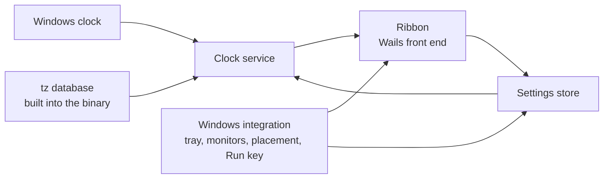

# TimeRibbon: Requirements Specification

Status: baselined by Oliver on 2026-09-27. Section 11 records the rulings that closed its open
questions; it holds none at present. Later changes arrive as dated amendments.

Amendment 2 (Oliver, 2026-09-27): Help, About and Licence (FR-508, FR-607 to FR-609) plus the
self-reading licence in setup (FR-811); CON-6, FR-108 and FR-502 carry notes of it.

Amendment 3 (Oliver, 2026-09-27): the web view's data moves inside `%APPDATA%\TimeRibbon` (FR-806).

Amendment 4 (Oliver, 2026-09-27): with 1.0.0 the settings file becomes a contract (NFR-C-1).

Amendment 5 (Oliver, 2026-09-27): the right-click menu gains `Exit` (FR-108); each setup screen opens
with nothing focused rather than on its lead action (FR-809).

Amendment 6 (Oliver, 2026-09-27): the ribbon runs in time order east from Greenwich, the reference,
worked out at each snapshot (FR-102); ordering by hand is withdrawn (FR-306).

Amendment 7 (Oliver, 2026-09-27): a ribbon whose length changes is re-centred along it on its
display, keeping its position across (FR-104).

Amendment 8 (Oliver, 2026-09-28): the Position submenu centres the ribbon on an edge (FR-408);
clocks come large or small (FR-610); the Settings header stays in place (FR-601).

Amendment 9 (Oliver, 2026-09-28): style and orientation move from Settings to the menus; each
orientation has a home edge the ribbon goes to when it is chosen (FR-409).

Amendment 10 (Oliver, 2026-09-28): the default place is flush against the home edge (FR-403).

Amendment 11 (Oliver, 2026-09-28): the product is renamed TimeRibbon over a trademark concern and
its window is the ribbon. Nothing carries over from the former name, which starts a new major
version (NFR-C-1).

Source: the initial product specification of 2026-09-27, written under the product's former name,
plus Oliver's rulings
of 2026-09-27: the stack is Go with Wails; orientation is a setting offering both horizontal and
vertical, both in the first release; a setup program ships with the first release; this document is
baselined before any code.

---

## 1. Introduction

### 1.1 Purpose

TimeRibbon is a small Windows desktop application showing a ribbon of clocks, one per chosen place in
the world. It answers one question at a glance: what time and what day is it where my friends are?

It shows places, never people. It is not a calendar, a meeting planner or a productivity tool.

### 1.2 Intended audience

Oliver Ernster as author and decision owner; contributors to the open source project.

### 1.3 Scope

**In scope:**

- A frameless ribbon of clocks, vertical by default, horizontal as a choice; either can be centred
  on an edge of its display.
- Each clock showing its place, its local time, its local weekday and date plus a zone
  abbreviation or UTC offset, all derived from real time zone rules.
- Adding, editing and removing clocks, with a searchable list of places; the ribbon keeps them in
  time order.
- Digital and analogue presentation, in large or small clocks; 12-hour and 24-hour time.
- Dragging the whole ribbon anywhere, including onto another monitor; restoring its monitor and
  position at the next launch; recovering it onto a visible display when its place has gone.
- A notification-area (tray) icon with a menu; optional Always on Top; optional Start with Windows.
- Light, dark and system themes.
- Local persistence in one human-readable file.
- A setup program that installs, updates, repairs and removes the application for one user
  (section 5).

**Out of scope:**

| Item | Why |
|---|---|
| People, contacts or friend names | The spec: clocks represent places, not people |
| Calendars, meetings, reminders, alarms or time conversion tools | The spec's section 1 and closing paragraph |
| A second hand or seconds display | The spec's section 7: seconds are not central |
| Per-clock 12/24-hour format | The spec's section 7: a global preference until use shows otherwise |
| Wrapping clocks onto several rows or columns | The spec's section 19; overflow scrolls instead (FR-106) |
| Relative wording such as "tomorrow" or "+1 day" | The spec's section 14 prefers the local weekday and date |
| Any platform but Windows | The spec's section 20 |
| Languages other than English | Not asked for; weekday and month names are English |
| Network time synchronisation | Windows owns the clock; TimeRibbon reads it (NFR-S-2) |
| Downloading time zone rule updates | Rules are built into the binary (CON-5, NFR-S-3) |
| Fixed UTC offsets as clocks | The spec's section 4 forbids them |

### 1.4 Definitions

| Term | Meaning, fixed for this document |
|---|---|
| **Clock** | One configured entry: a zone plus a label, at a position in the order. |
| **Zone** | An IANA time zone identifier such as `America/New_York`, resolved through the tz database built into the application. |
| **Label** | The place name a clock is shown by, such as `New York`. |
| **Default label** | The label derived from a zone id: its last segment with underscores read as spaces. `America/Argentina/Buenos_Aires` gives `Buenos Aires`. |
| **Ribbon** | The application's frameless window holding the clocks in order. |
| **Cell** | The part of the ribbon showing one clock. |
| **Orientation** | Horizontal (cells left to right) or vertical (cells top to bottom). |
| **Style** | Digital or analogue: how every cell presents its time. |
| **Format** | 12-hour or 24-hour: how every digital time and every textual time is written. |
| **Zone mark** | The text beside a label naming the zone's current abbreviation or UTC offset (FR-203). |
| **Local date** | The weekday, day and month at the clock's zone for the current instant. |
| **Work area** | A monitor's rectangle minus the taskbar and docked toolbars, as Windows reports it. |
| **Placement** | The monitor the ribbon is on plus the ribbon's position relative to that monitor's work area. |
| **Invalid clock** | A stored clock entry that cannot be used: its zone is not recognised or its fields cannot be read. |
| **Settings file** | `%APPDATA%\TimeRibbon\settings.json`. |
| **DIP** | Device-independent pixel: one pixel at 100 percent Windows scaling. |

### 1.5 References

- The initial product specification of 2026-09-27, written under the product's former name.
- `ARCHITECTURE.md`: the layering invariants and the tests that enforce them.
- IANA tz database, as embedded by Go's `time/tzdata` package.
- ISO/IEC/IEEE 29148 for requirement quality; EARS for requirement syntax.
- WCAG 2.2, success criterion 1.4.3 (contrast minimum) and 1.4.1 (use of colour).

---

## 2. Overall description

### 2.1 Product perspective

A new, standalone application. It reads the Windows clock and nothing else from outside itself.

The clock service takes an instant and the configured clocks and answers, for each clock, the text
and hand angles to show. Everything about Windows sits below the integration line.

### 2.2 User classes

| Class | Description | May do | May not do |
|---|---|---|---|
| **User** | Talks with friends in other time zones and wants their time and day at a glance | Everything the application offers | Nothing is withheld; there is one class |

### 2.3 Operating environment

Windows 10 or 11, 64-bit, with the WebView2 runtime present (it ships with Windows 11). Go 1.26 with
Wails v2 hosting a React and TypeScript front end; no CGO. No network use at runtime.

Measured on 2026-09-27 against Wails v2.12.0 in the module cache:

- The Wails Windows manifest declares `permonitorv2,permonitor` DPI awareness.
- The Wails runtime offers no call that creates a second window; there is one window (CON-6).
- `ScreenGetAll` reports each screen's size plus primary and current flags only: no origin, no
  device name, no work area (CON-7).
- `WindowSetPosition` places the window relative to the work area of the monitor it is currently on,
  while `WindowGetPosition` answers absolute virtual-desktop coordinates (CON-7).

**The reference machine** for performance requirements is the development machine, to be read and
recorded at the first measured build.

### 2.4 Constraints

| ID | Constraint |
|---|---|
| CON-1 | The layering invariant `UI to Application to Domain from Infrastructure` holds and is enforced by `tests/structural`. |
| CON-2 | Every Go source file and every TypeScript and CSS file under `frontend/src` stays at or below 400 lines; one landing between 381 and 400 lines is reduced to 350 or fewer. Build and packaging scripts are not counted. |
| CON-3 | The coverage floor over `internal/domain` and `internal/application` stays at 100 percent. |
| CON-4 | `VERSION` is the single source of truth for the version. No version literal elsewhere. |
| CON-5 | Zones resolve through Go's `time.LoadLocation` with the `time/tzdata` package embedded, so no rule depends on files present on the machine. Measured 2026-09-27 with `ZONEINFO` pointed at a missing path: `America/New_York` answered EST in January and EDT in July; `Not/AZone` answered an error. No DST rule is written by hand. |
| CON-6 | The ribbon, its context menu and the Settings surface share one window, since Wails v2 offers one. Settings is shown by resizing that window to a settings layout and returning it to the ribbon afterwards. Amendment 2: About and Licence (FR-607, FR-608) are shown the same way, as panels of that one window. |
| CON-7 | Monitor enumeration, work areas, monitor identity and window placement go through Win32 (`EnumDisplayMonitors`, `GetMonitorInfoW`, `SetWindowPos`) in infrastructure, never through Wails' position calls. |
| CON-8 | Everything written stays per user: the settings file under `%APPDATA%` and the Start with Windows value under `HKCU`. Windows never asks for administrator rights. |

### 2.5 Assumptions

| ID | Assumption | Owner | Confirm by |
|---|---|---|---|
| ASM-1 | The Windows clock is correct; TimeRibbon shows what it implies. | Oliver | Baselining |
| ASM-2 | Up to 12 clocks covers real use; beyond that the ribbon scrolls rather than grows (FR-106). The number sizes tests, not a limit. | Oliver | Baselining |
| ASM-3 | English weekday and month names suffice. | Oliver | Baselining |

---

## 3. Requirements

Every requirement below names the test that verifies it. A `Verified by:` line marked planned names
a test not yet written; one that says no test yet names none.

### 3.1 The ribbon

**FR-101 Frameless ribbon**
Priority: Must.
The ribbon shall be a window with no title bar, no system border and no taskbar button.
Rationale: the spec's sections 2 and 8; the tray is its presence (FR-501).
Verified by: inspection of the running build (section 12, check M-1).

**FR-102 Cells in configured order**
Priority: Must.
The ribbon shall show one cell per clock in ascending order of position, left to right when
horizontal and top to bottom when vertical.
Acceptance: Given clocks Sydney at position 0 and New York at position 1, when the ribbon is shown
horizontally, then Sydney's cell is left of New York's.
Amendment 6 (Oliver, 2026-09-27): the cells run east from Greenwich, the reference: first the
places level with or ahead of UTC by ascending offset, then the places behind UTC by ascending
offset, since going east from Greenwich reaches them last. Offsets are those at the moment shown,
daylight saving included, so the order is worked out at each snapshot. Clocks keeping the same
time keep their stored order; a clock that cannot be shown goes last. Acceptance: given New York,
Melbourne, Tokyo, Berlin and London added in that order, the ribbon shows London, Berlin, Tokyo,
Melbourne, New York.
Verified by: `TestTheRibbonRunsEastFromGreenwich`, `TestSnapshotFollowsClockOrderWithEachZonesDate` (application); `ribbon.test.tsx`.

**FR-103 Orientation setting**
Priority: Must (OQ-5, Oliver, 2026-09-27).
The ribbon shall lay its cells out in the orientation held in settings; vertical when none is held.
Rationale: Oliver, 2026-09-27: both orientations, as a setting.
Amendment 1 (Oliver, 2026-09-27, after the first build): the default changed from horizontal to
vertical.
Amendment 9 (Oliver, 2026-09-28): the orientation is chosen from the `Orientation` submenu of both
menus rather than in Settings (FR-108, FR-502, FR-601).
Verified by: `TestDefaultsAreDigitalTwentyFourHourVerticalAndNotOnTop` (domain); `ribbon.test.tsx`.

**FR-104 Changing orientation keeps the ribbon on screen**
Priority: Must.
When the orientation changes, the application shall keep the ribbon's top-left corner where it was,
then apply the recovery of FR-405 so the whole ribbon lies inside its monitor's work area.
Amendment 7 (Oliver, 2026-09-27): when the ribbon's length changes (a clock added or removed, a
notice raised or dismissed, the style or orientation changed), the application shall centre it
along its length on its monitor's work area, keeping its position across; it shall store that place.
Nothing else re-centres it: a drag is kept until the length next changes. Acceptance: given a
vertical ribbon dragged near the top of its display, when a clock is added, then it is centred top
to bottom with its left edge where it was; it opens there next time.
Amendment 9 (Oliver, 2026-09-28): a change of orientation no longer keeps the top-left corner; the
ribbon goes to that orientation's home edge instead (FR-409). A change of length for any other reason
is re-centred as above.
Verified by: `TestARibbonWhoseLengthChangesIsRecentredAndKept`, `TestAHorizontalRibbonIsRecentredLeftToRight`, `TestNothingButAChangeOfLengthRecentresTheRibbon`, `TestARecentringThatCannotBeSavedMakesRoomForItsNotice` (application).

**FR-105 Ribbon sized to its clocks**
Priority: Must.
The ribbon's length along its orientation shall equal the sum of its cells' lengths plus its padding,
while that sum fits the work area of its monitor.
Verified by: `TestRibbonLengthFollowsClockCountAndNeverExceedsWorkArea` (domain, placement).

**FR-106 Overflow scrolls**
Priority: Must.
If the ribbon's cells need more length than the monitor's work area offers along the orientation,
then the application shall size the ribbon to that work area and scroll the cells along the
orientation, never clipping a cell out of reach and never wrapping to a second row or column.
Acceptance: Given a work area 1920 DIP wide and 12 horizontal cells needing 2400 DIP, then the ribbon
is 1920 DIP long and the last cell is reachable by scrolling.
Verified by: `TestRibbonLengthFollowsClockCountAndNeverExceedsWorkArea` (domain); `ribbon.test.tsx` for the scroll.

**FR-107 Empty ribbon**
Priority: Must.
While no clock is configured, the ribbon shall show one cell reading `No clocks yet` with an `Add clock`
control opening the place search of FR-302.
Verified by: `ribbon.test.tsx`.

**FR-108 Context menu**
Priority: Should.
When the ribbon is right-clicked, the application shall offer `Add clock`, `Settings`, `Always on top`
(showing its state) and `Hide ribbon`.
Amendment 2 (Oliver, 2026-09-27): a `Help` submenu (FR-508) sits after `Always on top`.
Amendment 5 (Oliver, 2026-09-27): `Exit` follows `Hide ribbon` and ends the application as the tray's
does (FR-502).
Amendment 8 (Oliver, 2026-09-28): a `Position` submenu (FR-408) sits after `Settings`.
Amendment 9 (Oliver, 2026-09-28): `Style` and `Orientation` submenus sit between `Settings` and
`Position`, as in the tray menu (FR-502).
Verified by: `TestContextMenuOffersTheRibbonsActions`,
`TestBothMenusOfferStyleAndOrientationWithTheCurrentTicked` (application).

### 3.2 Time and date

**FR-201 Local time per clock**
Priority: Must.
The clock service shall compute each clock's local time by converting the current instant to that
clock's zone through the tz database of CON-5.
Acceptance: Given the instant 2026-09-27T01:37:00Z, then `America/New_York` shows 21:37 and
`Australia/Sydney` shows 11:37.
Verified by: `TestLocalTimeInDistantZones` (domain).

**FR-202 Local date per clock**
Priority: Must.
Each cell shall show the weekday, day and month in its own zone, written `Sunday, 27 September`,
never the user's own date.
Acceptance: Given the instant 2026-09-27T20:37:00Z, then New York reads `Sunday, 27 September` while
Sydney reads `Monday, 28 September`.
Note: the spec's section 3 pairs New York 21:37 with Sydney 06:37; no single instant gives that pair,
since the two are 14 hours apart in late September (measured 2026-09-27). This example uses a pair
that occurs: New York 16:37, Sydney 06:37.
Verified by: `TestLocalDateCrossesMidnightByZone` (domain).

**FR-203 Zone mark**
Priority: Must.
Each cell shall show a zone mark: the zone's current abbreviation where the tz database gives one of
letters; otherwise `UTC` followed by the signed offset in hours, with minutes only when non-zero.
Acceptance, from values measured on 2026-09-27: New York in July reads `EDT`; São Paulo reads
`UTC-3`; Kathmandu reads `UTC+5:45`.
Verified by: `TestZoneMarkPrefersLettersElseOffset` (domain).

**FR-204 Daylight saving follows the rules**
Priority: Must.
The clock service shall take every offset and abbreviation from the tz database at the instant
being shown, holding no offset of its own.
Acceptance: Given `America/New_York`, the instant 2026-03-08T06:59:00Z reads `01:59 EST` and
2026-03-08T07:00:00Z reads `03:00 EDT`.
Verified by: `TestDaylightSavingTransitionIsFollowed` (domain).

**FR-205 Year boundary**
Priority: Must.
Each cell shall show its own zone's date across a year boundary.
Acceptance: Given the instant 2026-12-31T12:00:00Z, then `Pacific/Kiritimati` reads
`Friday, 1 January` while `America/Los_Angeles` reads `Thursday, 31 December`.
Verified by: `TestYearBoundaryDiffersByZone` (domain).

**FR-206 Time format**
Priority: Must.
Where the format is 24-hour, a time shall be written with two-digit hours (`06:37`, `21:37`); where
it is 12-hour, with unpadded hours plus `AM` or `PM` (`6:37 AM`, `9:37 PM`, `12:00 AM` at midnight,
`12:00 PM` at noon).
Verified by: `TestTwelveAndTwentyFourHourFormats` (domain).

**FR-207 Injected instant**
Priority: Must.
The clock service shall take the instant as an argument; no domain or application code shall read
the wall clock.
Verified by: `tests/structural` domain purity test, proved by a planted `time.Now()`.

**FR-208 Minute-aligned updates**
Priority: Must.
While the ribbon is shown, the application shall refresh every cell at each minute boundary of the
Windows clock, scheduling each refresh from the current time rather than from the last refresh.
Verified by: `TestNextRefreshIsTheNextMinuteBoundary` (domain); NFR-P-2.

**FR-209 Clock change and resume**
Priority: Must.
When Windows reports a system time change, a time zone change or a resume from sleep, the
application shall refresh every cell and reschedule the next minute boundary.
Verified by: section 12, check M-5 (a person changes the clock and sleeps the machine).

### 3.3 Clock configuration

**FR-301 Add a clock**
Priority: Must.
When the user chooses a place from the place search, the application shall append a clock for its
zone with the default label and persist it.
Verified by: `TestAddingAClockAppendsItWithTheDefaultLabel` (application).

**FR-302 Place search**
Priority: Must.
The place search shall list every canonical zone of the embedded tz database by default label and
region, filtering as the user types by case-insensitive substring over the default label, the zone
id and the country name.
Acceptance: typing `york` offers `New York (America/New_York)`; typing `kolkata` offers `Kolkata`.
Note: a city without a zone of its own (Manchester, Brighton) is not searchable; the user picks its
zone and types the label (FR-303). Ruled on OQ-1 by Oliver, 2026-09-27.
Verified by: `TestPlaceSearchMatchesLabelZoneOrCountry` (application).

**FR-303 Edit a clock's label**
Priority: Must.
When the user edits a clock's label, the application shall store the new label; if the label is
empty after trimming spaces, then it shall store the default label instead.
Verified by: `TestEmptyLabelFallsBackToDefault` (domain).

**FR-304 Edit a clock's zone**
Priority: Must.
When the user chooses a different place for an existing clock, the application shall replace its
zone, keep its position and replace its label only if the label was the old zone's default label.
Verified by: `TestChangingZoneKeepsACustomLabel` (domain).

**FR-305 Remove a clock**
Priority: Must.
When the user confirms removal of a clock named in a confirmation prompt, the application shall
remove it and close the gap in the order.
Verified by: `TestRemovingAClockClosesTheGap` (domain); `settings.test.tsx` for the
prompt.

**FR-306 Reorder clocks**
Priority: Must.
The Clocks list in Settings shall reorder clocks by dragging a row and by `Move up` / `Move down`
controls reachable from the keyboard; the new order shall be persisted.
Rationale: dragging on the ribbon itself moves the window (FR-401), so reordering lives where a drag
cannot be mistaken for a move; the spec's section 10.
Withdrawn by Amendment 6 (Oliver, 2026-09-27): the order follows the time (FR-102), so there is
nothing to order by hand. The number is kept so references to it still resolve.

**FR-307 Label length**
Priority: Should.
A label shall hold at most 32 characters; a cell too narrow for its label shall end it with an
ellipsis and show the whole label as a tooltip.
Rationale: 32 is Claude's proposal, sized to keep a cell compact.
Verified by: `TestLabelIsCappedAt32Characters` (domain); no test yet for the ellipsis and tooltip.

**FR-308 Duplicate zones permitted**
Priority: Could.
The application shall accept a clock whose zone another clock already uses.
Rationale: two labels for one zone (`London`, `Brighton`) are a legitimate choice.
Verified by: planned `TestTheSameZoneMayBeAddedTwice` (application).

### 3.4 Dragging and placement

**FR-401 Whole-ribbon drag**
Priority: Must.
When the user presses the primary button on any part of the ribbon that is not a control and moves
further than the Windows drag threshold (`SM_CXDRAG`, `SM_CYDRAG`), the application shall move the
whole ribbon with the pointer, onto any monitor.
Verified by: section 12, check M-2.

**FR-402 Controls do not drag**
Priority: Must.
A press on a control (a button, the scroll bar, a menu) shall not start a drag.
Verified by: `ribbon.test.tsx` for the drag regions; check M-2.

**FR-403 Default placement**
Priority: Must.
While no placement is stored, the application shall place the ribbon on the primary monitor with its
right edge 16 DIP inside the work area's right edge, centred vertically in the work area.
Rationale: the spec's section 8; 16 DIP is Claude's proposal.
Amendment 10 (Oliver, 2026-09-28): the ribbon sits flush, with no margin, against its orientation's
home edge (FR-409): the right edge, centred vertically, for a vertical ribbon; the top edge, centred
horizontally, for a horizontal one. The same holds wherever FR-405 or FR-406 fall back to this place.
Verified by: `TestDefaultPlacementIsRightEdgeCentred` (domain);
`TestLaunchWithNothingStoredGoesToTheDefaultPlace` (application).

**FR-404 Placement persisted**
Priority: Must.
When a drag ends, the application shall persist the placement: the monitor's device name, its work
area, its DPI and the ribbon's offset from that work area's top-left corner.
Verified by: `TestPlacementIsStoredRelativeToItsMonitor` (application).

**FR-405 Placement restored or recovered**
Priority: Must.
At launch, the application shall restore the ribbon to the stored monitor, scaling the stored offset
by the ratio of the monitor's current DPI to its stored DPI. If the stored monitor is not present,
then it shall use the primary monitor with the default placement of FR-403. If any part of the ribbon
would lie outside the chosen monitor's work area, then it shall move the ribbon the least distance
that brings it wholly inside.
Acceptance: Given a ribbon stored at offset (1700, 500) on `\\.\DISPLAY2` and only `\\.\DISPLAY1`
present, when launched, then the ribbon is at the default placement on `\\.\DISPLAY1`.
Verified by: `TestMissingMonitorFallsBackToPrimary`,
`TestOffscreenPlacementIsClampedIntoWorkArea` and `TestDpiChangeScalesTheOffset` (domain).

**FR-406 Display changes while running**
Priority: Must.
When Windows reports a display configuration change while the ribbon is shown, the application shall
apply the recovery of FR-405 to the ribbon's current position.
Verified by: `TestDisplayChangeRecoversARibbonLeftOffscreen` (domain); check M-3.

**FR-407 Scaling across monitors**
Priority: Must.
The ribbon shall keep its size in DIP when moved between monitors with different scaling, with text
drawn at the destination monitor's resolution.
Verified by: section 12, check M-3.

**FR-408 Centre on an edge**
Priority: Must (Amendment 8, Oliver, 2026-09-28).
The tray menu and the ribbon's right-click menu shall each hold a `Position` submenu offering the two
edges the ribbon runs along: `Centre on left edge` and `Centre on right edge` while the orientation is
vertical; `Centre on top edge` and `Centre on bottom edge` while it is horizontal. When one is chosen,
the application shall put the ribbon flush against that edge of the work area of the monitor it is
on, centred along the edge, then show it and store that placement (FR-404). While a panel is open the
placement is stored and the ribbon goes there when the panel closes. Flush, with no margin (Oliver,
2026-09-28), as the first-run place of FR-403 is.
Acceptance: given a vertical ribbon 196 DIP long on a work area 1032 DIP tall at 100 percent, when
`Centre on left edge` is chosen, then its left edge is the work area's left edge and its top is 418
DIP down; it opens there next time.
Verified by: `TestAgainstEdgeIsFlushAndCentredAlongTheEdge` (domain);
`TestToEdgePutsAVerticalRibbonFlushAndKeepsIt`, `TestToEdgeUsesTheDisplayTheRibbonIsOn`,
`TestToEdgeThatCannotBeSavedMakesRoomForItsNotice`, `TestPositionOffersTheEdgesAlongTheOrientation`
(application); `TestAPositionItemPutsTheRibbonAgainstItsEdge` (facade); check M-12.

**FR-409 An orientation's home edge**
Priority: Must (Amendment 9, Oliver, 2026-09-28).
When the orientation is chosen, the application shall put the ribbon against that orientation's home
edge as FR-408 does: the top edge for horizontal, the right edge for vertical. A choice whose save
failed has still taken, so it moves the ribbon; a choice that is refused leaves the ribbon fitted where
it stands.
Acceptance: given a vertical ribbon anywhere on its display, when `Horizontal` is chosen, then the
ribbon lies flush against the top of that display's work area, centred left to right.
Verified by: `TestEachOrientationHasAHomeEdge` (domain, settings); `TestChoosingAnOrientationGoesToItsHomeEdge`,
`TestStyleAndOrientationItemsChooseAndRedraw` (facade), each proved by planting the right edge as the
left; check M-12.

### 3.5 Tray and window behaviour

**FR-501 Tray icon**
Priority: Must.
While the application runs, it shall show a notification-area icon with the tooltip `TimeRibbon`.
Verified by: check M-4.

**FR-502 Tray menu**
Priority: Must.
When the tray icon is right-clicked, the application shall offer `Show ribbon` or `Hide ribbon`
(whichever applies), `Add clock`, `Settings`, `Always on top` (showing its state) and `Exit`.
Amendment 2 (Oliver, 2026-09-27): a `Help` submenu (FR-508) sits after `Always on top`.
Amendment 8 (Oliver, 2026-09-28): a `Position` submenu (FR-408) sits after `Settings`.
Amendment 9 (Oliver, 2026-09-28): `Style` (`Digital`, `Analogue`) and `Orientation` (`Horizontal`,
`Vertical`) submenus sit between `Settings` and `Position`, each ticking the current choice; choosing
an item applies it at once as FR-602 does.
Verified by: `TestTrayMenuNamesTheOppositeOfTheVisibility`,
`TestBothMenusOfferStyleAndOrientationWithTheCurrentTicked` (application); check M-4.

**FR-503 Tray click**
Priority: Should.
When the tray icon is left-clicked, the application shall toggle the ribbon's visibility.
Verified by: check M-4.

**FR-504 Hide is not exit**
Priority: Must.
Hiding the ribbon shall leave the application running with its tray icon; only `Exit` ends it.
Verified by: check M-4.

**FR-507 Alt+F4 hides**
Priority: Must.
When `Alt+F4` is pressed while the ribbon has focus, the application shall hide the ribbon as
`Hide ribbon` does and keep running.
Rationale: ruled on OQ-4 by Oliver, 2026-09-27; `Exit` stays in the tray alone.
Verified by: `TestCloseRequestHidesRatherThanQuits` (application); check M-4.

**FR-508 Help submenu**
Priority: Must (Amendment 2, Oliver, 2026-09-27).
The tray menu and the ribbon's right-click menu shall each hold a `Help` submenu offering `About`
(FR-607) and `Licence` (FR-608). Choosing either shall show the ribbon's window as that panel.
Verified by: `TestBothMenusOfferHelpWithAboutAndLicence` (application);
`TestASubmenuIsNumberedAfterEveryItemBeforeIt` (infrastructure, desktop); check M-10.

**FR-505 Always on Top**
Priority: Must.
Where Always on Top is on, the ribbon shall stay above windows that are not themselves topmost; the
setting shall be off by default and persisted.
Verified by: `TestDefaultsAreDigitalTwentyFourHourVerticalAndNotOnTop` (domain); `TestChangingASettingPersistsIt` (application); check M-4.

**FR-506 One instance**
Priority: Must.
If TimeRibbon is launched while it is already running for the same Windows user, then the new
process shall show the running ribbon and exit.
Verified by: check M-6.

### 3.6 Settings and startup

**FR-601 Settings content**
Priority: Must.
Settings shall offer: style (digital, analogue); format (12-hour, 24-hour); orientation
(horizontal, vertical); theme (system, light, dark); Always on Top; Start with Windows; the Clocks
list of FR-303 to FR-305, in the ribbon's order; at its foot, a donate button that hands the
donation page to the desktop's browser. Nothing else.
Amendment 8 (Oliver, 2026-09-28): size (large, small; FR-610) follows style. The title and `Close`
stay at the top of the window while the rest of the panel scrolls beneath them, as the foot stays
at the bottom.
Amendment 9 (Oliver, 2026-09-28): style and orientation leave Settings for the menus (FR-108,
FR-502), so Settings offers size, format and theme.
Verified by: `settings.test.tsx`; the header by check M-12.

**FR-602 Settings apply at once**
Priority: Must.
When a setting changes, the application shall apply it to the ribbon and persist it without a Save
step.
Verified by: `TestChangingASettingPersistsIt` (application).

**FR-603 Analogue style**
Priority: Must.
Where the style is analogue, each cell shall show a dial with hour and minute hands for the local
time plus the label, zone mark and local date as text.
Verified by: `TestHandAnglesForLocalTime` (domain); no front-end test yet draws the dial.

**FR-604 Digital style**
Priority: Must.
Where the style is digital, the time shall be the largest text in each cell.
Verified by: no test yet.

**FR-605 Start with Windows**
Priority: Should.
When Start with Windows is turned on, the application shall write the value `TimeRibbon` under
`HKCU\Software\Microsoft\Windows\CurrentVersion\Run` holding its own quoted path; when turned off, it
shall delete that value. It shall be off by default and never written without the user turning it on.
The value carries no arguments: a sign-in start shows the ribbon at once, as a normal launch does
(ruled on OQ-2 by Oliver, 2026-09-27). Setup's box of FR-805 writes this same value.
Verified by: `TestStartWithWindowsWritesAndRemovesOneValue` (infrastructure).

**FR-606 Theme**
Priority: Should.
Where the theme is system, the ribbon shall follow the Windows app theme as it changes; light and dark
shall hold regardless of Windows.
Verified by: check M-7; no front-end test yet.

**FR-607 About**
Priority: Must (Amendment 2, Oliver, 2026-09-27).
The About panel shall show, in this order: the application icon; the product name with the version
this build carries; `by Oliver Ernster`; `© Oliver Ernster`; then a credit for every component the
application ships, each naming the component, its licence and what it does here. Close and Escape
return the window to the ribbon.
Verified by: `help.test.tsx`; `TestEveryLinkedModuleIsCredited` (structural).

**FR-608 Licence**
Priority: Must (Amendment 2, Oliver, 2026-09-27).
The Licence panel shall show the whole of the `LICENSE` file the application was built with, as
embedded in the binary. Close and Escape return the window to the ribbon.
Verified by: `help.test.tsx`; `TestTheLicencePanelIsSizedForTheLicencesWidestLine` (structural).

**FR-609 Help content reads itself**
Priority: Must (Amendment 2, Oliver, 2026-09-27).
While the About or Licence panel holds more than fits, its body shall read itself in the house
auto-scroll cycle: still for 5 s on opening; down 1 DIP every 80 ms; still for 5 s at the end;
back to the top at 15 DIP every 40 ms; still for 2 s; repeat. A wheel, a press, a touch, a key or
focus arriving in the body shall suspend the cycle for 2.5 s of stillness, after which it resumes
from where the reader left it. Focus arriving while the opening 5 s still run shall not shorten
them. While a dialog marked modal stands above the body, the cycle shall stand frozen in place. The
cycle is one script, shared with the setup program (FR-811).
Verified by: `autoScroll.test.ts`; `help.test.tsx`.

**FR-610 Clock size**
Priority: Must (Amendment 8, Oliver, 2026-09-28).
The ribbon shall draw every clock cell at the size held in settings, large or small, in either style;
large when none is held, so a settings file written before the size existed keeps the clocks it had. Small cells are 146 by 72
DIP digital and 146 by 116 DIP analogue against large's 176 by 92 and 176 by 176, with their text and
dial reduced to fit; the empty ribbon's prompt is the same at either size. A ribbon lying flush against
an edge of its display stays against that edge when the size changes, as it does when its cells
change for any other reason (Oliver, 2026-09-28).
Rationale: small screens such as a 13 inch laptop, where large analogue cells leave room for few
clocks.
Acceptance: given two analogue clocks in a vertical ribbon at 100 percent with 6 DIP padding, when the
size is small, then the ribbon is 158 DIP wide and 244 DIP long.
Verified by: `TestUnknownChoicesAreNormalisedToDefaults` (domain);
`TestKeptFlushHoldsTheFarEdgeNotTheCorner` (domain); `TestTheSmallSizeFitsTheRibbonToSmallCells`,
`TestShrinkingKeepsTheRibbonAgainstItsEdge` (application); `TestA1Point0SettingsFileIsReadWhole`,
`TestSettingsRoundTrip` (infrastructure, store); `ribbon.test.tsx`, `settings.test.tsx`; the fit of
the text by check M-12.

### 3.7 Persistence and recovery

**FR-701 Settings file**
Priority: Must.
The application shall keep its settings in the settings file as indented JSON holding style, size, format,
orientation, theme, Always on Top, placement and clocks; each clock holding a stable id, its zone id,
its label and its position. Derived values (offset, abbreviation, time, date) shall not be stored.
Verified by: `TestSettingsRoundTrip` and `TestNoDerivedValueIsStored` (infrastructure).

**FR-702 Atomic writes**
Priority: Must.
The application shall write the settings file to a temporary file in the same folder and replace the
old file with it, so a crash mid-write leaves the previous file intact.
Verified by: `TestWriteReplacesAtomically` (infrastructure).

**FR-703 First run**
Priority: Must.
If the settings file does not exist, then the application shall start with default settings and no
clocks, write nothing until something changes and report no problem.
Verified by: `TestAbsentFileMeansDefaults` (infrastructure).

**FR-704 Unreadable file**
Priority: Must.
If the settings file exists but is not valid JSON, then the application shall rename it to
`settings.unreadable.json`, start with default settings and show on the ribbon `Settings could not be
read; the old file was kept as settings.unreadable.json`.
Verified by: `TestUnreadableFileIsKeptAsideAndReported` (infrastructure).

**FR-705 One bad clock**
Priority: Must.
If one clock entry cannot be read or names a zone the tz database does not recognise, then the
application shall load every other clock, keep the bad entry in the file unchanged and show it as an
invalid clock.
Acceptance: Given three clocks where the second names `Not/AZone`, then the first and third show
their times and the second reads `Unknown time zone: Not/AZone`.
Verified by: `TestOneBadClockLeavesTheOthersWorking` (application).

**FR-706 Invalid clock shown for repair**
Priority: Must.
An invalid clock shall keep its place in the order, show its stored label (else its stored zone
text) with the words `Unknown time zone` and offer `Edit` and `Remove` in Settings. The application
shall never substitute another zone.
Verified by: `ribbon.test.tsx`; `TestInvalidClockIsNeverGivenAnotherZone` (application).

**FR-707 Write failure**
Priority: Must.
If the settings file cannot be written, then the application shall keep running with the change in
effect and show `Settings could not be saved:` followed by the reason, until a later write succeeds.
Verified by: `TestWriteFailureIsReportedAndCleared` (application).

### 3.8 Non-functional

| ID | Requirement | Method |
|---|---|---|
| NFR-P-1 | From launch to the ribbon showing current times shall take at most 1.5 s on the reference machine. | Timed from the log's first line to the first snapshot, median of 5 launches |
| NFR-P-2 | While running normally, each cell shall show the new minute within 1 s after the Windows clock reaches it. | Log timestamps against the refresh, over 10 boundaries |
| NFR-P-3 | After a resume or a system time change, every cell shall be correct within 2 s. | Check M-5 |
| NFR-P-4 | While shown, the application shall schedule no periodic timer more frequent than once per minute. | Inspection plus a planned structural test over the front end's timer calls |
| NFR-U-1 | Label, time, date and zone mark text shall meet a contrast ratio of at least 4.5:1 against the cell in both themes. | Planned theme token contrast test |
| NFR-U-2 | No state shall be told by colour alone; an invalid clock carries words (FR-706). | Inspection |
| NFR-U-3 | Every control in Settings and the place search shall be reachable and operable from the keyboard, with a visible focus indicator on the focused control. | `settings.test.tsx`; check M-8 |
| NFR-U-4 | Every icon-only control shall carry an accessible name and a tooltip. | Planned `a11y.test.tsx` |
| NFR-U-5 | Interactive targets shall be at least 24 by 24 DIP. | Inspection; WCAG 2.2 criterion 2.5.8 |
| NFR-S-1 | The application shall make no network request. | Structural test forbidding any `net` or `net/http` import in the module |
| NFR-S-2 | The application shall not change the Windows clock or time zone. | Inspection |
| NFR-S-3 | Non-claim: time zone rules are those of the tz database embedded at build time. A rule change made by a government after the build is shown only after a new release. The README states this. | Inspection of the README |
| NFR-M-1 | The coverage floor of CON-3, the size limit of CON-2 and the layering of CON-1 are enforced by `test.ps1`, which `build.ps1` runs first with no switch to skip it. | `build.ps1` |
| NFR-M-2 | Go code passes gofmt, go vet and staticcheck; the front end passes eslint, `tsc --noEmit` and Vitest. | `test.ps1` |
| NFR-C-1 | From 1.0.0, every later 1.x release shall read every settings file 1.0.0 writes to the same settings: no key 1.0.0 writes is renamed, dropped or given another meaning; no stored word changes. A later release may add keys; 1.0.0 keeps a key it does not know and writes it back. Amendment 4 (Oliver, 2026-09-27). Amendment 11 (Oliver, 2026-09-28): the next major version still reads that shape to the same settings; the file now lives in the renamed folder and nothing is read from the former one. | `TestA1Point0SettingsFileIsReadWhole` over the frozen fixture `internal/infrastructure/store/testdata/settings-1.0.0.json` |
| NFR-O-1 | The application shall write a log to `%APPDATA%\TimeRibbon\TimeRibbon.log` recording launch, placement recovery decisions, settings failures and invalid clocks; standard error is pointed at it before anything can fail. | `TestLogReceivesStandardError` (infrastructure) |

---

## 4. Documents

README.md, ARCHITECTURE.md, TESTING.md and DEVELOPMENT.md, ported in shape from BridgeTalk, are
written with the first build and kept true by the docs pass.

---

## 5. Delivery and the setup program

`build.ps1` reads `VERSION` into the binary, runs `test.ps1` first with no switch to skip it, builds
the application with `wails build`, then builds the setup program embedding it. A setup program ships
with the first release (ruled on OQ-3 by Oliver, 2026-09-27). It is a second Wails application in the
same module, `installer/`, whose install policy lives in `internal/infrastructure/setup`; ported in
shape from BridgeTalk's.

**FR-801 Setup opens on the screen the machine calls for**
Priority: Must.
When setup starts with `-uninstall`, it shall open on the Uninstall screen. Otherwise it shall open on
Install where nothing is installed; on Installed, offering Repair, Reinstall and Uninstall, where the
same version is installed; on Update or Go back where another version is installed, with the button
making the change leading. Versions compare by major, minor then patch as numbers, ignoring anything
after a hyphen; a missing or non-numeric field counts as zero.
Verified by: `TestCompareOrdersVersions` (infrastructure, setup); check M-9.

**FR-802 Every install writes the same way**
Priority: Must.
When Install, Update, Go back or Reinstall is confirmed, setup shall write the application's files into
`%LOCALAPPDATA%\Programs\TimeRibbon`, place a copy of itself there as `uninstall.exe`, record the
application in the Apps list with Modify and Repair offered, then apply the boxes of FR-805.
Verified by: `TestExtractZipWritesEveryEntry` and `TestTheUninstallEntryNamesTheRealPath`
(infrastructure, setup); check M-9.

**FR-803 A payload entry leaving the install folder is refused**
Priority: Must.
If an entry in the payload names a path outside the install folder, then setup shall stop, report
`unsafe path in payload` with the entry's name and write nothing further.
Verified by: `TestExtractZipRejectsAPathThatEscapes` (infrastructure, setup).

**FR-804 Repair keeps the options as they stand**
Priority: Must.
When Repair is pressed, setup shall write the files again as FR-802 does, keeping the Start Menu
shortcut, the Desktop shortcut and the Start with Windows value exactly as they are on the machine.
Verified by: `TestTheBoxesReflectWhatIsOnTheMachine` (infrastructure, setup).

**FR-805 Install options**
Priority: Must.
The Install screen shall offer three boxes: `Add to the Start Menu` (ticked), `Add a Desktop shortcut`
(unticked) and `Start with Windows` (unticked), plus `Start TimeRibbon when setup closes` (ticked).
`Start with Windows` shall write the one value FR-605 writes, so the two cannot disagree.
Verified by: `TestStartWithWindowsIsTheSameValueSettingsWrites` (infrastructure).

**FR-806 Uninstall removes the application and keeps the user's settings unless told**
Priority: Must.
When Uninstall is confirmed, setup shall remove the shortcuts, the Start with Windows value and the
Apps list entry, then delete the install folder once setup has closed. Where `Also forget my settings`
is ticked, which it is not by default, setup shall also delete `%APPDATA%\TimeRibbon`.
Amendment 3 (Oliver, 2026-09-27): everything the application writes under `%APPDATA%`, the web
view's data included, lies inside `%APPDATA%\TimeRibbon`, so forgetting leaves nothing behind.
Verified by: `TestForgettingRemovesOnlyTheSettingsFolder` (infrastructure, setup); check M-9.

**FR-807 A running copy is closed before setup writes**
Priority: Must.
If TimeRibbon is running when setup is asked to write or to uninstall, then setup shall say so and offer
to close it. If it is still running 5 seconds after being asked to close, then setup shall say it could
not be closed and ask for it to be closed by hand.
Verified by: check M-9.

**FR-808 A failure says why**
Priority: Must.
If a step fails, then setup shall show `Something went wrong` with the reason and a Close button.
Verified by: `setupScreens.test.ts`.

**FR-809 Setup answers the keyboard**
Priority: Must.
Setup shall move focus forward on Tab and Right, back on Shift+Tab and Left, wrapping at both ends and
passing over disabled or hidden controls; Enter on a focused box shall toggle it as Space does; each
screen shall open with nothing focused, the first Tab or Right entering at the first control and the
first Shift+Tab or Left at the last.
Verified by: `setupRing.test.ts`, `setupScreens.test.ts`.

**FR-810 Per user, no elevation**
Priority: Must.
Setup shall write only under `%LOCALAPPDATA%`, `%APPDATA%` (the Start Menu and the settings folder),
the user's Desktop and `HKCU`, so Windows never asks for administrator rights (CON-8).
Verified by: inspection of `internal/infrastructure/setup`; check M-9.

**FR-811 Setup's licence reads itself**
Priority: Must (Amendment 2, Oliver, 2026-09-27).
While setup's Licence screen is shown and holds more than fits, it shall read itself in the cycle
of FR-609, from the same script, starting afresh each time the screen opens.
Verified by: `setupScreens.test.ts`.

---

## 6. Architecture sketch

Proposed, to be fixed in ARCHITECTURE.md:

| Layer | Package | Holds |
|---|---|---|
| Domain | `internal/domain/clock` | Clock, zone mark rule, time and date formatting, hand angles; takes an instant |
| Domain | `internal/domain/placement` | Monitors as rectangles, default placement, DPI scaling, recovery by clamping |
| Domain | `internal/domain/settings` | Settings value, defaults, clock order operations |
| Application | `internal/application` | Use cases: snapshot (in time order), add, edit, remove, change setting, place, recover; ports for store, monitors, startup entry, zone catalogue |
| Infrastructure | `internal/infrastructure/store` | JSON settings file, atomic write, tolerant clock decoding |
| Infrastructure | `internal/infrastructure/zones` | Zone resolution through `time/tzdata`; the place catalogue |
| Infrastructure | `internal/infrastructure/windows` | Monitors, `SetWindowPos`, drag, tray, Run key, time change and resume messages |
| UI | `frontend/` | The ribbon, the cells in both styles, Settings, the place search |

---

## 7. Silence check

| Situation | Answered by |
|---|---|
| First run with no data | FR-703, FR-107 |
| Largest plausible input | FR-106 (scrolling), FR-307 (label length) |
| Interrupted write | FR-702 |
| Settings file damaged | FR-704, FR-705 |
| Disk not writable | FR-707 |
| Second launch | FR-506 |
| Time moving backwards or the zone changing | FR-209 |
| Monitor removed or scaling changed | FR-405, FR-406, FR-407 |
| Upgrade from a previous version | The settings file carries a `version` field from the first release; an unknown later field is kept on write |
| No permission | CON-8: nothing needs elevation |

---

## 8. Build order

Built inside out: domain, then application, then infrastructure, then the user interface. Every
action that changes what the application does (add, edit, remove, change a setting, place,
recover, snapshot) is executable from a Go test with no window open before the front end is built.

1. Domain: clock formatting and zone marks against fixed instants; placement recovery.
2. Application: the use cases over faked ports.
3. Infrastructure: the settings store, the zone catalogue, the Windows integration.
4. User interface: the ribbon in digital style, then dragging and placement, then Settings, the tray,
   the analogue style and the vertical orientation.
5. Hardening against section 12's checks on real hardware; then artwork and polish.

---

## 9. Prioritisation

| Priority | Content |
|---|---|
| **Must** | FR-101 to FR-107, FR-201 to FR-209, FR-301 to FR-305, FR-401 to FR-409, FR-501, FR-502, FR-504 to FR-508, FR-601 to FR-604, FR-607 to FR-610, FR-701 to FR-707, FR-801 to FR-811, NFR-P-1 to NFR-P-4, NFR-U-1 to NFR-U-5, NFR-S-1 to NFR-S-3, NFR-M-1, NFR-M-2, NFR-C-1, NFR-O-1 |
| **Should** | FR-108, FR-307, FR-503, FR-605, FR-606 |
| **Could** | FR-308 |
| **Won't this time** | Everything in the out-of-scope table of section 1.3 |

---

## 10. Traceability

The spec's first-useful-release criteria, mapped:

| Spec criterion | Requirements |
|---|---|
| 1 Launch on Windows | FR-101, NFR-P-1 |
| 2 Add several places | FR-301, FR-302 |
| 3 Current local times together | FR-102, FR-201 |
| 4 Correct local weekday and date | FR-202, FR-205 |
| 5 DST automatic | FR-204, CON-5 |
| 6 Compact horizontal frameless ribbon | FR-101, FR-105 |
| 7 Drag anywhere | FR-401, FR-402 |
| 8 Onto another monitor | FR-401, FR-407 |
| 9 Restart restores clocks, order, display, position | FR-404, FR-405, FR-701 |
| 10 Add, edit, remove, reorder | FR-301, FR-303 to FR-305; reordering withdrawn (FR-306), FR-102 orders by time |
| 11 Digital or analogue | FR-603, FR-604 |
| 12 12-hour or 24-hour | FR-206 |
| 13 Optional Always on Top | FR-505 |
| 14 Tray control | FR-501 to FR-504 |
| 15 Survive monitor changes | FR-405, FR-406 |

No requirement is considered met until its test exists and has been seen to fail without the
implementation; where no test can hold it, its `Verified by:` line names the check in section 12.

---

## 11. Open questions

There are no open questions. The five raised while drafting were ruled by Oliver on 2026-09-27:

| ID | Question | Ruling | Now held by |
|---|---|---|---|
| OQ-1 | Should the place search find cities with no zone of their own? | No: zone and country names only; any label can be typed | FR-302 |
| OQ-2 | Does a sign-in start show the ribbon or wait in the tray? | Show it at once | FR-605 |
| OQ-3 | Does a setup program ship with the first release? | Yes | Section 5 |
| OQ-4 | What does `Alt+F4` on the ribbon do? | Hide the ribbon | FR-507 |
| OQ-5 | Is the vertical orientation in the first useful release? | Yes | FR-103, FR-104 |

---

## 12. Checks a person settles

| ID | Check |
|---|---|
| M-1 | The ribbon shows with no title bar, border or taskbar button. |
| M-2 | Dragging empty ribbon area moves it; pressing a control does not; a small wobble does not. |
| M-3 | Dragged onto a monitor with different scaling, the ribbon keeps its size and stays crisp; unplugging that monitor brings it back onto a visible one. |
| M-4 | The tray icon, its menu, left click, Always on Top and Exit behave as FR-501 to FR-505 say. |
| M-5 | Changing the Windows clock, changing the time zone and sleeping then waking the machine each leave every cell correct within 2 s. |
| M-6 | Launching a second copy shows the first and leaves one tray icon. |
| M-7 | Switching the Windows theme while on system theme recolours the ribbon. |
| M-8 | Settings and the place search can be driven entirely from the keyboard. |
| M-9 | Setup installs, updates, repairs and uninstalls on a real machine without asking for administrator rights, closing a running copy first. |
| M-10 | Both menus open a Help submenu whose About and Licence each show their panel; the licence reads itself down after 5 s, a wheel stops it and it resumes; setup's Licence screen does the same. |
| M-11 | The donate button at the foot of Settings opens the default browser on the donation page. |
| M-12 | Each Position item puts the ribbon flush against its edge and centred along it on the display it is on; it opens there next time; choosing Horizontal or Vertical from either menu sends it to the top or right edge; small clocks show their whole date and time in both styles; the Settings title and Close stay put while the panel scrolls. |
