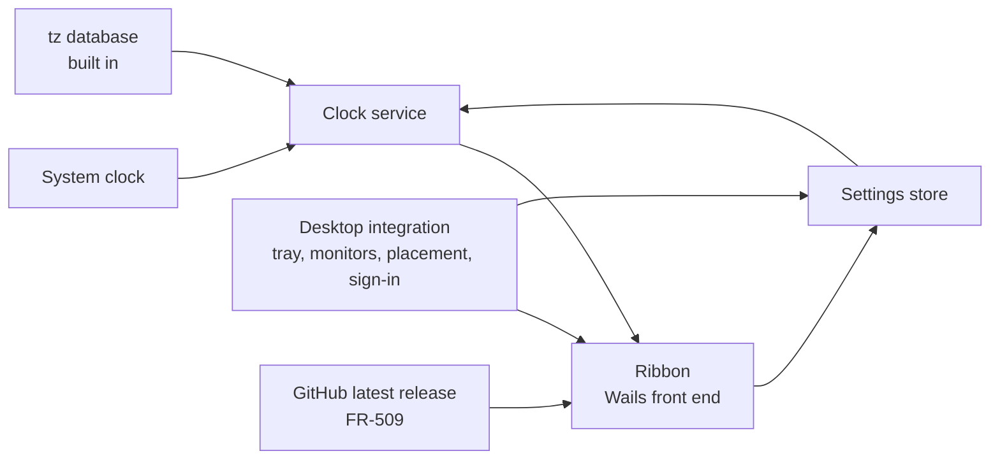

# TimeRibbon: Requirements Specification

Status: baselined by Oliver on 2026-09-27. Section 11 records the rulings that closed its open
questions; none is open. Later changes arrive as dated amendments, listed here and cited by number
where they apply.

## Amendments

| No. | Date | Change |
|---|---|---|
| 1 | 2026-09-27 | The default orientation becomes vertical (FR-103). |
| 2 | 2026-09-27 | Help, About and Licence (FR-508, FR-607 to FR-609); setup's licence reads itself (FR-811). |
| 3 | 2026-09-27 | The web view's data moves inside `%APPDATA%\TimeRibbon` (FR-806). |
| 4 | 2026-09-27 | The settings file becomes a contract with the first release (NFR-C-1). |
| 5 | 2026-09-27 | The right-click menu gains Exit (FR-108); each setup screen opens with nothing focused (FR-809). |
| 6 | 2026-09-27 | The ribbon runs east from Greenwich, worked out at each snapshot (FR-102); ordering by hand is withdrawn (FR-306). |
| 7 | 2026-09-27 | A ribbon whose length changes is re-centred along it, keeping its position across (FR-104). |
| 8 | 2026-09-28 | Position centres the ribbon on an edge (FR-408); large or small clocks (FR-610); the Settings header stays in place (FR-601). |
| 9 | 2026-09-28 | Style and orientation move to the menus; each orientation has a home edge (FR-409). |
| 10 | 2026-09-28 | The default place is flush against the home edge (FR-403). |
| 11 | 2026-09-28 | The product is renamed TimeRibbon over a trademark concern, its window the ribbon; nothing carries over from the former name, which starts a new major version (NFR-C-1). |
| 12 | 2026-09-28 | Colour schemes, chosen from a Colour submenu (FR-611). |
| 13 | 2026-09-28 | macOS (Apple Silicon, a signed and notarised DMG) and Linux (a Flatpak, through X11) join Windows, each with a real tray icon and the sign-in entry in its own words (section 1.3, 2.3, CON-7, CON-8, FR-401, FR-503, FR-605, FR-607, NFR-O-1, section 5). |
| 14 | 2026-09-28 | Five more schemes; Neon gains a light side; Ocean redrawn; each scheme's hue carried by the colours the ribbon paints (FR-611). |
| 15 | 2026-09-28 | An update check against GitHub, the one network request (FR-509, NFR-S-1); Help gains Check for updates (FR-508). |
| 16 | 2026-09-28 | A date format chosen in Settings (FR-612). |
| 17 | 2026-09-28 | A second launch toggles the ribbon rather than only showing it (FR-506). |
| 18 | 2026-09-28 | The ribbon can be unpinned to a tab (FR-613 to FR-618); NFR-U-5 exempts the tab; OQ-6 to OQ-9. |
| 19 | 2026-09-29 | The pin chosen and the pin in effect told apart (FR-619); a drop near an edge snaps (FR-410); the last edge is remembered (FR-411); the tab covers the flush side (FR-614, reversing OQ-6); OQ-10 to OQ-12. |
| 20 | 2026-09-29 | The sun map (section 3.9, FR-901 to FR-912; NFR-P-5, NFR-C-2, ASM-5); OQ-13 to OQ-18. |
| 21 | 2026-09-29 | On Windows the window is cut to the ribbon and its map (FR-913); map labels move aside (FR-914); OQ-19, OQ-20. |
| 22 | 2026-09-29 | One pull out handle for both orientations, one remembered choice (FR-902, FR-903); OQ-21, OQ-22. |
| 23 | 2026-09-29 | The handle stands in a lane of its own (FR-903); OQ-23. |
| 24 | 2026-09-29 | A cell is as wide as its widest text as the page draws it (FR-620); OQ-24. |
| 25 | 2026-09-29 | Settings grows to its content, capped by the work area (FR-621); OQ-25. |
| 26 | 2026-09-29 | An Opacity slider from 20 to 100 percent (FR-622); OQ-26. |
| 27 | 2026-09-29 | A corner grip resizes the clocks from 75 to 200 percent (FR-623); OQ-27, OQ-28. |
| 28 | 2026-09-29 | Settings offers every menu choice (FR-624), opens 900 DIP wide (FR-625) and keeps the place search open (FR-626); OQ-29 to OQ-31. |
| 29 | 2026-09-29 | The place search matches the start of a word, best matches first (FR-302). |
| 30 | 2026-10-04 | The opacity applies to the ribbon's background alone; the clocks, the sun map and every panel stay opaque (FR-622). |
| 31 | 2026-10-04 | A change of scale grows and shrinks the ribbon from its top-left corner; a change of clocks still re-centres it (FR-104, FR-623). |
| 32 | 2026-10-04 | The document's wording is consolidated (Oliver: "Make the docs concise"). Each requirement now states what holds after its amendments and cites them by number; the measurements behind section 2.3 are summarised. No requirement, acceptance or verifying test was removed or changed in meaning. |
| 33 | 2026-10-04 | On macOS and Linux the spare area of the window beside a ribbon shorter than its map answers a right-click and a drag as the ribbon does (FR-913); Oliver found it answering neither. |
| 34 | 2026-10-05 | Ribbons of different products running together never land on each other: a shared occupancy folder of locked entries, the ribbon being placed yields along its edge, then the opposite edge (FR-412). Oliver's rulings of the same day. |

Source: the initial product specification of 2026-09-27, written under the product's former name,
plus Oliver's rulings of 2026-09-27: Go with Wails; both orientations in the first release; a setup
program with the first release; this document baselined before any code.

---

## 1. Introduction

### 1.1 Purpose

TimeRibbon is a small desktop application for Windows, macOS and Linux (Amendment 13) showing a ribbon
of clocks, one per chosen place. It answers at a glance: what time and day is it where my friends
are? It shows places, never people. It is not a calendar, meeting planner or productivity tool.

### 1.2 Intended audience

Oliver Ernster as author and decision owner; contributors to the open source project.

### 1.3 Scope

**In scope:** a frameless ribbon of clocks, vertical by default, centred on an edge when asked; each
clock's place, local time, weekday, date and zone mark from real time zone rules; adding, editing and
removing clocks through a place search, ordered by time; digital or analogue, large or small,
12-hour or 24-hour; dragging onto any monitor, restoring and recovering its place; a tray icon with a
menu, Always on top, start at sign-in; an unpinned ribbon waiting as a tab (FR-613 to FR-619, FR-410);
a sun map (FR-901 to FR-914); light, dark and system themes in ten schemes (FR-611); an update check,
the one network request (FR-509); local persistence in one readable file; a setup program for one
user on Windows (section 5).

**Out of scope:**

| Item | Why |
|---|---|
| People, contacts or friends' names | Clocks represent places |
| Calendars, meetings, reminders, alarms, time conversion | The spec's section 1 |
| Seconds | The spec's section 7 |
| A 12/24-hour format per clock | The spec's section 7: one preference |
| Wrapping clocks onto several rows | The spec's section 19; overflow scrolls (FR-106) |
| Relative wording such as "tomorrow" | The spec's section 14 prefers the local weekday and date |
| Languages other than English | Not asked for |
| Network time synchronisation | The system owns the clock (NFR-S-2) |
| Downloading time zone rule updates | Rules are built in; macOS and Linux read their own first (CON-5, NFR-S-3) |
| Fixed UTC offsets as clocks | The spec's section 4 forbids them |
| Opening an unpinned ribbon by touch | Touch reports no resting pointer; pinned, the default, serves it (Amendment 18) |
| Marking a clock's real town on the map | The mark is the zone's city (OQ-17) |
| Zooming, panning or reprojecting the map | One whole-world map (Amendment 20) |
| Live imagery, weather, the moon | Nothing is fetched (FR-911, NFR-S-1) |

Only Windows was in scope at baseline (the spec's section 20); Amendment 13 withdrew that.

### 1.4 Definitions

| Term | Meaning |
|---|---|
| **Clock** | One entry: a zone plus a label, at a position in the order. |
| **Zone** | An IANA time zone identifier such as `America/New_York`, resolved as CON-5 says. |
| **Label** | The name a clock is shown by. |
| **Default label** | A zone id's last segment, underscores as spaces: `America/Argentina/Buenos_Aires` gives `Buenos Aires`. |
| **Ribbon** | The frameless window holding the clocks. |
| **Cell** | The part of the ribbon showing one clock. |
| **Orientation** | Horizontal (cells left to right) or vertical (top to bottom). |
| **Style** | Digital or analogue. |
| **Format** | 12-hour or 24-hour. |
| **Sun map** | The world map lit by day and dark by night (section 3.9). |
| **Pull out** | The sun map beside the ribbon, opened and closed by its handle (FR-903). |
| **Zone mark** | The zone's current abbreviation or UTC offset beside a label (FR-203). |
| **Local date** | The weekday, day and month in the clock's zone now. |
| **Work area** | A monitor's rectangle minus the taskbar, dock and docked toolbars, as the desktop reports it. |
| **Placement** | The monitor the ribbon is on plus its position relative to that monitor's work area. |
| **Invalid clock** | A stored clock whose zone is not recognised or whose fields cannot be read. |
| **Settings file** | `settings.json` in the settings folder of CON-8. |
| **Pinned** | Always shown in full while shown; the default. Unpinned, it collapses (FR-613). |
| **Tab** | The 8 DIP accent band an unpinned ribbon shrinks to (FR-614). |
| **Collapsed** | Unpinned and showing only its tab; **expanded** is unpinned and in full. |
| **DIP** | Device-independent pixel: one pixel at 100 percent scaling. |

### 1.5 References

The initial product specification of 2026-09-27; `ARCHITECTURE.md`; the IANA tz database as Go's
`time/tzdata` embeds it; ISO/IEC/IEEE 29148 and EARS; WCAG 2.2 criteria 1.4.1 and 1.4.3.

---

## 2. Overall description

### 2.1 Product perspective

A standalone application reading the system clock and nothing else from outside itself, apart from
the latest release it asks GitHub for (FR-509).

The clock service takes an instant and the clocks and answers each clock's text and hand angles.

### 2.2 User classes

One class, the **user**, who talks with people in other time zones and may do everything the
application offers.

### 2.3 Operating environment

Windows 10 or 11, 64-bit, with WebView2; macOS 12 or later on Apple Silicon (the oldest the Go
toolchain supports); Linux desktops running Flatpaks on the GNOME 50 runtime with WebKitGTK 4.1, through
X11 (XWayland on Wayland). Go 1.26 with Wails v2 and a React and TypeScript front end; cgo only on macOS
and Linux. The one network use is the update check.

Measurements the design rests on, each taken on the date given:

- **Wails v2.12.0 (2026-09-27, 2026-09-28):** one window, no call for a second (CON-6); `ScreenGetAll`
  gives each screen's size and flags but no origin, device name or work area; `WindowSetPosition` is
  relative to the current monitor's work area while `WindowGetPosition` is absolute (CON-7), on every
  platform. On macOS Wails makes the application regular as it finishes launching.
- **The tab on Windows (2026-09-28):** a frameless Wails window keeps `WS_CAPTION`, `WS_SYSMENU` and
  `WS_MINIMIZEBOX`, holding it at least 42 px wide; as an overlapped window it is held 39 px tall
  (`SM_CYMINTRACK`). As a popup it took 8 px as asked, so the tab is a popup; the unpinned ribbon
  keeps that style. A never-activated topmost window's page saw every arrival and departure of the
  pointer (28 passes, within 2.1 ms of a 1 ms poll); growing it with `SWP_NOACTIVATE` never took focus.
- **The tab on macOS 26.6.2 (2026-09-28):** the window took 8 by 300 pt. The page is blind while the
  application is inactive (no pointer event over six arrivals and departures), so a poll of
  `NSEvent mouseLocation` drives the tab: it opened on all 8 rests and collapsed after all 8
  departures, never activating the application.
- **The tab on Ubuntu 26.04 under X11 (2026-09-28):** neither the page nor `XQueryPointer` sees the
  pointer leave onto a Wayland window; GTK's crossing events saw every arrival and departure and drove
  the tab correctly. A move must wait for a new size to land.
- **The opening flicker on Windows (2026-09-29):** screen capture at 8 to 17 ms a frame showed, before
  the clocks, Wails' frame with a close button, the tab's band stretched over the window and white.
  Keeping the tab's frame, telling the page before growing and painting the window the page's colour
  removed all three in three runs of three.
- **NVIDIA on Linux (2026-10-02):** on Bazzite (KDE) with an RTX 3080 Ti on NVIDIA's driver the window
  showed only the page's background; `WEBKIT_DISABLE_DMABUF_RENDERER=1` made it draw. The application
  turns that renderer off unless the environment already sets it.

**The reference machine** for performance (2026-09-29): AMD Ryzen 9 9900X, 62 GB, NVIDIA GeForce RTX
4060, Windows 11 Pro build 26200, WebView2 154.0.4258.37, 100 percent scaling.

### 2.4 Constraints

| ID | Constraint |
|---|---|
| CON-1 | The layering `UI to Application to Domain from Infrastructure` holds, enforced by `tests/structural`. |
| CON-2 | Every Go source file and every TypeScript and CSS file under `frontend/src` and `ribbonkit/web` stays at or below 400 lines; one between 381 and 400 is reduced to 350 or fewer. Build and packaging scripts are not counted. |
| CON-3 | Coverage over `internal/domain` and `internal/application` stays at 100 percent. |
| CON-4 | `VERSION` is the single source of the version; no version literal elsewhere. |
| CON-5 | Zones resolve through `time.LoadLocation` with `time/tzdata` embedded. On Windows the embedded rules are read (unless `ZONEINFO` names others); macOS and Linux read the system's zone files first. Measured 2026-09-27 with `ZONEINFO` pointed nowhere: `America/New_York` answered EST in January and EDT in July; `Not/AZone` an error. No DST rule is written by hand. |
| CON-6 | The ribbon, its menus' panels and Settings share one window, since Wails v2 offers one; About, Licence (Amendment 2) and the update panel are panels of it too. |
| CON-7 | Monitors, work areas, monitor identity and placement go through the desktop's own calls in infrastructure: Win32 (`EnumDisplayMonitors`, `GetMonitorInfoW`, `SetWindowPos`), GDK and GTK on Linux, AppKit on macOS (Amendment 13); never Wails' position calls. |
| CON-8 | Everything written is per user and nothing asks for administrator rights: on Windows the settings under `%APPDATA%\TimeRibbon` and the sign-in value under `HKCU`; on macOS `~/Library/Application Support/TimeRibbon` and `~/Library/LaunchAgents`; on Linux the Flatpak's own configuration folder and `~/.config/autostart` (Amendment 13). |

### 2.5 Assumptions

| ID | Assumption | Status |
|---|---|---|
| ASM-1 | The system clock is correct; TimeRibbon shows what it implies. | Confirmed at baseline |
| ASM-2 | Up to 12 clocks covers real use; beyond that the ribbon scrolls (FR-106). The number sizes tests, not a limit. | Confirmed at baseline |
| ASM-3 | English weekday and month names suffice. | Confirmed at baseline |
| ASM-4 | The pointer arriving on and leaving a window as thin as the tab can be seen on every platform, each by its own source (section 2.3). FR-615 and FR-616 depend on it. | Confirmed 2026-09-28 |
| ASM-5 | NASA's Blue Marble (day) and Black Marble (night) may ship inside a GPL application with a credit, reduced to the size NFR-C-2 allows (FR-905, FR-911, FR-912). | Confirmed 2026-09-29. NASA's guidelines (https://www.nasa.gov/nasa-brand-center/images-and-media/) say its images are generally not under US copyright, ask for NASA to be acknowledged and forbid implying endorsement. Blue Marble: Next Generation (https://science.nasa.gov/earth/earth-observatory/blue-marble-next-generation/) asks for "NASA Earth Observatory" credit; produced by Reto Stöckli. Day: `world.topo.bathy.200407.3x5400x2700.jpg` (https://eoimages.gsfc.nasa.gov/images/imagerecords/73000/73751/). Night: `BlackMarble_2016_01deg.jpg` (https://science.nasa.gov/earth/earth-observatory/earth-at-night/maps) |

---

## 3. Requirements

Every requirement names the test that verifies it; "by hand" means checked by a person in a real
build.

### 3.1 The ribbon

**FR-101 Frameless ribbon** (Must). The ribbon shall be a window with no title bar, no system border
and no taskbar or Dock button. Verified by: by hand.

**FR-102 Cells in time order** (Must; Amendment 6). The ribbon shall show one cell per clock, left to
right or top to bottom, running east from Greenwich: places level with or ahead of UTC by ascending
offset, then places behind UTC by ascending offset. Offsets are those at the snapshot's instant, so
daylight saving can move a clock; clocks keeping the same time keep their stored order; a clock that
cannot be shown goes last.
Acceptance: given New York, Melbourne, Tokyo, Berlin and London added in that order, the ribbon shows
London, Berlin, Tokyo, Melbourne, New York.
Verified by: `TestTheRibbonRunsEastFromGreenwich`, `TestSnapshotFollowsClockOrderWithEachZonesDate`
(application); `ribbon.test.tsx`.

**FR-103 Orientation** (Must; OQ-5; Amendments 1, 9, 28). The ribbon shall lay its cells out in the
orientation held in settings, vertical when none is held, chosen from the Orientation submenu of both
menus and from Settings.
Verified by: `TestDefaultsAreDigitalTwentyFourHourVerticalAndNotOnTop` (domain); `ribbon.test.tsx`.

**FR-104 Re-centred when its length changes** (Must; Amendments 7, 9, 31). When the ribbon's length
changes (a clock added or removed, a notice raised or dismissed, the style changed), the application
shall centre it along its length on its monitor's work area, keeping its position across; it shall
store that place. A change of orientation goes to the home edge instead (FR-409); a change of scale keeps the
top-left corner (FR-623). Nothing else re-centres it.
Acceptance: given a vertical ribbon dragged near the top of its display, when a clock is added, then
it is centred top to bottom with its left edge where it was; it opens there next time.
Verified by: `TestARibbonWhoseLengthChangesIsRecentredAndKept`, `TestAHorizontalRibbonIsRecentredLeftToRight`,
`TestNothingButAChangeOfLengthRecentresTheRibbon`, `TestARecentringThatCannotBeSavedMakesRoomForItsNotice`,
`TestAChangeOfScaleKeepsTheCorner`, `TestAChangeOfClocksAfterAScaleStillRecentres` (arranger).

**FR-105 Sized to its clocks** (Must). The ribbon's length shall be the sum of its cells plus padding
while that fits its monitor's work area.
Verified by: `TestRibbonLengthFollowsClockCountAndNeverExceedsWorkArea` (domain).

**FR-106 Overflow scrolls** (Must). Cells needing more length than the work area shall scroll along
the orientation, never clipped out of reach and never wrapped.
Acceptance: a work area 1920 DIP wide and 12 horizontal cells needing 2400 DIP give a ribbon 1920 DIP
long whose last cell is reachable by scrolling.
Verified by: `TestRibbonLengthFollowsClockCountAndNeverExceedsWorkArea` (domain); `Band.test.tsx` (ribbonkit).

**FR-107 Empty ribbon** (Must). With no clock, the ribbon shall show one cell reading `No clocks yet`
with an `Add clock` control opening the place search.
Verified by: `ribbon.test.tsx`.

**FR-108 Context menu** (Should; Amendments 2, 5, 8, 9, 12, 18). Right-clicking the ribbon shall offer
`Add clock`, `Settings`, `Style`, `Colour`, `Orientation`, `Position`, `Always on top` (ticked by
state), `Pin ribbon`, `Sun map`, `Help`, `Hide ribbon` and `Exit`, which ends the application as the
tray's does.
Verified by: `TestContextMenuOffersTheRibbonsActions`,
`TestBothMenusOfferStyleAndOrientationWithTheCurrentTicked` (application).

### 3.2 Time and date

**FR-201 Local time** (Must). Each clock's time shall be the current instant converted to its zone
through the tz database of CON-5.
Acceptance: at 2026-09-27T01:37:00Z, `America/New_York` shows 21:37 and `Australia/Sydney` 11:37.
Verified by: `TestLocalTimeInDistantZones` (domain).

**FR-202 Local date** (Must). Each cell shall show the weekday, day and month in its own zone, never
the user's own date.
Acceptance: at 2026-09-27T20:37:00Z, New York reads `Sunday, 27 September` while Sydney reads
`Monday, 28 September`. (The spec's own pairing of 21:37 with 06:37 occurs at no instant.)
Verified by: `TestLocalDateCrossesMidnightByZone` (domain).

**FR-203 Zone mark** (Must). Each cell shall show the zone's current abbreviation where the tz
database gives one of letters, else `UTC` with the signed offset in hours, minutes only when non-zero.
Acceptance (measured 2026-09-27): New York in July `EDT`; São Paulo `UTC-3`; Kathmandu `UTC+5:45`.
Verified by: `TestZoneMarkPrefersLettersElseOffset` (domain).

**FR-204 Daylight saving** (Must). Every offset and abbreviation shall come from the tz database at
the instant shown.
Acceptance: `America/New_York` reads `01:59 EST` at 2026-03-08T06:59:00Z and `03:00 EDT` a minute later.
Verified by: `TestDaylightSavingTransitionIsFollowed` (domain).

**FR-205 Year boundary** (Must). Each cell shall show its own zone's date across a year boundary.
Acceptance: at 2026-12-31T12:00:00Z, `Pacific/Kiritimati` reads `Friday, 1 January` and
`America/Los_Angeles` `Thursday, 31 December`.
Verified by: `TestYearBoundaryDiffersByZone` (domain).

**FR-206 Time format** (Must). 24-hour times have two-digit hours (`06:37`); 12-hour times unpadded
hours with `AM` or `PM` (`6:37 AM`, `12:00 AM` at midnight, `12:00 PM` at noon).
Verified by: `TestTwelveAndTwentyFourHourFormats` (domain).

**FR-207 Injected instant** (Must). No domain or application code shall read the wall clock.
Verified by: `TestDomainIsPure` (structural), proved by a planted `time.Now()`.

**FR-208 Minute-aligned updates** (Must). While shown, every cell shall refresh at each minute
boundary, each refresh scheduled from the current time.
Verified by: `TestNextRefreshIsTheNextMinuteBoundary` (domain); NFR-P-2.

**FR-209 Clock change and resume** (Must). When the system's time or zone changes or it resumes from
sleep, every cell shall refresh and the next boundary be rescheduled.
Verified by: by hand.

### 3.3 Clock configuration

**FR-301 Add a clock** (Must). Choosing a place shall append a clock for its zone with the default
label and persist it.
Verified by: `TestAddingAClockAppendsItWithTheDefaultLabel` (application).

**FR-302 Place search** (Must; OQ-1; Amendment 29). The search shall list every zone of the built-in
`zone.tab` by default label, country and zone id, matching case-insensitively what is typed at the
start of a word of any of them. Labels beginning with it come first, then labels with a later word
beginning with it, then countries and zone ids, by label within each. A city with no zone of its own
is not searchable; its zone is picked and the label typed (FR-303).
Acceptance: `york` offers `New York (America/New_York)`; `l` offers La Paz, Lagos, Lima and London
first and never Adelaide or Algiers.
Verified by: `TestPlaceSearchMatchesLabelZoneOrCountry` (application).

**FR-303 Edit a label** (Must). An edited label is stored; one empty after trimming stores the
default label.
Verified by: `TestEmptyLabelFallsBackToDefault` (domain).

**FR-304 Edit a zone** (Must). A new place replaces the zone, keeps the position and replaces the
label only if it was the old zone's default.
Verified by: `TestChangingZoneKeepsACustomLabel` (domain).

**FR-305 Remove a clock** (Must). After a confirmation naming it, the clock is removed and the gap
closed.
Verified by: `TestRemovingAClockClosesTheGap` (domain); `settings.test.tsx`.

**FR-306 Reorder clocks.** Withdrawn by Amendment 6: the order follows the time.

**FR-307 Label length** (Should). A label holds at most 32 characters; a cell too narrow ends it with
an ellipsis and shows it whole as a tooltip.
Verified by: `TestLabelIsCappedAt32Characters` (domain); no test yet for the ellipsis and tooltip.

**FR-308 Duplicate zones** (Could). A zone may be used by more than one clock (`London`, `Brighton`).
Verified by: `TestTheSameZoneMayBeAddedTwice` (application).

### 3.4 Dragging and placement

**FR-401 Whole-ribbon drag** (Must; Amendment 13). A primary press on any part of the ribbon that is
not a control, moved past the desktop's drag threshold (`SM_CXDRAG`/`SM_CYDRAG` on Windows,
`gtk-dnd-drag-threshold` on Linux, Windows' 4 DIP on macOS), shall move the whole ribbon, onto any
monitor.
Verified by: by hand; `TestTheDragThresholdIsTheDesktopsOwn` (desktop, Linux and macOS).

**FR-402 Controls do not drag** (Must). A press on a control (a button, the scroll bar, a menu, the
grip, the handle) starts no drag.
Verified by: `Band.test.tsx` (ribbonkit); by hand.

**FR-403 Default placement** (Must; Amendment 10). With no placement stored, the ribbon shall stand
flush against its orientation's home edge of the primary work area, centred along it (FR-409); so
wherever FR-405 or FR-406 fall back.
Note (2026-10-04): on Ubuntu GNOME a first launch from the app launcher was sometimes shown at the
top-left, the desktop's own choice, which was then stored as a drag. A window shown anywhere but
where it was placed is now placed again at once (measured the same day after `cleanup_flatpak.sh`
and `build_flatpak.sh`: shown at 80,0, placed again at 1252,358, nothing stored).
Verified by: `TestDefaultPlacementIsRightEdgeCentred` (domain);
`TestLaunchWithNothingStoredGoesToTheDefaultPlace` (arranger);
`TestALaunchedRibbonShownElsewhereIsPlacedAgain` (window); by hand on GNOME.

**FR-404 Placement persisted** (Must). When a drag ends, the placement shall be stored: the monitor's
device name, its work area, its DPI and the offset from the work area's top-left corner.
Verified by: `TestPlacementIsStoredRelativeToItsMonitor` (arranger).

**FR-405 Placement restored or recovered** (Must). At launch the ribbon is restored to its monitor,
the offset scaled by any change of DPI; with that monitor gone, the default placement on the primary;
any part outside the work area is moved the least distance inside.
Acceptance: a ribbon stored at (1700, 500) on `\\.\DISPLAY2` with only `\\.\DISPLAY1` present opens at
the default placement on `\\.\DISPLAY1`.
Verified by: `TestMissingMonitorFallsBackToPrimary`, `TestOffscreenPlacementIsClampedIntoWorkArea`,
`TestDpiChangeScalesTheOffset` (domain).

**FR-406 Display changes** (Must). On a display change while shown, the recovery of FR-405 applies to
the current position.
Verified by: `TestDisplayChangeRecoversARibbonLeftOffscreen` (domain); by hand.

**FR-407 Scaling across monitors** (Must). The ribbon keeps its size in DIP across monitors, its text
drawn at the destination's resolution. The window is sized by the scale the page is drawn at, which
the page reports as its `devicePixelRatio` and again on every change; the display's DPI stands in only
until then. A ratio that is not a positive finite number is refused. Windows' text size enlarges
the page without changing the DPI; AppKit sizes in points; on Linux the window takes the page's ratio
over GTK's window scale, since KDE hands an X11 program a fractional scale as font DPI alone.
Verified by: by hand; `TestTheRibbonIsSizedByTheScaleThePageIsDrawnAt`,
`TestTheReportedScaleHoldsOnADisplayAtAnotherDPI`, `TestAPanelIsSizedByTheScaleThePageIsDrawnAt`,
`TestAScaledRibbonFitsTheRoomTheDisplayOffersAtThatScale`, `TestAnUnusableScaleIsRefused`
(arranger); `TestThePagesRatioIsTakenWithTheToolkitsScale` (window);
`TestTheWindowTakesThePagesRatioOverGTKsScale`, `TestGTKsWindowScaleIsRead` (desktop, Linux);
`pixelRatio.test.ts` (ribbonkit).

**FR-408 Centre on an edge** (Must; Amendment 8). Both menus shall hold a `Position` submenu offering
the two edges the ribbon runs along (`Centre on left edge`, `Centre on right edge` when vertical; top
and bottom when horizontal). Choosing one puts the ribbon flush against that edge of its monitor's
work area, centred along it, shown and stored (FR-404); while a panel is open it goes there when the
panel closes. A ribbon kept against its edge while it grows or shrinks across has that place stored
too.
Acceptance: a vertical ribbon 196 DIP long on a work area 1032 DIP tall, sent to the left edge, stands
at the work area's left edge 418 DIP down; it opens there next time.
Verified by: `TestAgainstEdgeIsFlushAndCentredAlongTheEdge` (domain);
`TestToEdgePutsAVerticalRibbonFlushAndKeepsIt`, `TestToEdgeUsesTheDisplayTheRibbonIsOn`,
`TestToEdgeThatCannotBeSavedMakesRoomForItsNotice`, `TestAPlaceKeptAgainstTheEdgeIsSaved` (arranger);
`TestPositionOffersTheEdgesAlongTheOrientation` (application); `TestAPositionItemPutsTheRibbonAgainstItsEdge` (window); by hand.

**FR-409 An orientation's home edge** (Must; Amendment 9). Choosing an orientation puts the ribbon
against its home edge as FR-408 does: top for horizontal, right for vertical. A choice whose save
failed still moves it; a refused choice leaves it fitted where it stands.
Acceptance: a vertical ribbon anywhere, when Horizontal is chosen, lies flush against the top of its
display's work area, centred.
Verified by: `TestEachOrientationHasAHomeEdge` (ribbon); `TestChoosingAnOrientationGoesToItsHomeEdge`
(window), proved by planting the wrong edge; `TestTimeRibbonsMenuActions` (facade); by hand.

**FR-410 A drop near an edge snaps flush** (Should; Amendment 19; OQ-11, OQ-12). When a drag ends
with the ribbon's side within 16 DIP, either side, of an edge running along its orientation of the
work area it overlaps most, the ribbon moves flush against it inside that work area, keeping its
position along it; the placement is stored. Every display's own edges count, inner ones
included; the nearer wins. Pinned or not.
Acceptance: a vertical ribbon dropped with its right side at 1910 on a work area ending at 1920 moves
to 1920 with its top unmoved; at 1900 it stays; at 1930 with most of it on the left of two displays it
moves to 1920.
Verified by: `TestADropNearAnEdgeSnapsFlush`, `TestTheNearerEdgeWinsWhenBothAreInReach`,
`TestTheEdgesAlongEachOrientation` (domain); `TestADropNearAnEdgeSnapsFlushAndIsStored`,
`TestAVerticalRibbonNeverSnapsToTheTop` (arranger); by hand.

**FR-411 The last edge is remembered** (Should; Amendment 19). Whenever the ribbon is placed flush
against an edge along its orientation, however it got there, the settings file shall remember that
edge and its display; placed anywhere else it keeps the last one.
Acceptance: a vertical ribbon flush against the left edge of `\\.\DISPLAY2`, dragged to the middle of
`\\.\DISPLAY1`, still has the left edge of `\\.\DISPLAY2` remembered.
Verified by: `TestAnUnknownRememberedEdgeIsForgotten` (ribbon); `TestTheLastEdgeIsRemembered`,
`TestRearrangingClampsAndSavesNothing` (arranger); `TestSettingsRoundTrip`,
`TestAnUnreadableLastEdgeIsNone` (store).

**FR-412 Ribbons never land on each other** (Must; Amendment 34). Every product built on the shared
module (TimeRibbon, WeatherRibbon) running for the same user keeps out of the others' way:
- Each running ribbon shall keep an entry of its own in one occupancy folder per user, shared by
  every such product and owned by the module, holding a lock on it while it runs: its product, its
  display and the rectangles it occupies in physical pixels, being the full ribbon (whose tab lies
  inside it) and its pull out while shown. A hidden ribbon keeps its entry, since it returns where it
  was. The entry is replaced whenever the ribbon is placed and removed when it exits. The folder is
  `%LOCALAPPDATA%\ribbonkit` on Windows, `~/Library/Application Support/ribbonkit` on macOS and
  `$XDG_RUNTIME_DIR/ribbonkit` on Linux, which a Flatpak is granted.
- When a ribbon is placed (at launch, by default or restored, by a drop, a snap, a Position item, a
  choice of orientation, a change of size or the opening of its pull out) and its footprint, the
  ribbon with its pull out as it would show there, would overlap a rectangle held by another running
  ribbon, it shall stand instead at the nearest place along the edge it stands against (along its own
  length where it stands against none) at which its footprint overlaps none, still flush; touching is
  not overlapping. Of two places equally near, the one towards the top or left wins. Where that edge
  has no such place, the opposite edge along its orientation is tried by the same rule; where neither
  has one, the ribbon stands where it would have stood, since nowhere is better.
- Only the ribbon being placed moves. A placed ribbon never moves because another arrives, moves or
  grows; nothing is checked while a drag lasts, only where it ends.
- An entry whose lock is no longer held is ignored, since its ribbon has gone however it ended; it is
  removed by whichever ribbon next finds it so. A missing file means no other ribbon; an unreadable one means the same,
  with a line in the log.
Acceptance, on a work area 1920 by 1032 with TimeRibbon vertical, 176 by 196, at the right edge from
(1744, 418) to (1920, 614):
- WeatherRibbon vertical, 176 by 300, launched with no place stored, would centre from 366 to 666;
  it stands from (1744, 118) to (1920, 418), above, which ties with below at 248 and wins as the top.
- WeatherRibbon dropped against the right edge with its top at 500 stands from 614 to 914 (114 away
  rather than 382 above); that place is stored.
- WeatherRibbon 900 tall finds no free 900 on the right edge (418 above, 418 below), so it stands
  against the left edge from (0, 66) to (176, 966).
- With TimeRibbon's sun map shown from (1264, 396) to (1744, 636), WeatherRibbon, 176 by 300, dropped
  against no edge at (1400, 300) stands at (1400, 96), 204 up rather than 336 down.
Verified by: `TestARibbonStandsAtTheNearestClearPlaceAlongItsEdge`, `TestTouchingIsNotOverlapping`,
`TestNoClearPlaceIsSaid`, `TestARibbonKeepsOffAnotherPullOut`, `TestTheRibbonsOwnPullOutKeepsOffTheOther`,
`TestEachEdgeHasAnOpposite` (placement); `TestALaunchedRibbonKeepsOffAnother`,
`TestADroppedRibbonKeepsOffAnotherAndIsStoredThere`, `TestWithNoRoomOnItsEdgeARibbonTakesTheOpposite`,
`TestWithNoRoomOnEitherEdgeARibbonStaysWhereItWasPut`, `TestTheRibbonsOwnPullOutKeepsOffAnother`,
`TestARibbonIsClearedOnlyOnceTheGripIsLetGo`, `TestTheRibbonHoldsWhatItOccupies`,
`TestNoNeighboursIsARibbonAlone` (arranger); the occupancy folder's own tests (A10c); by hand with both
products running.

### 3.5 Tray and window behaviour

**FR-501 Tray icon** (Must). While running, a notification-area, menu bar or tray icon with the
tooltip `TimeRibbon` shall show.
Verified by: by hand.

**FR-502 Tray menu** (Must; Amendments 2, 8, 9, 12, 18). The tray menu shall offer `Show ribbon` or
`Hide ribbon` (whichever applies; a collapsed ribbon counts as shown, FR-618), `Add clock`,
`Settings`, `Style`, `Colour`, `Orientation`, `Position`, `Always on top`, `Pin ribbon`, `Sun map`,
`Help` and `Exit`. Submenus tick the current choice; an item applies at once (FR-602).
Verified by: `TestTrayMenuNamesTheOppositeOfTheVisibility`,
`TestBothMenusOfferStyleAndOrientationWithTheCurrentTicked` (application); by hand.

**FR-503 Tray click** (Should; Amendment 13). A left click on the Windows icon toggles the ribbon; on
Linux the tray host's activation does (a double click on Ubuntu); on macOS a click opens the menu.
Verified by: by hand.

**FR-504 Hide is not exit** (Must). Hiding leaves the application running; only Exit ends it.
Verified by: by hand.

**FR-505 Always on Top** (Must). When on, the ribbon stays above windows not themselves topmost; off by
default and persisted.
Verified by: `TestDefaultsAreDigitalTwentyFourHourVerticalAndNotOnTop` (domain);
`TestChangingASettingPersistsIt` (application); by hand.

**FR-506 One instance** (Must; Amendments 17, 18). A launch while TimeRibbon runs for the same user
shall exit and toggle the running ribbon: hide it while shown (collapsed included), else show it.
Nothing is toggled before the running copy has finished starting. A ribbon covered by other windows
counts as shown.
Acceptance: launching again hides a shown ribbon; launching once more shows it.
Verified by: `TestASecondLaunchTogglesTheRibbon` (window); by hand.

**FR-507 Alt+F4 hides** (Must; OQ-4). Alt+F4 on the ribbon hides it and the application keeps running.
Verified by: `TestCloseRequestHidesRatherThanQuits` (application); by hand.

**FR-508 Help submenu** (Must; Amendments 2, 15). Both menus shall hold `Help` with `About`,
`Licence` and `Check for updates`; About and Licence show the window as that panel.
Verified by: `TestBothMenusOfferHelpWithAboutLicenceAndUpdates` (application);
`TestASubmenuIsNumberedAfterEveryItemBeforeIt` (desktop); by hand.

**FR-509 Update check** (Should; Amendment 15). The application shall ask GitHub's latest-release
endpoint for the latest published release (never a draft or prerelease) 3 seconds after starting,
then every 24 hours, with a 5 second timeout and no retry. A release newer than the running version
and not skipped shows the update panel naming both versions with `Download`, `Skip this version` and
`Later`; otherwise an automatic check shows nothing. `Check for updates` ignores the skip and always
answers: the offer, "You are running the latest version." or "The update check could not reach
GitHub. Please try again later." Download opens this platform's asset (`.exe`, `.dmg`, `.flatpak`),
else the release page, in the browser. Skip keeps the version as `skippedUpdate`. A version that is not
dotted integers is never newer.
Acceptance: with 1.2.0 running and v1.3.0 published the automatic check shows the panel; after Skip it
shows nothing while Check for updates offers v1.3.0 again; with GitHub out of reach only Check for
updates speaks, saying so.
Verified by: `TestIsNewerVersionComparesDottedIntegers`, `TestEachSystemDownloadsItsOwnAsset`,
`TestANewerReleaseIsOffered`, `TestAnUnreachableSourceOffersNothing`,
`TestTheRunningVersionIsNotOffered`, `TestASkippedReleaseIsOfferedOnlyWhenAskedFor` (release);
`TestSkippingKeepsTheVersion` (application); `TestTheLatestReleaseIsReadWithOnlyWholeAssets`,
`TestEveryUnusableAnswerIsAnError`, `TestTheProductionSourceAsksThisRepositoryAndGivesUp` (update);
`TestAnAutomaticCheckSpeaksOnlyOfANewRelease`, `TestAManualCheckAlwaysAnswers`,
`TestTheWatchChecksAfterTheStartThenAtEachIntervalUntilTheEnd`, `TestDownloadOpensWhatWasOffered`,
`TestSkipKeepsTheOfferedVersion` (window); `TestSettingsRoundTrip` (store); `Help.test.tsx` (ribbonkit); the real
request and browser by hand.

### 3.6 Settings and startup

**FR-601 Settings content** (Must; Amendments 8, 9, 16, 20, 26, 28). Settings shall offer size, time
format, date format, theme, opacity, start at sign-in, every menu choice (FR-624), the clocks in the
ribbon's order with the place search (FR-303 to FR-305, FR-626) and at its foot a donate button
handing the donation page to the browser. The title and Close stay at the top and the foot at the
bottom while the rest scrolls.
Verified by: `settings.test.tsx`; the header and donate button by hand.

**FR-602 Settings apply at once** (Must). A changed setting applies and persists with no Save step.
Verified by: `TestChangingASettingPersistsIt` (application).

**FR-603 Analogue style** (Must). Each analogue cell shows a dial with hour and minute hands plus the
label, zone mark and date as text.
Verified by: `TestHandAnglesForLocalTime` (domain); no front-end test yet draws the dial.

**FR-604 Digital style** (Must). In a digital cell the time is the largest text.
Verified by: no test yet.

**FR-605 Start at sign-in** (Should; OQ-2; Amendment 13). Turned on, it writes one entry starting
TimeRibbon at sign-in; turned off, it removes it; off by default. On Windows the value `TimeRibbon`
under `HKCU\Software\Microsoft\Windows\CurrentVersion\Run` holds the quoted path and no arguments, so a
sign-in start shows the ribbon; setup's box writes the same value (FR-805). On macOS a launchd agent in
`~/Library/LaunchAgents`; on Linux an XDG autostart entry, in the real `~/.config/autostart` under a
Flatpak with `flatpak run` as its command. Each is named in the platform's words: `Start with
Windows`, `Open at Login`, `Start when I sign in`.
Verified by: `TestStartWithWindowsWritesAndRemovesOneValue`; `TestOpenAtLoginWritesAndRemovesOneAgent`
(macOS); `TestStartAtSignInWritesAndRemovesOneEntry` (Linux).

**FR-606 Theme** (Should). System follows the system's app theme as it changes; light and dark hold
regardless.
Verified by: by hand; no front-end test yet.

**FR-607 About** (Must; Amendments 2, 13). About shows, in order, the icon, the name with this build's
version, `by Oliver Ernster`, `© Oliver Ernster`, then a credit for every component this platform's
build ships, naming its licence and what it does. Close and Escape return to the ribbon.
Verified by: `Help.test.tsx` (ribbonkit); `TestEveryLinkedModuleIsCredited`, `TestAModuleIsCreditedOncePerPlatform`
(structural); `TestEachPlatformCreditsWhatItShips` (product).

**FR-608 Licence** (Must; Amendment 2). Licence shows the whole embedded `LICENSE`. Close and Escape
return to the ribbon.
Verified by: `Help.test.tsx` (ribbonkit); `TestTheLicencePanelIsSizedForTheLicencesWidestLine` (structural).

**FR-609 Help reads itself** (Must; Amendment 2). While About or Licence overflows, its body reads
itself: still for 5 s; down 1 DIP every 80 ms; still 5 s at the end; back up at 15 DIP every 40 ms;
still 2 s; repeat. A wheel, press, touch, key or focus suspends it for 2.5 s, after which it resumes
where the reader left it; focus does not shorten the opening 5 s; under a modal dialog it stands
frozen. One script serves setup too (FR-811).
Verified by: `autoScroll.test.ts`, `Help.test.tsx` (ribbonkit).

**FR-610 Clock size** (Must; Amendments 8, 24). Every cell is drawn large or small as held, large
when none is held. Small cells are 146 by 72 DIP digital and 146 by 116 analogue against large's 176 by
92 and 176 by 176, text and dial reduced; the empty prompt is the same at either size. These widths are
floors that FR-620 widens. A ribbon flush against an edge stays there when the size changes.
Acceptance: two small analogue clocks in a vertical ribbon at 100 percent with 6 DIP padding make it
158 DIP wide and 244 long.
Verified by: `TestUnknownChoicesAreNormalisedToDefaults`, `TestKeptFlushHoldsTheFarEdgeNotTheCorner`
(domain); `TestTheSmallSizeFitsTheRibbonToSmallCells` (application);
`TestShrinkingKeepsTheRibbonAgainstItsEdge` (arranger); `TestA1Point0SettingsFileIsReadWhole`, `TestSettingsRoundTrip` (store);
`ribbon.test.tsx`, `settings.test.tsx`; the fit of the text by hand.

**FR-611 Colour schemes** (Should; Amendments 12, 14, 18). Every clock is drawn in the scheme held:
`Classic` (the default), `Neon`, `Ocean`, `Sunset`, `Forest`, `Amber`, `Ruby`, `Indigo`, `Berry` or
`Contrast`, from a Colour submenu in both menus ticking the current one. Each has a light and a dark
side chosen by the theme; Neon glows on its dark side. A scheme's hue is carried by the colours the
ribbon paints, not the accent alone, which shows in Settings and the tab. Text meets 4.5:1 (NFR-U-1).
Acceptance: Neon in Light gives white cells with deep cyan digits and magenta zone marks, in Dark near
black cells with glowing cyan digits; Ocean is pale aqua in Light and deep teal in Dark.
Verified by: `TestUnknownChoicesAreNormalisedToDefaults` (domain);
`TestBothMenusOfferEveryColourWithTheCurrentTicked` (application);
`TestTimeRibbonsMenuActions` (facade); `TestSettingsRoundTrip`,
`TestA1Point0SettingsFileIsReadWhole` (store); `TestEveryOfferedSchemeHasItsOwnCompleteBlock`
(structural); the colours by hand. Measured 2026-09-28: the weakest contrast 5.8:1; every pair of
schemes at least 10 apart (mean CIEDE2000) on each side.

**FR-612 Date format** (Should; Amendment 16). Settings offers `28 September` (the default),
`September 28`, `DD/MM/YYYY`, `MM/DD/YYYY` or `YYYY/MM/DD`, the numeric ones after the short weekday,
applied at once.
Acceptance: at 2026-12-31T12:00:00Z with `DD/MM/YYYY`, `Pacific/Kiritimati` reads `Fri 01/01/2027` and
`America/Los_Angeles` `Thu 31/12/2026`; with `September 28`, `Friday, January 1` and
`Thursday, December 31`.
Verified by: `TestEachDateFormatWritesTheLocalDate`, `TestUnknownChoicesAreNormalisedToDefaults`
(domain); `TestSnapshotWritesDatesInTheChosenFormat`, `TestChangingASettingPersistsIt`,
`TestAValueASettingDoesNotOfferIsRefused` (application); `TestSettingsRoundTrip` (store);
`settings.test.tsx`; each format's fit by hand.

**FR-613 Pin ribbon** (Should; Amendments 18, 19; OQ-10). Both menus hold `Pin ribbon` after `Always
on top`, ticked while the pin is chosen (never the pin in effect, FR-619); choosing it flips it at once.
Pinned while the file holds no pin. Unticking it while flush against no edge along the orientation
moves the ribbon flush against the edge last stood against (FR-411), centred, stored; with none
remembered (or not along this orientation) the home edge (FR-409); with the remembered display gone,
the same edge of the ribbon's display. Neither unticking while flush nor ticking moves anything.
Acceptance: a pre-pin settings file starts pinned; choosing `Pin ribbon` stores `"pinned": false`. A
pinned vertical ribbon mid-display whose remembered edge is the left of `\\.\DISPLAY1` goes there,
centred, when unpinned; with nothing remembered, to the right edge; with the remembered display
unplugged, to the left edge of `\\.\DISPLAY1`.
Verified by: `TestDefaultsAreDigitalTwentyFourHourVerticalAndNotOnTop` (domain);
`TestBothMenusOfferPinAfterAlwaysOnTop` (application); `TestUnpinningAwayFromAnEdgeGoesToTheLastEdge`,
`TestUnpinningGoesToTheRememberedDisplay` (arranger); `TestPinningAndUnpinning`,
`TestUnpinningAwayFromAnEdgeMovesItToTheLastEdge`,
`TestUnpinningOnAnEdgeMovesNothingAndRecentringKeepsThePin` (window);
`TestA1Point0SettingsFileIsReadWhole`, `TestSettingsRoundTrip` (store); by hand.

**FR-614 The tab** (Should; Amendments 18, 19; OQ-6). While collapsed, only the tab shows: an 8 DIP
band along the ribbon's whole length in the scheme's accent, covering the side flush against its edge.
Collapsing moves nothing; the stored placement stays the expanded ribbon's.
Acceptance: a vertical ribbon 196 DIP long flush right collapses to an 8 by 196 band flush against that
edge; a horizontal one flush against the bottom of the upper of two stacked displays collapses along
that edge.
Verified by: `TestTheTabCoversTheFlushSide` (domain); `TestCollapsingKeepsThePlacement`,
`TestARibbonAgainstNoEdgeHasNoTab` (arranger); `Band.test.tsx` (ribbonkit); by hand.

**FR-615 Opens on a resting pointer** (Should; Amendment 18). When the pointer has rested on the tab
for 0.3 s, the ribbon expands at its placement without taking keyboard focus; a pointer leaving sooner
leaves it collapsed, counting afresh. The page draws the opening ribbon, map included, at its full size
while the window is still the tab.
Acceptance: a 0.3 s rest opens it while the focused window keeps focus; a 0.1 s crossing does not.
Verified by: `TestTheRibbonOpensAfterTheRest`, `TestAPassingPointerDoesNotOpenIt` (hover);
`TestTheTabOpensAfterTheRestAndCollapsesOnceAway`, `TestAnOpeningRibbonIsDrawnWithItsPullOut`,
`TestThePullOutsPartsReachThePageInItsOwnUnits` (window); `Band.test.tsx`, `PullOut.test.tsx` (ribbonkit); focus by hand.

**FR-616 Collapses after the pointer leaves** (Should; Amendment 18). While unpinned in effect and
expanded, with no drag, menu or panel open, the ribbon collapses once the pointer has been off it for
1 s; a return within the second keeps it open, counting afresh.
Acceptance: away 1 s, only the tab shows; back after 0.5 s it stays open; with its menu open it stays
open.
Verified by: `TestTheRibbonCollapsesASecondAfterThePointerLeaves`, `TestAReturningPointerKeepsItOpen`,
`TestNothingCollapsesWhileHeld`, `TestAPanelHoldsTheRibbonOpen` (hover);
`TestTheTabOpensAfterTheRestAndCollapsesOnceAway`, `TestAPanelAndTheMenuHoldTheRibbonOpen` (window);
by hand.

**FR-617 Unpinned stays on top** (Should; Amendments 18, 19; OQ-8). While unpinned in effect the
ribbon and tab stay above windows not themselves topmost, whatever Always on top holds, which keeps its
stored value; pinned in effect, Always on top applies.
Acceptance: with Always on top off, a maximised window does not cover the tab; once pinned the ribbon
is no longer kept on top.
Verified by: `TestAnUnpinnedRibbonIsAlwaysOnTop` (ribbon); `TestPinningAndUnpinning` (window); by hand.

**FR-618 Collapsed counts as shown** (Should; Amendment 18; OQ-9). The tray menu, tray click and a
second launch treat a collapsed ribbon as shown, so each hides it, tab included.
Acceptance: a launch hides a collapsed ribbon and the tray offers `Show ribbon`; another brings the
tab back.
Verified by: `TestASecondLaunchHidesACollapsedRibbon`, `TestTheTrayMenuTreatsACollapsedRibbonAsShown` (window); by hand.

**FR-619 The pin in effect** (Should; Amendment 19; OQ-6, OQ-11). The ribbon is unpinned in effect
while `Pin ribbon` is unticked and it is flush against an edge along its orientation of its display's
work area, inner edges included; otherwise it is pinned in effect (in full, never collapsing, following
Always on top) while the choice stays as it was. The pin in effect is read afresh after every
placement, whatever made it.
Acceptance: an unpinned vertical ribbon dragged from the right edge to mid-display stays in full with
`"pinned": false` kept; dropped within 16 DIP of the left edge it snaps flush and collapses 1 s after
the pointer leaves. One standing away from every edge at launch shows in full. One flush against an
edge sent to `Centre on left edge` stays unpinned and collapses there once the pointer is off it.
Verified by: `TestFlushnessGivesThePinInEffect`, `TestAnUnpinnedRibbonIsAlwaysOnTop` (ribbon);
`TestOnlyAnEdgeAlongTheOrientationIsFlush`, `TestAnInnerEdgeCounts` (placement);
`TestAnUnpinnedRibbonOffAnEdgeShowsInFull`, `TestDraggingBackOntoAnEdgeCollapsesAgain`,
`TestUnpinningOnAnEdgeMovesNothingAndRecentringKeepsThePin` (window); by hand.

**FR-620 A cell fits its text** (Must; Amendment 24; OQ-24). Every cell is at least as wide as the
widest time and date its size, style and formats can show in the font the page draws with, padding and
divider included; it is no narrower than FR-610's width. The widest are taken over every minute of a day
and every day of a 28 year span; an analogue cell counts only its date. After any of those choices
changes, the page measures again.
Acceptance: large digital clocks in the day-month format in Segoe UI Variable Text are 178 DIP wide,
showing `Wednesday, 30 September` whole; a measurement taken under other choices widens nothing.
Verified by: `TestSamplesHoldEveryTimeOnce`, `TestSamplesHoldEveryPairingOfWeekdayDayAndMonth`
(clock); `TestTheTextSamplesFollowTheFormats`, `TestAMeasuredWidthWidensTheCells`,
`TestAMeasurementCountsOnlyForItsOwnChoices` (application); `TestTheMeasurementRoundTrip` (facade);
`measure.test.ts`; by hand.

**FR-621 Settings fits its content** (Should; Amendment 25; OQ-25). While Settings is open its window
is as tall as its content laid out at the panel's width, re-centred, never taller than the work area,
where it scrolls beneath the title and Close; it follows every change of content height. The page
measures only once the window has become the panel.
Acceptance: five clocks on a work area 1400 DIP tall give a Settings 1064 DIP tall that does not
scroll; removing a clock shortens it; a shorter work area caps it and it scrolls.
Verified by: `TestFitPanelMakesTheOpenPanelAsTallAsItsContent`,
`TestFitPanelLeavesTheRibbonAloneAndRefusesANegativeHeight`, `TestFitPanelAnswersWhatStoppedIt` (window); `TestSettingsOpenCentredOnTheRibbonsDisplay` (arranger); `panelFit.test.tsx` (ribbonkit); by hand.

**FR-622 Opacity** (Should; Amendments 26, 30; OQ-26). Settings offers an Opacity slider in steps of
5 from 20 to 100 percent. Only the ribbon's backgrounds take it (the ribbon, each dial's face, the
tab); times, dates, hands, ticks, the sun map and every panel stay wholly opaque, so the desktop shows
through behind the clocks. The slider shows its value and is saved once let go; 100 percent when the
file holds none; a value outside the bounds is refused by the setting and brought within them when read from a
file.
20 percent is the least, so the ribbon can always be found.
Acceptance: dragged to 40 and let go, Settings stays wholly opaque, the file holds `"opacity": 40` and
a restart keeps it; closed, the clocks are solid while the desktop shows through behind them; a file
holding 5 draws the background at 20.
Verified by: `TestOpacityIsHeldWithinItsBounds` (ribbon); `TestOpacityIsChosenSavedAndShown`
(application); `TestSettingsRoundTrip` (store); `TestThePagesBackgroundReachesTheWindow`,
`TestTheWindowIsPaintedClearBelowFullOpacity` (window); `opacity.test.ts`, `OpacitySlider.test.tsx` (ribbonkit),
`shell.test.tsx`, `background.test.ts` (ribbonkit); by hand.

**FR-623 Resizing the clocks** (Should; Amendments 27, 31; OQ-27, OQ-28). A grip in the ribbon's
corner, dragged outward or back, draws everything in the clocks (text, dials, padding, cells, the
handle) at 75 to 200 percent of the chosen size, the window following while it moves; the scale is
saved once let go, 100 percent when none is held; a double-click returns to 100. It applies on top of
Large or Small and survives a change between them; the scroll bar keeps its own thickness. As a
resized window does, the ribbon grows and shrinks from its top-left corner, so the grip follows the
pointer, while dragging, on release and on a double-click; a change of clocks still re-centres it
(FR-104). 75 percent draws a small clock's 11 px text at about 8 px, the least readable; at 200 the
thickest ribbon is 408 DIP across, which a 720 line display holds.
Acceptance: five large digital clocks dragged to 150 percent give cells 1.5 times their FR-620 width
by 138 DIP (264 by 138 at the size's own 176), text whole; the file holds `"scale": 150`; Small then
draws at 150; a double-click restores their own size.
Note (2026-10-04): the drag follows the cursor read from the desktop on every platform, since the
page's pointer events jumped backwards on Windows while the window resized (smooth on macOS and
Linux by hand the same day); the sun map holds still until the grip is
let go, so the window's corner does not move.
Verified by: `TestScaleIsHeldWithinItsBounds`, `TestScaleAfterFollowsTheFarSide` (ribbon);
`TestThePullOutIsHeldWhileTheRibbonIsResized` (placement); `TestAScaledRibbonGrowsInBothDirections`,
`TestAPreviewIsDrawnButNotKept`, `TestAChangeOfScaleKeepsTheCorner`,
`TestAChangeOfClocksAfterAScaleStillRecentres`, `TestTheScrollBarIsNotScaled`,
`TestThePullOutIsHeldWhileTheGripIsDragged` (arranger); `TestTheSnapshotShowsTheScaleTheRibbonIsDrawnAt`
(application); `TestSettingsRoundTrip` (store);
`TestAChangeOfScaleTellsThePageToDrawAgain`, `TestEveryChangeFitsTheRibbonAndAnswersTheServicesError`,
`TestTheGripFollowsTheDesktopsPointerOverThePages`,
`TestTheGripFollowsThePagesPointerWhereTheDesktopCannotReadIt`, `TestAPressThatMovesNothingKeepsNothing` (window); `TestTheCursorIsWhereWindowsSaysItIs` (desktop, Windows); `TestThePointerIsReadWhereTheRibbonIsPlaced`
(desktop, macOS and Linux); `ScaleGrip.test.tsx` (ribbonkit); `scaleGrip.test.tsx`; by hand.

**FR-624 Settings offers every menu choice** (Should; Amendment 28; OQ-29). Settings offers Style,
Colour, Orientation, Position, Always on top, Pin ribbon and Sun map from the menus' own items, words
and ticks; a ticked group as one choice, Position's moves as buttons, a lone ticked item as a tick box.
Each does exactly what the menu item does; the menus keep them all. Commands (show or hide, Add clock,
Settings, Help, Exit) stay on the menus.
Acceptance: Neon chosen in Settings makes the ribbon Neon and both menus tick it; Centre on bottom edge
sends the ribbon there.
Verified by: `TestEveryMenuChoiceIsOfferedBySettings`, `TestSettingsChoicesAreTheMenusOwnItems`
(application); `TestTheSnapshotCarriesEveryCellAndTheWindowsReading` (facade);
`TestChooseCarriesOutOnlyTheChoicesSettingsOffers` (window); `settings.test.tsx`; by hand.

**FR-625 Settings is wide** (Should; Amendment 28; OQ-30). Settings opens 900 DIP wide with its groups
in as many columns as fit, folding where the work area is narrower; fitting its height keeps that
width. About, Licence and the update panel stay 560 DIP wide.
Acceptance: on 1920 by 1080 at 100 percent Settings is 900 wide with three columns; About is 560.
Verified by: `TestSettingsOpensAndFitsAtItsOwnWidth` (window); by hand.

**FR-626 The place search stays open** (Should; Amendment 28; OQ-31). Settings shows the search
beneath the clocks with the Add clock picture beside its box; places list once something is typed.
The picture, Enter or a click adds the highlighted place and empties the box; with nothing typed the
picture focuses the box. Escape empties a typed box, else closes Settings. Change place opens the
search for that clock with Cancel.
Acceptance: "Oslo" then the picture adds Oslo and empties the box; the picture with nothing typed adds
nothing and focuses the box.
Verified by: `settings.test.tsx`; by hand.

### 3.7 Persistence and recovery

**FR-701 Settings file** (Must). Settings are kept as indented JSON: the format `version`, style,
size, colour, format, orientation, theme, Always on top, placement, `skippedUpdate`, `dateFormat`,
`pinned`, `lastEdge`, `sunMap`, `pullOut`, `opacity`, `scale` and the clocks (a stable id, zone id,
label and position each). Derived values are never stored.
Verified by: `TestSettingsRoundTrip`, `TestNoDerivedValueIsStored` (store).

**FR-702 Atomic writes** (Must). The file is written to a temporary file in the same folder and swapped
in, so a crash mid-write leaves the old one intact.
Verified by: `TestWriteReplacesAtomically` (store).

**FR-703 First run** (Must). With no file, defaults and no clocks; nothing written until something
changes; no problem reported.
Verified by: `TestAbsentFileMeansDefaults` (store).

**FR-704 Unreadable file** (Must). A file that is not valid JSON is renamed to
`settings.unreadable.json`, defaults are used and the ribbon shows `Settings could not be read; the
old file was kept as settings.unreadable.json`.
Verified by: `TestUnreadableFileIsKeptAsideAndReported` (store).

**FR-705 One bad clock** (Must). A clock that cannot be read or names an unknown zone leaves the others
loaded, stays in the file unchanged and shows as invalid.
Acceptance: three clocks, the second `Not/AZone`: the first and third show times, the second reads
`Unknown time zone: Not/AZone`.
Verified by: `TestOneBadClockLeavesTheOthersWorking` (application).

**FR-706 Invalid clock shown for repair** (Must). An invalid clock keeps its place, shows its label
(else its zone text) with `Unknown time zone` and offers Edit and Remove in Settings; no other zone is
ever substituted.
Verified by: `ribbon.test.tsx`; `TestInvalidClockIsNeverGivenAnotherZone` (application).

**FR-707 Write failure** (Must). A failed write keeps the change in effect and shows `Settings could
not be saved:` with the reason until a later write succeeds.
Verified by: `TestWriteFailureIsReportedAndCleared`, `TestTheArrangersChangesAreSavedWithTheSettings`
(application).

### 3.8 Non-functional

| ID | Requirement | Method |
|---|---|---|
| NFR-P-1 | Launch to current times in at most 1.5 s on the reference machine. | Log's first line to first snapshot, median of 5 launches |
| NFR-P-2 | Each cell shows a new minute within 1 s of the system clock reaching it. | Log timestamps over 10 boundaries |
| NFR-P-3 | After a resume or time change every cell is correct within 2 s. | By hand |
| NFR-P-4 | The ribbon's page schedules no periodic timer more often than once a minute; a Help panel's cycle (FR-609) runs only while shown. Off Windows, Go compares the wall and monotonic clocks every 2 s (FR-209). | `timers.test.ts`; inspection for the Go check |
| NFR-P-5 | Drawing the sun map at 960 by 480 DIP takes at most 100 ms on the reference machine (Amendment 20). | Measured 2026-09-29 by a temporary probe over three launches: medians 13.3, 12.6 and 13.3 ms, slowest 18.7 ms |
| NFR-U-1 | Label, time, date and zone mark meet 4.5:1 against the cell in both themes. | `TestTextMeetsTheContrastFloorOnEverySchemeAndTheme` (structural), every scheme, cell and surface |
| NFR-U-2 | No state is told by colour alone; an invalid clock carries words. | Inspection |
| NFR-U-3 | Every control in Settings and the search is reachable and operable from the keyboard with a visible focus indicator. | `settings.test.tsx`; by hand |
| NFR-U-4 | Every icon-only control carries an accessible name and a tooltip. | `a11y.test.tsx` |
| NFR-U-5 | Targets are at least 24 by 24 DIP; the 8 DIP tab is exempt, rested on rather than pressed (Amendment 18, OQ-7). | Inspection; WCAG 2.2 criterion 2.5.8 |
| NFR-S-1 | No network request but the update check: one unauthenticated request to GitHub's latest-release endpoint, sending nothing about the user (Amendment 15). | `TestOnlyTheUpdateCheckImportsANetworkPackage`, `TestTheNetworkExemptionNamesTheUpdatePackage` (structural) |
| NFR-S-2 | The system clock and time zone are never changed. | Inspection |
| NFR-S-3 | Non-claim: where the system offers no rules (always on Windows), the built-in ones apply, so a government's change after a build shows only after a new release; the README says so. | Inspection of the README |
| NFR-M-1 | The coverage floor (CON-3), size limit (CON-2) and layering (CON-1) are enforced by `test.ps1`, which `build.ps1` runs first with no switch to skip it. | `build.ps1` |
| NFR-M-2 | Go passes gofmt, go vet and staticcheck; the front end eslint, `tsc --noEmit` and Vitest. | `test.ps1` |
| NFR-C-1 | Every later release reads every settings file the first release writes to the same settings, the next major version included: no key renamed, dropped or redefined, no stored word changed; keys may be added; an unknown key is written back (Amendments 4, 11). The renamed product reads only its own folder. | `TestA1Point0SettingsFileIsReadWhole` over `internal/infrastructure/store/testdata/settings-1.0.0.json` |
| NFR-C-2 | The built-in map images add at most 4 MB to the executable (Amendment 20). | Measured 2026-09-30: `sun-day.jpg` 318,480 bytes and `sun-night.jpg` 151,835, copied byte for byte into `frontend/dist` |
| NFR-O-1 | A log, `TimeRibbon.log` in the settings folder, records launch, placement recovery, settings failures and invalid clocks; standard error points at it before anything can fail (Amendment 13). | `TestLogReceivesStandardError` |

### 3.9 The sun map

Amendment 20. A friend asked for a world map lit where it is day, city lights where it is night, the
clocks' places marked, after the Solar World Clock. The **handle** opens and closes the pull out; the
**subsolar point** is where the sun stands overhead; **solar altitude** is the sun's height above the
horizon at a place, in degrees.

**FR-901 Sun map on or off** (Should). Both menus and Settings hold a `Sun map` choice, ticked while
on, applied at once; off while the file holds none.
Acceptance: a pre-map file shows no map and an unticked choice; choosing it shows the map and stores
`"sunMap": true`.
Verified by: `TestA1Point0SettingsFileIsReadWhole`, `TestSettingsRoundTrip` (store);
`TestBothMenusOfferSunMap` (application); by hand.

**FR-902 The map beside a horizontal ribbon** (Should; OQ-13; Amendment 22, OQ-21). While on, with
the pull out open and a horizontal ribbon in full, the map adjoins the long side facing away from the
ribbon's edge: below at the top, above at the bottom; against no edge, the side with more room, below
when equal.
Acceptance: flush against the top, the map's top meets the ribbon's bottom along its length; flush
against the bottom, the map's bottom meets its top.
Verified by: `TestThePullOutAdjoinsTheSideAwayFromTheEdge` (placement);
`TestAHorizontalRibbonsPullOutGoesBelowIt` (arranger); by hand.

**FR-903 The pull out** (Should; OQ-14; Amendments 22, 23; OQ-21 to OQ-23). While on and in full, the
ribbon shows a handle half way along its long side facing away from its edge (against no edge, the side
with more room), its arrow pointing the way the map will move, in a lane of its own by which the ribbon
is deeper, so it covers no cell. Choosing it shows or hides the map; the file remembers it, one choice
for both orientations. The handle is a control (FR-402).
Acceptance: a vertical ribbon flush right with the pull out closed shows the map on its left when the
handle is clicked, hides it on a second click and keeps it after a restart; a horizontal one flush top
shows a downward arrow and no map until clicked; with the map on, either ribbon is deeper by the lane
alone and the handle overlaps no text.
Verified by: `TestAVerticalRibbonsPullOutWaitsUntilOpen`, `TestAHorizontalRibbonsPullOutWaitsUntilOpen`,
`TestTheHandlesLaneDeepensTheRibbon` (arranger); `TestTheServiceHandsTheArrangerItsContent`
(application); `TestTheHandleFlipsThePullOut` (window); `TestTimeRibbonsMenuActions` (facade);
`surface.test.tsx`; `PullOut.test.tsx` (ribbonkit); by hand.

**FR-904 The map's size** (Should; OQ-15). The map is twice as long as deep, as long as the ribbon and
centred on it, at least 480 by 240 DIP; with less room across, scaled down to fit, keeping its shape;
under 120 DIP of room, not shown.
Acceptance: a horizontal ribbon 1200 long flush top on a 1032 tall work area gets 1200 by 600; one 336
long gets 480 by 240 centred; a vertical one 1032 long with 700 of room gets 700 by 350.
Verified by: `TestThePullOutMatchesTheRibbon`, `TestThePullOutScalesToTheRoom`, `TestTooLittleRoomShowsNoPullOut`
(placement).

**FR-905 Day and night** (Should; OQ-16). Each point comes from the day image where the solar altitude
is above 0 degrees, the night image below minus 12 (nautical dusk), blended in proportion between, at
the snapshot's instant.
Acceptance: at 12:00 UTC on 2026-03-20, latitude 0 longitude 0 is day, longitude 180 night, a point at
minus 6 degrees half each.
Verified by: `sunLight.test.ts`.

**FR-906 The sun's position** (Should). The domain computes the subsolar point within 0.2 degrees of
NOAA's Solar Calculator (under a pixel at 960 DIP across 360 degrees).
Acceptance: eight instants over a year, stored with NOAA's values, each within 0.2 degrees.
Verified by: `TestTheSubsolarPointMatchesNOAA` (sun).

**FR-907 The map follows the time** (Should). Each new snapshot redraws the map for its instant, with
no timer of its own (NFR-P-4).
Acceptance: the 12:01 snapshot draws the map for 12:01.
Verified by: `TestTheSnapshotCarriesTheSubsolarPoint` (application); the redraw by hand.

**FR-908 The clocks' places** (Should; OQ-17). Each clock whose zone has a place in `zone.tab` is marked
there with a red dot beside its label; a zone with none (`UTC`, `Etc/GMT+5`) is not marked.
Acceptance: `Europe/London` labelled `Mum` and `UTC` give one dot near 51.5 N 0.1 W labelled `Mum`.
Verified by: `TestEveryPlaceHasItsZonesCoordinate` (zones); `TestAZoneWithNoPlaceHasNoMark`
(application); `surface.test.tsx`.

**FR-909 The map goes with the ribbon** (Should). The map moves with the ribbon, adjoined; a drag on the
map moves both. The ribbon's own edge alone decides flushness (FR-619).
Verified by: `TestTheWindowHoldsTheRibbonAndItsPullOut`, `TestADragOfThePullOutMovesTheRibbonToo` (window); by
hand.

**FR-910 When the map is not shown** (Should; OQ-18). Collapsed, hidden or showing a panel, no map;
it returns with the full ribbon. A pointer on the map counts as on the ribbon (FR-616).
Verified by: `TestThePullOutHidesWithTheTab`, `TestAnOpeningRibbonIsDrawnWithItsPullOut` (window);
`surface.test.tsx`; by hand.

**FR-911 The imagery is built in** (Should). Both images are carried inside and nothing is fetched
(NFR-S-1); an unreadable image shows a notice naming it rather than a blank or partial map.
Verified by: `TestOnlyTheUpdateCheckImportsANetworkPackage` (structural); the notice by inspection of
`SunMap.tsx`.

**FR-912 The imagery is credited** (Should). About credits each image's source and licence (ASM-5).
Verified by: `TestEveryPlatformCreditsTheMapPictures` (product).

**FR-913 The window is the ribbon and its map** (Should; Amendment 21; OQ-19). On Windows, while the
map shows, the window is limited to the ribbon and map together, so the desktop shows and takes clicks
elsewhere; refitted on every change of size; without the map, its whole rectangle. A pointer where the
window is cut away is off the ribbon. On macOS and Linux it stays a rectangle, whose area holding
neither answers a right-click and a drag as the ribbon does (Amendment 33).
Acceptance: a vertical ribbon 708 DIP long flush right with a 708 by 354 map shows the desktop above
and below the map, clickable; closing the pull out leaves the ribbon alone.
Verified by: `TestTheShapeIsTheRibbonAndItsPullOut` (placement); `TestTheShapeFollowsEveryRefit` (window);
`TestThePointerIsReadAgainstTheWindowsShape` (desktop); `PullOut.test.tsx` (ribbonkit) for the spare area; by hand.

**FR-914 Labels stand clear** (Should; Amendment 21; OQ-20). Each label, in clock order, takes the
first spot beside its dot (right, left, below, above) wholly inside the map and clear of every dot and
earlier label; else the right.
Acceptance: London then Berlin on a 708 DIP map: London's label left of its dot, Berlin's right,
neither touching.
Verified by: `labels.test.ts`; by hand.

---

## 4. Documents

README.md, ARCHITECTURE.md, TESTING.md and DEVELOPMENT.md, ported in shape from BridgeTalk, are kept
true by the docs pass; NOTES.md holds the release notes, TECH_DEBT.md the known debt and
DECISIONS-TRADEOFFS.md the decisions with their costs.

---

## 5. Delivery and the setup program

`build.ps1` reads `VERSION`, runs `test.ps1` first with no switch to skip it, builds the application
with `wails build`, then the setup program embedding it (OQ-3): a second Wails application in
`installer/` whose policy lives in `ribbonkit/infrastructure/setup`, ported in shape from BridgeTalk's.
Setup and FR-801 to FR-811 are Windows only (Amendment 13). macOS ships as a DMG signed with a
Developer ID and notarised (`builddmg.sh`); Linux as a Flatpak for the user (`build_flatpak.sh`),
granted X11 with IPC, the GPU, the tray host's and single-instance lock's bus names, the autostart
folder and the network for FR-509.

**FR-801 The screen the machine calls for** (Must). With `-uninstall` setup opens on Uninstall;
otherwise Install where nothing is installed, Installed (Repair, Reinstall, Uninstall) over the same
version, Update or Go back over another, the changing button leading. Versions compare by major, minor
then patch as numbers, ignoring anything after a hyphen; a missing or non-numeric field is zero.
Verified by: `TestCompareOrdersVersions` (setup); by hand.

**FR-802 Every install writes the same way** (Must). Install, Update, Go back and Reinstall write the
files into `%LOCALAPPDATA%\Programs\TimeRibbon`, copy setup there as `uninstall.exe`, record the
application in the Apps list with Modify and Repair, then apply FR-805's boxes.
Verified by: `TestExtractZipWritesEveryEntry`, `TestTheUninstallEntryNamesTheRealPath` (setup); by hand.

**FR-803 A payload entry leaving the folder is refused** (Must). Setup stops, reports `unsafe path in
payload` with the entry and writes nothing further.
Verified by: `TestExtractZipRejectsAPathThatEscapes` (setup).

**FR-804 Repair keeps the options** (Must). Repair rewrites the files, keeping both shortcuts and Start
with Windows exactly as they are.
Verified by: `TestTheBoxesReflectWhatIsOnTheMachine` (setup).

**FR-805 Install options** (Must). Install offers `Add to the Start Menu` (ticked), `Add a Desktop
shortcut`, `Start with Windows` (both unticked) and `Start TimeRibbon when setup closes` (ticked);
Start with Windows writes FR-605's value.
Verified by: `TestStartWithWindowsIsTheSameValueSettingsWrites`.

**FR-806 Uninstall keeps the settings unless told** (Must; Amendment 3). Uninstall removes the
shortcuts, Start with Windows and the Apps list entry, then deletes the install folder once setup has
closed; with `Also forget my settings` ticked (not by default) it also deletes `%APPDATA%\TimeRibbon`,
which holds everything the application writes there, web view data included.
Verified by: `TestForgettingRemovesOnlyTheSettingsFolder` (setup); by hand.

**FR-807 A running copy is closed first** (Must). Setup says TimeRibbon is running and offers to close
it; still running after 5 seconds, it asks for it to be closed by hand.
Verified by: by hand.

**FR-808 A failure says why** (Must). A failed step shows `Something went wrong` with the reason and
Close.
Verified by: `setupScreens.test.ts`.

**FR-809 Setup answers the keyboard** (Must; Amendment 5). Tab and Right move forward, Shift+Tab and
Left back, wrapping and skipping disabled or hidden controls; Enter toggles a focused box as Space
does; each screen opens with nothing focused, the first Tab or Right entering at the first control and
Shift+Tab or Left at the last.
Verified by: `setupRing.test.ts`, `setupScreens.test.ts`.

**FR-810 Per user, no elevation** (Must). Setup writes only under `%LOCALAPPDATA%`, `%APPDATA%`, the
user's Desktop and `HKCU` (CON-8).
Verified by: inspection of `ribbonkit/infrastructure/setup`; by hand.

**FR-811 Setup's licence reads itself** (Must; Amendment 2). Setup's overflowing Licence reads itself
in the cycle of FR-609, from the same script, afresh each time it opens.
Verified by: `setupScreens.test.ts`.

---

## 6. Architecture sketch

The packages as built, their layering and the tests that hold it are in ARCHITECTURE.md, Layers. The
sketch drawn before the first build had one `internal/infrastructure/windows` package, built as
`desktop`, `monitors` and `startup`, which now live in `ribbonkit/infrastructure`.

---

## 7. Silence check

| Situation | Answered by |
|---|---|
| First run with no data | FR-703, FR-107 |
| Largest plausible input | FR-106, FR-307 |
| Interrupted write | FR-702 |
| Settings file damaged | FR-704, FR-705 |
| Disk not writable | FR-707 |
| Second launch | FR-506 |
| Time moving backwards or the zone changing | FR-209 |
| Monitor removed or scaling changed | FR-405 to FR-407 |
| Upgrade from a previous version | The file's `version` field; unknown fields kept (NFR-C-1) |
| No permission | CON-8: nothing needs elevation |
| GitHub out of reach | FR-509 |
| Unpinned ribbon moved, re-oriented, resized or its display changed | FR-619, FR-616, FR-410 |
| Unpinned ribbon away from every edge | FR-619; unticking moves it to the last edge (FR-613, FR-411) |
| An edge shared by two displays | FR-410, FR-619 |
| Too little room for the map | FR-904 |
| A zone with no place | FR-908 |
| A map image that cannot be read | FR-911 |
| Map while collapsed, hidden or a panel shows | FR-910 |
| Map with no network | FR-911 |
| Map after a time change or resume | FR-907 |
| Map shorter or longer than the ribbon | FR-913 |
| Two nearby cities | FR-914 |
| The map from the keyboard | `Sun map` is in both menus (FR-901); the handle, like the cells, is for the pointer |
| Unpinned ribbon covered by windows | FR-617 |
| A panel or menu open while unpinned | FR-616 |
| Unpinned ribbon hidden then shown | FR-618 |
| A notice raised while collapsed | Read when the ribbon next opens; the tab carries no words, so nothing is told by colour (NFR-U-2) |
| Keyboard only | `Pin ribbon` is in both menus; a collapsed ribbon opens only to the pointer, while its menus reach every action |
| Touch only | Out of scope (section 1.3) |
| Pointer tracking on macOS and Linux | ASM-4 |

---

## 8. Build order

Inside out: domain, application, infrastructure, then the user interface, so every action is
executable from a Go test with no window before the front end exists. Then hardening against checks by
hand on real hardware, then artwork and polish.

---

## 9. Prioritisation

| Priority | Content |
|---|---|
| **Must** | FR-101 to FR-107, FR-201 to FR-209, FR-301 to FR-305, FR-401 to FR-409, FR-412, FR-501, FR-502, FR-504 to FR-508, FR-601 to FR-604, FR-607 to FR-610, FR-620, FR-701 to FR-707, FR-801 to FR-811, NFR-P-1 to NFR-P-4, NFR-U-1 to NFR-U-5, NFR-S-1 to NFR-S-3, NFR-M-1, NFR-M-2, NFR-C-1, NFR-O-1 |
| **Should** | FR-108, FR-307, FR-410, FR-411, FR-503, FR-509, FR-605, FR-606, FR-611 to FR-619, FR-621 to FR-626, FR-901 to FR-914, NFR-P-5, NFR-C-2 |
| **Could** | FR-308 |
| **Withdrawn** | FR-306 (Amendment 6) |
| **Won't this time** | The out-of-scope table of section 1.3 |

---

## 10. Traceability

| Spec criterion | Requirements |
|---|---|
| 1 Launch on Windows | FR-101, NFR-P-1 |
| 2 Add several places | FR-301, FR-302 |
| 3 Current local times together | FR-102, FR-201 |
| 4 Correct local weekday and date | FR-202, FR-205 |
| 5 DST automatic | FR-204, CON-5 |
| 6 Compact frameless ribbon | FR-101, FR-105 |
| 7 Drag anywhere | FR-401, FR-402 |
| 8 Onto another monitor | FR-401, FR-407 |
| 9 Restart restores clocks, order, display, position | FR-404, FR-405, FR-701 |
| 10 Add, edit, remove, reorder | FR-301, FR-303 to FR-305; reordering withdrawn (FR-306) for FR-102 |
| 11 Digital or analogue | FR-603, FR-604 |
| 12 12-hour or 24-hour | FR-206 |
| 13 Optional Always on Top | FR-505 |
| 14 Tray control | FR-501 to FR-504 |
| 15 Survive monitor changes | FR-405, FR-406 |

No requirement is met until its test exists and has been seen to fail without the implementation;
where no test can hold it, its `Verified by:` line says it is checked by hand.

---

## 11. Open questions

None is open. OQ-1 to OQ-5 were ruled on 2026-09-27, OQ-6 to OQ-9 on 2026-09-28 and OQ-10 to OQ-31 on
2026-09-29, when OQ-6 was also reversed; OQ-32 to OQ-38 on 2026-10-05.

| ID | Question | Ruling | Held by |
|---|---|---|---|
| OQ-1 | Should the search find cities with no zone of their own? | No; any label can be typed | FR-302 |
| OQ-2 | Does a sign-in start show the ribbon or wait in the tray? | Show it | FR-605 |
| OQ-3 | Does a setup program ship with the first release? | Yes | Section 5 |
| OQ-4 | What does Alt+F4 on the ribbon do? | Hide it | FR-507 |
| OQ-5 | Is vertical in the first release? | Yes | FR-103, FR-104 |
| OQ-6 | Where does the tab of a ribbon away from every edge go? | Nowhere: it never collapses, shown in full and pinned in effect (Amendment 19, reversing 2026-09-28) | FR-614, FR-619 |
| OQ-7 | The 8 DIP tab or the 24 DIP minimum target? | The tab is exempt | NFR-U-5 |
| OQ-8 | Can a window cover an unpinned tab? | No: unpinned stays on top | FR-617 |
| OQ-9 | Does a collapsed ribbon count as shown? | Yes | FR-618 |
| OQ-10 | Unticking Pin ribbon away from every edge: where to? | The last edge; else the home edge; the same edge here if its display is gone | FR-613, FR-411 |
| OQ-11 | Which edges count? | Those along the orientation, of each display's own work area, inner ones included | FR-410, FR-619 |
| OQ-12 | How close must a drop land? | Within 16 DIP either side; it snaps flush | FR-410 |
| OQ-13 | Where does a horizontal ribbon's map go? | Away from its edge | FR-902 |
| OQ-14 | How does a vertical ribbon show its map? | A remembered pull out with a handle | FR-903 |
| OQ-15 | How big is the map? | As long as the ribbon, twice as long as deep, at least 480 by 240 DIP | FR-904 |
| OQ-16 | What does the map look like? | Photographic, city lights at night | FR-905, ASM-5 |
| OQ-17 | Where is a clock's place marked? | At its zone's city, in red with its label | FR-908 |
| OQ-18 | What does the map do while the ribbon is a tab? | Hides with it | FR-910 |
| OQ-19 | What covers the desktop beside a map of another length? | Nothing: on Windows the window is cut to ribbon and map | FR-913 |
| OQ-20 | What happens when two labels collide? | The later moves aside; every label stays | FR-914 |
| OQ-21 | Does a horizontal ribbon get the handle too? | Yes, for consistency | FR-902, FR-903 |
| OQ-22 | Is the pull out remembered per orientation? | No: one choice | FR-903 |
| OQ-23 | Where does the handle stand? | In a lane of its own | FR-903 |
| OQ-24 | What decides a cell's width? | Its widest time and date as drawn, never under the size's width | FR-610, FR-620 |
| OQ-25 | How tall is Settings? | As tall as its content, capped by the work area | FR-621 |
| OQ-26 | How faint may it be drawn? | 20 percent at least | FR-622 |
| OQ-27 | How are the clocks resized by hand? | A corner grip scales everything together | FR-623 |
| OQ-28 | Who sets the scale's bounds? | The application: 75 to 200 percent | FR-623 |
| OQ-29 | Which menu items does Settings offer? | Every choice; commands stay on the menus | FR-624 |
| OQ-30 | How wide is Settings? | 900 DIP, capped; the others 560 | FR-625 |
| OQ-31 | Where does the Add clock picture go? | Beside the place search, which stays open | FR-626 |
| OQ-32 | How does one ribbon learn where another is? | A per-user occupancy file the module owns | FR-412 |
| OQ-33 | Where does a ribbon go when its place is taken? | The nearest free place along the same edge | FR-412 |
| OQ-34 | Which ribbon moves? | Only the one being placed; a placed ribbon never | FR-412 |
| OQ-35 | And with no room on that edge? | The opposite edge, by the same rule | FR-412 |
| OQ-36 | Is a shown pull out occupied? | Yes, while shown | FR-412 |
| OQ-37 | How is a gone ribbon told from a running one? | A lock it holds on its own entry; process IDs mean nothing between two Flatpaks | FR-412 |
| OQ-38 | Does the ribbon's own pull out avoid the other? | Yes: its whole footprint is tested | FR-412 |
