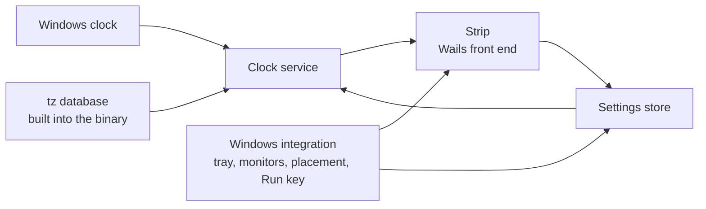

# TimeStrip: Requirements Specification

Status: draft for baselining. Section 11 records five open questions, each with a proposed answer.
Nothing in section 3 depends on an open question unless it says so.

Source: `TimeStrip-SPEC.md` (the initial product specification, 2026-09-27), plus three rulings
Oliver gave on 2026-09-27: the stack is Go with Wails; orientation is a setting offering both
horizontal and vertical; this document is written and baselined before any code.

---

## 1. Introduction

### 1.1 Purpose

TimeStrip is a small Windows desktop application showing a strip of clocks, one per chosen place in
the world. It answers one question at a glance: what time and what day is it where my friends are?

It shows places, never people. It is not a calendar, a meeting planner or a productivity tool.

### 1.2 Intended audience

Oliver Ernster as author and decision owner; contributors to the open source project.

### 1.3 Scope

**In scope:**

- A frameless strip of clocks, horizontal by default, vertical as a setting.
- Each clock showing its place, its local time, its local weekday and date plus a zone
  abbreviation or UTC offset, all derived from real time zone rules.
- Adding, editing, removing and reordering clocks, with a searchable list of places.
- Digital and analogue presentation; 12-hour and 24-hour time.
- Dragging the whole strip anywhere, including onto another monitor; restoring its monitor and
  position at the next launch; recovering it onto a visible display when its place has gone.
- A notification-area (tray) icon with a menu; optional Always on Top; optional Start with Windows.
- Light, dark and system themes.
- Local persistence in one human-readable file.

**Out of scope:**

| Item | Why |
|---|---|
| People, contacts or friend names | The spec: clocks represent places, not people |
| Calendars, meetings, reminders, alarms or time conversion tools | The spec's section 1 and closing paragraph |
| A second hand or seconds display | The spec's section 7: seconds are not central |
| Per-clock 12/24-hour format | The spec's section 7: a global preference until use shows otherwise |
| Wrapping clocks onto several rows or columns | The spec's section 19; overflow scrolls instead (FR-106) |
| Relative wording such as "tomorrow" or "+1 day" | The spec's section 14 prefers the local weekday and date |
| Any platform but Windows | The spec's section 20 |
| Languages other than English | Not asked for; weekday and month names are English |
| Network time synchronisation | Windows owns the clock; TimeStrip reads it (NFR-S-2) |
| Downloading time zone rule updates | Rules are built into the binary (CON-5, NFR-S-3) |
| Fixed UTC offsets as clocks | The spec's section 4 forbids them |

### 1.4 Definitions

| Term | Meaning, fixed for this document |
|---|---|
| **Clock** | One configured entry: a zone plus a label, at a position in the order. |
| **Zone** | An IANA time zone identifier such as `America/New_York`, resolved through the tz database built into the application. |
| **Label** | The place name a clock is shown by, such as `New York`. |
| **Default label** | The label derived from a zone id: its last segment with underscores read as spaces. `America/Argentina/Buenos_Aires` gives `Buenos Aires`. |
| **Strip** | The application's frameless window holding the clocks in order. |
| **Cell** | The part of the strip showing one clock. |
| **Orientation** | Horizontal (cells left to right) or vertical (cells top to bottom). |
| **Style** | Digital or analogue: how every cell presents its time. |
| **Format** | 12-hour or 24-hour: how every digital time and every textual time is written. |
| **Zone mark** | The text beside a label naming the zone's current abbreviation or UTC offset (FR-203). |
| **Local date** | The weekday, day and month at the clock's zone for the current instant. |
| **Work area** | A monitor's rectangle minus the taskbar and docked toolbars, as Windows reports it. |
| **Placement** | The monitor the strip is on plus the strip's position relative to that monitor's work area. |
| **Invalid clock** | A stored clock entry that cannot be used: its zone is not recognised or its fields cannot be read. |
| **Settings file** | `%APPDATA%\TimeStrip\settings.json`. |
| **DIP** | Device-independent pixel: one pixel at 100 percent Windows scaling. |

### 1.5 References

- `TimeStrip-SPEC.md`: the initial product specification.
- `ARCHITECTURE.md` (to be written): the layering invariants and the tests that enforce them.
- IANA tz database, as embedded by Go's `time/tzdata` package.
- ISO/IEC/IEEE 29148 for requirement quality; EARS for requirement syntax.
- WCAG 2.2, success criterion 1.4.3 (contrast minimum) and 1.4.1 (use of colour).

---

## 2. Overall description

### 2.1 Product perspective

A new, standalone application. It reads the Windows clock and nothing else from outside itself.

The clock service takes an instant and the configured clocks and answers, for each clock, the text
and hand angles to show. Everything about Windows sits below the integration line.

### 2.2 User classes

| Class | Description | May do | May not do |
|---|---|---|---|
| **User** | Talks with friends in other time zones and wants their time and day at a glance | Everything the application offers | Nothing is withheld; there is one class |

### 2.3 Operating environment

Windows 10 or 11, 64-bit, with the WebView2 runtime present (it ships with Windows 11). Go 1.26 with
Wails v2 hosting a React and TypeScript front end; no CGO. No network use at runtime.

Measured on 2026-09-27 against Wails v2.12.0 in the module cache:

- The Wails Windows manifest declares `permonitorv2,permonitor` DPI awareness.
- The Wails runtime offers no call that creates a second window; there is one window (CON-6).
- `ScreenGetAll` reports each screen's size plus primary and current flags only: no origin, no
  device name, no work area (CON-7).
- `WindowSetPosition` places the window relative to the work area of the monitor it is currently on,
  while `WindowGetPosition` answers absolute virtual-desktop coordinates (CON-7).

**The reference machine** for performance requirements is the development machine, to be read and
recorded at the first measured build.

### 2.4 Constraints

| ID | Constraint |
|---|---|
| CON-1 | The layering invariant `UI to Application to Domain from Infrastructure` holds and is enforced by `tests/structural`. |
| CON-2 | Every Go source file and every TypeScript and CSS file under `frontend/src` stays at or below 400 lines; one landing between 381 and 399 lines is reduced to 350 or fewer. Build and packaging scripts are not counted. |
| CON-3 | The coverage floor over `internal/domain` and `internal/application` stays at 100 percent. |
| CON-4 | `VERSION` is the single source of truth for the version. No version literal elsewhere. |
| CON-5 | Zones resolve through Go's `time.LoadLocation` with the `time/tzdata` package embedded, so no rule depends on files present on the machine. Measured 2026-09-27 with `ZONEINFO` pointed at a missing path: `America/New_York` answered EST in January and EDT in July; `Not/AZone` answered an error. No DST rule is written by hand. |
| CON-6 | The strip, its context menu and the Settings surface share one window, since Wails v2 offers one. Settings is shown by resizing that window to a settings layout and returning it to the strip afterwards. |
| CON-7 | Monitor enumeration, work areas, monitor identity and window placement go through Win32 (`EnumDisplayMonitors`, `GetMonitorInfoW`, `SetWindowPos`) in infrastructure, never through Wails' position calls. |
| CON-8 | Everything written stays per user: the settings file under `%APPDATA%` and the Start with Windows value under `HKCU`. Windows never asks for administrator rights. |

### 2.5 Assumptions

| ID | Assumption | Owner | Confirm by |
|---|---|---|---|
| ASM-1 | The Windows clock is correct; TimeStrip shows what it implies. | Oliver | Baselining |
| ASM-2 | Up to 12 clocks covers real use; beyond that the strip scrolls rather than grows (FR-106). The number sizes tests, not a limit. | Oliver | Baselining |
| ASM-3 | English weekday and month names suffice. | Oliver | Baselining |

---

## 3. Requirements

Every requirement below names the test planned to verify it. None is written yet; a `Verified by:`
line names a planned test until it exists and has been seen to fail without the implementation.

### 3.1 The strip

**FR-101 Frameless strip**
Priority: Must.
The strip shall be a window with no title bar, no system border and no taskbar button.
Rationale: the spec's sections 2 and 8; the tray is its presence (FR-501).
Verified by: inspection of the running build (section 12, check M-1).

**FR-102 Cells in configured order**
Priority: Must.
The strip shall show one cell per clock in ascending order of position, left to right when
horizontal and top to bottom when vertical.
Acceptance: Given clocks Sydney at position 0 and New York at position 1, when the strip is shown
horizontally, then Sydney's cell is left of New York's.
Verified by: planned `TestSnapshotFollowsClockOrder` (application); `strip.test.tsx`.

**FR-103 Orientation setting**
Priority: Should.
The strip shall lay its cells out in the orientation held in settings; horizontal when none is held.
Rationale: Oliver, 2026-09-27: both orientations, as a setting.
Verified by: planned `TestOrientationDefaultsToHorizontal` (domain); `strip.test.tsx`.

**FR-104 Changing orientation keeps the strip on screen**
Priority: Should.
When the orientation changes, the application shall keep the strip's top-left corner where it was,
then apply the recovery of FR-405 so the whole strip lies inside its monitor's work area.
Verified by: planned `TestOrientationChangeClampsIntoWorkArea` (application).

**FR-105 Strip sized to its clocks**
Priority: Must.
The strip's length along its orientation shall equal the sum of its cells' lengths plus its padding,
while that sum fits the work area of its monitor.
Verified by: planned `TestStripLengthFollowsClockCount` (domain, placement).

**FR-106 Overflow scrolls**
Priority: Must.
If the strip's cells need more length than the monitor's work area offers along the orientation,
then the application shall size the strip to that work area and scroll the cells along the
orientation, never clipping a cell out of reach and never wrapping to a second row or column.
Acceptance: Given a work area 1920 DIP wide and 12 horizontal cells needing 2400 DIP, then the strip
is 1920 DIP long and the last cell is reachable by scrolling.
Verified by: planned `TestStripNeverExceedsWorkArea` (domain); `strip.test.tsx` for the scroll.

**FR-107 Empty strip**
Priority: Must.
While no clock is configured, the strip shall show one cell reading `No clocks yet` with an `Add clock`
control opening the place search of FR-302.
Verified by: `strip.test.tsx`.

**FR-108 Context menu**
Priority: Should.
When the strip is right-clicked, the application shall offer `Add clock`, `Settings`, `Always on top`
(showing its state) and `Hide strip`.
Verified by: `contextMenu.test.tsx`.

### 3.2 Time and date

**FR-201 Local time per clock**
Priority: Must.
The clock service shall compute each clock's local time by converting the current instant to that
clock's zone through the tz database of CON-5.
Acceptance: Given the instant 2026-09-27T01:37:00Z, then `America/New_York` shows 21:37 and
`Australia/Sydney` shows 11:37.
Verified by: planned `TestLocalTimeInDistantZones` (domain).

**FR-202 Local date per clock**
Priority: Must.
Each cell shall show the weekday, day and month in its own zone, written `Sunday, 27 September`,
never the user's own date.
Acceptance: Given the instant 2026-09-27T20:37:00Z, then New York reads `Sunday, 27 September` while
Sydney reads `Monday, 28 September`.
Note: the spec's section 3 pairs New York 21:37 with Sydney 06:37; no single instant gives that pair,
since the two are 14 hours apart in late September (measured 2026-09-27). This example uses a pair
that occurs: New York 16:37, Sydney 06:37.
Verified by: planned `TestLocalDateCrossesMidnightByZone` (domain).

**FR-203 Zone mark**
Priority: Must.
Each cell shall show a zone mark: the zone's current abbreviation where the tz database gives one of
letters; otherwise `UTC` followed by the signed offset in hours, with minutes only when non-zero.
Acceptance, from values measured on 2026-09-27: New York in July reads `EDT`; São Paulo reads
`UTC-3`; Kathmandu reads `UTC+5:45`.
Verified by: planned `TestZoneMarkPrefersLettersElseOffset` (domain).

**FR-204 Daylight saving follows the rules**
Priority: Must.
The clock service shall take every offset and abbreviation from the tz database at the instant
being shown, holding no offset of its own.
Acceptance: Given `America/New_York`, the instant 2026-03-08T06:59:00Z reads `01:59 EST` and
2026-03-08T07:00:00Z reads `03:00 EDT`.
Verified by: planned `TestDaylightSavingTransitionIsFollowed` (domain).

**FR-205 Year boundary**
Priority: Must.
Each cell shall show its own zone's date across a year boundary.
Acceptance: Given the instant 2026-12-31T12:00:00Z, then `Pacific/Kiritimati` reads
`Friday, 1 January` while `America/Los_Angeles` reads `Thursday, 31 December`.
Verified by: planned `TestYearBoundaryDiffersByZone` (domain).

**FR-206 Time format**
Priority: Must.
Where the format is 24-hour, a time shall be written with two-digit hours (`06:37`, `21:37`); where
it is 12-hour, with unpadded hours plus `AM` or `PM` (`6:37 AM`, `9:37 PM`, `12:00 AM` at midnight,
`12:00 PM` at noon).
Verified by: planned `TestTwelveAndTwentyFourHourFormats` (domain).

**FR-207 Injected instant**
Priority: Must.
The clock service shall take the instant as an argument; no domain or application code shall read
the wall clock.
Verified by: `tests/structural` domain purity test, proved by a planted `time.Now()`.

**FR-208 Minute-aligned updates**
Priority: Must.
While the strip is shown, the application shall refresh every cell at each minute boundary of the
Windows clock, scheduling each refresh from the current time rather than from the last refresh.
Verified by: planned `TestNextRefreshIsTheNextMinuteBoundary` (application); NFR-P-2.

**FR-209 Clock change and resume**
Priority: Must.
When Windows reports a system time change, a time zone change or a resume from sleep, the
application shall refresh every cell and reschedule the next minute boundary.
Verified by: section 12, check M-5 (a person changes the clock and sleeps the machine).

### 3.3 Clock configuration

**FR-301 Add a clock**
Priority: Must.
When the user chooses a place from the place search, the application shall append a clock for its
zone with the default label and persist it.
Verified by: planned `TestAddingAClockAppendsItWithTheDefaultLabel` (application).

**FR-302 Place search**
Priority: Must.
The place search shall list every canonical zone of the embedded tz database by default label and
region, filtering as the user types by case-insensitive substring over the default label, the zone
id and the country name.
Acceptance: typing `york` offers `New York (America/New_York)`; typing `kolkata` offers `Kolkata`.
Note: whether cities without a zone of their own (Manchester, Toronto's suburbs) are searchable
depends on OQ-1.
Verified by: planned `TestPlaceSearchMatchesLabelZoneOrCountry` (application).

**FR-303 Edit a clock's label**
Priority: Must.
When the user edits a clock's label, the application shall store the new label; if the label is
empty after trimming spaces, then it shall store the default label instead.
Verified by: planned `TestEmptyLabelFallsBackToDefault` (application).

**FR-304 Edit a clock's zone**
Priority: Must.
When the user chooses a different place for an existing clock, the application shall replace its
zone, keep its position and replace its label only if the label was the old zone's default label.
Verified by: planned `TestChangingZoneKeepsACustomLabel` (application).

**FR-305 Remove a clock**
Priority: Must.
When the user confirms removal of a clock named in a confirmation prompt, the application shall
remove it and close the gap in the order.
Verified by: planned `TestRemovingAClockClosesTheGap` (application); `clocks.test.tsx` for the
prompt.

**FR-306 Reorder clocks**
Priority: Must.
The Clocks list in Settings shall reorder clocks by dragging a row and by `Move up` / `Move down`
controls reachable from the keyboard; the new order shall be persisted.
Rationale: dragging on the strip itself moves the window (FR-401), so reordering lives where a drag
cannot be mistaken for a move; the spec's section 10.
Verified by: planned `TestMovingAClockPersistsTheOrder` (application); `clocks.test.tsx`.

**FR-307 Label length**
Priority: Should.
A label shall hold at most 32 characters; a cell too narrow for its label shall end it with an
ellipsis and show the whole label as a tooltip.
Rationale: 32 is Claude's proposal, sized to keep a cell compact.
Verified by: planned `TestLabelIsCappedAt32Characters` (domain); `cell.test.tsx`.

**FR-308 Duplicate zones permitted**
Priority: Could.
The application shall accept a clock whose zone another clock already uses.
Rationale: two labels for one zone (`London`, `Brighton`) are a legitimate choice.
Verified by: planned `TestTheSameZoneMayBeAddedTwice` (application).

### 3.4 Dragging and placement

**FR-401 Whole-strip drag**
Priority: Must.
When the user presses the primary button on any part of the strip that is not a control and moves
further than the Windows drag threshold (`SM_CXDRAG`, `SM_CYDRAG`), the application shall move the
whole strip with the pointer, onto any monitor.
Verified by: section 12, check M-2.

**FR-402 Controls do not drag**
Priority: Must.
A press on a control (a button, the scroll bar, a menu) shall not start a drag.
Verified by: `strip.test.tsx` for the drag regions; check M-2.

**FR-403 Default placement**
Priority: Must.
While no placement is stored, the application shall place the strip on the primary monitor with its
right edge 16 DIP inside the work area's right edge, centred vertically in the work area.
Rationale: the spec's section 8; 16 DIP is Claude's proposal.
Verified by: planned `TestDefaultPlacementIsRightEdgeCentred` (domain).

**FR-404 Placement persisted**
Priority: Must.
When a drag ends, the application shall persist the placement: the monitor's device name, its work
area, its DPI and the strip's offset from that work area's top-left corner.
Verified by: planned `TestPlacementIsStoredRelativeToItsMonitor` (application).

**FR-405 Placement restored or recovered**
Priority: Must.
At launch, the application shall restore the strip to the stored monitor, scaling the stored offset
by the ratio of the monitor's current DPI to its stored DPI. If the stored monitor is not present,
then it shall use the primary monitor with the default placement of FR-403. If any part of the strip
would lie outside the chosen monitor's work area, then it shall move the strip the least distance
that brings it wholly inside.
Acceptance: Given a strip stored at offset (1700, 500) on `\\.\DISPLAY2` and only `\\.\DISPLAY1`
present, when launched, then the strip is at the default placement on `\\.\DISPLAY1`.
Verified by: planned `TestMissingMonitorFallsBackToPrimary`,
`TestOffscreenPlacementIsClampedIntoWorkArea` and `TestDpiChangeScalesTheOffset` (domain).

**FR-406 Display changes while running**
Priority: Must.
When Windows reports a display configuration change while the strip is shown, the application shall
apply the recovery of FR-405 to the strip's current position.
Verified by: planned `TestDisplayChangeRecoversAStripLeftOffscreen` (application); check M-3.

**FR-407 Scaling across monitors**
Priority: Must.
The strip shall keep its size in DIP when moved between monitors with different scaling, with text
drawn at the destination monitor's resolution.
Verified by: section 12, check M-3.

### 3.5 Tray and window behaviour

**FR-501 Tray icon**
Priority: Must.
While the application runs, it shall show a notification-area icon with the tooltip `TimeStrip`.
Verified by: check M-4.

**FR-502 Tray menu**
Priority: Must.
When the tray icon is right-clicked, the application shall offer `Show strip` or `Hide strip`
(whichever applies), `Add clock`, `Settings`, `Always on top` (showing its state) and `Exit`.
Verified by: planned `TestTrayMenuNamesTheOppositeOfTheVisibility` (application); check M-4.

**FR-503 Tray click**
Priority: Should.
When the tray icon is left-clicked, the application shall toggle the strip's visibility.
Verified by: check M-4.

**FR-504 Hide is not exit**
Priority: Must.
Hiding the strip shall leave the application running with its tray icon; only `Exit` ends it.
Note: what `Alt+F4` does on the strip is OQ-4.
Verified by: check M-4.

**FR-505 Always on Top**
Priority: Must.
Where Always on Top is on, the strip shall stay above windows that are not themselves topmost; the
setting shall be off by default and persisted.
Verified by: planned `TestAlwaysOnTopDefaultsOffAndPersists` (application); check M-4.

**FR-506 One instance**
Priority: Must.
If TimeStrip is launched while it is already running for the same Windows user, then the new
process shall show the running strip and exit.
Verified by: check M-6.

### 3.6 Settings and startup

**FR-601 Settings content**
Priority: Must.
Settings shall offer: style (digital, analogue); format (12-hour, 24-hour); orientation
(horizontal, vertical); theme (system, light, dark); Always on Top; Start with Windows; the Clocks
list of FR-306. Nothing else.
Verified by: `settings.test.tsx`.

**FR-602 Settings apply at once**
Priority: Must.
When a setting changes, the application shall apply it to the strip and persist it without a Save
step.
Verified by: planned `TestChangingASettingPersistsIt` (application).

**FR-603 Analogue style**
Priority: Must.
Where the style is analogue, each cell shall show a dial with hour and minute hands for the local
time plus the label, zone mark and local date as text.
Verified by: planned `TestHandAnglesForLocalTime` (domain); `cell.test.tsx`.

**FR-604 Digital style**
Priority: Must.
Where the style is digital, the time shall be the largest text in each cell.
Verified by: `cell.test.tsx` (computed font sizes).

**FR-605 Start with Windows**
Priority: Should.
When Start with Windows is turned on, the application shall write the value `TimeStrip` under
`HKCU\Software\Microsoft\Windows\CurrentVersion\Run` holding its own quoted path; when turned off, it
shall delete that value. It shall be off by default and never written without the user turning it on.
Note: the launch arguments depend on OQ-2.
Verified by: planned `TestStartWithWindowsWritesAndRemovesOneValue` (infrastructure).

**FR-606 Theme**
Priority: Should.
Where the theme is system, the strip shall follow the Windows app theme as it changes; light and dark
shall hold regardless of Windows.
Verified by: `theme.test.tsx`; check M-7.

### 3.7 Persistence and recovery

**FR-701 Settings file**
Priority: Must.
The application shall keep its settings in the settings file as indented JSON holding style, format,
orientation, theme, Always on Top, placement and clocks; each clock holding a stable id, its zone id,
its label and its position. Derived values (offset, abbreviation, time, date) shall not be stored.
Verified by: planned `TestSettingsRoundTrip` and `TestNoDerivedValueIsStored` (infrastructure).

**FR-702 Atomic writes**
Priority: Must.
The application shall write the settings file to a temporary file in the same folder and replace the
old file with it, so a crash mid-write leaves the previous file intact.
Verified by: planned `TestWriteReplacesAtomically` (infrastructure).

**FR-703 First run**
Priority: Must.
If the settings file does not exist, then the application shall start with default settings and no
clocks, write nothing until something changes and report no problem.
Verified by: planned `TestAbsentFileMeansDefaults` (infrastructure).

**FR-704 Unreadable file**
Priority: Must.
If the settings file exists but is not valid JSON, then the application shall rename it to
`settings.unreadable.json`, start with default settings and show on the strip `Settings could not be
read; the old file was kept as settings.unreadable.json`.
Verified by: planned `TestUnreadableFileIsKeptAsideAndReported` (infrastructure).

**FR-705 One bad clock**
Priority: Must.
If one clock entry cannot be read or names a zone the tz database does not recognise, then the
application shall load every other clock, keep the bad entry in the file unchanged and show it as an
invalid clock.
Acceptance: Given three clocks where the second names `Not/AZone`, then the first and third show
their times and the second reads `Unknown time zone: Not/AZone`.
Verified by: planned `TestOneBadClockLeavesTheOthersWorking` (infrastructure, application).

**FR-706 Invalid clock shown for repair**
Priority: Must.
An invalid clock shall keep its place in the order, show its stored label (else its stored zone
text) with the words `Unknown time zone` and offer `Edit` and `Remove` in Settings. The application
shall never substitute another zone.
Verified by: `cell.test.tsx`; planned `TestInvalidClockIsNeverGivenAnotherZone` (application).

**FR-707 Write failure**
Priority: Must.
If the settings file cannot be written, then the application shall keep running with the change in
effect and show `Settings could not be saved:` followed by the reason, until a later write succeeds.
Verified by: planned `TestWriteFailureIsReportedAndCleared` (application).

### 3.8 Non-functional

| ID | Requirement | Method |
|---|---|---|
| NFR-P-1 | From launch to the strip showing current times shall take at most 1.5 s on the reference machine. | Timed from the log's first line to the first snapshot, median of 5 launches |
| NFR-P-2 | While running normally, each cell shall show the new minute within 1 s after the Windows clock reaches it. | Log timestamps against the refresh, over 10 boundaries |
| NFR-P-3 | After a resume or a system time change, every cell shall be correct within 2 s. | Check M-5 |
| NFR-P-4 | While shown, the application shall schedule no periodic timer more frequent than once per minute. | Inspection plus a structural test over the front end's timer calls |
| NFR-U-1 | Label, time, date and zone mark text shall meet a contrast ratio of at least 4.5:1 against the cell in both themes. | Theme token contrast test |
| NFR-U-2 | No state shall be told by colour alone; an invalid clock carries words (FR-706). | Inspection |
| NFR-U-3 | Every control in Settings and the place search shall be reachable and operable from the keyboard, with a visible focus indicator on the focused control. | `settings.test.tsx`; check M-8 |
| NFR-U-4 | Every icon-only control shall carry an accessible name and a tooltip. | `a11y.test.tsx` |
| NFR-U-5 | Interactive targets shall be at least 24 by 24 DIP. | Inspection; WCAG 2.2 criterion 2.5.8 |
| NFR-S-1 | The application shall make no network request. | Structural test forbidding any `net` or `net/http` import in the module |
| NFR-S-2 | The application shall not change the Windows clock or time zone. | Inspection |
| NFR-S-3 | Non-claim: time zone rules are those of the tz database embedded at build time. A rule change made by a government after the build is shown only after a new release. The README states this. | Inspection of the README |
| NFR-M-1 | The coverage floor of CON-3, the size limit of CON-2 and the layering of CON-1 are enforced by `test.ps1`, which `build.ps1` runs first with no switch to skip it. | `build.ps1` |
| NFR-M-2 | Go code passes gofmt, go vet and staticcheck; the front end passes eslint, `tsc --noEmit` and Vitest. | `test.ps1` |
| NFR-O-1 | The application shall write a log to `%APPDATA%\TimeStrip\TimeStrip.log` recording launch, placement recovery decisions, settings failures and invalid clocks; standard error is pointed at it before anything can fail. | Planned `TestLogReceivesStandardError` (infrastructure) |

---

## 4. Documents

README.md, ARCHITECTURE.md, TESTING.md and DEVELOPMENT.md, ported in shape from BridgeTalk, are
written with the first build and kept true by the docs pass.

---

## 5. Delivery

`build.ps1` reads `VERSION` into the binary, runs `test.ps1` first and builds with `wails build`.
Whether a setup program is part of the first release is OQ-3.

---

## 6. Architecture sketch

Proposed, to be fixed in ARCHITECTURE.md:

| Layer | Package | Holds |
|---|---|---|
| Domain | `internal/domain/clock` | Clock, zone mark rule, time and date formatting, hand angles; takes an instant |
| Domain | `internal/domain/placement` | Monitors as rectangles, default placement, DPI scaling, recovery by clamping |
| Domain | `internal/domain/settings` | Settings value, defaults, clock order operations |
| Application | `internal/application` | Use cases: snapshot, add, edit, remove, move, change setting, place, recover; ports for store, monitors, startup entry, zone catalogue |
| Infrastructure | `internal/infrastructure/store` | JSON settings file, atomic write, tolerant clock decoding |
| Infrastructure | `internal/infrastructure/zones` | Zone resolution through `time/tzdata`; the place catalogue |
| Infrastructure | `internal/infrastructure/windows` | Monitors, `SetWindowPos`, drag, tray, Run key, time change and resume messages |
| UI | `frontend/` | The strip, the cells in both styles, Settings, the place search |

---

## 7. Silence check

| Situation | Answered by |
|---|---|
| First run with no data | FR-703, FR-107 |
| Largest plausible input | FR-106 (scrolling), FR-307 (label length) |
| Interrupted write | FR-702 |
| Settings file damaged | FR-704, FR-705 |
| Disk not writable | FR-707 |
| Second launch | FR-506 |
| Time moving backwards or the zone changing | FR-209 |
| Monitor removed or scaling changed | FR-405, FR-406, FR-407 |
| Upgrade from a previous version | The settings file carries a `version` field from the first release; an unknown later field is kept on write |
| No permission | CON-8: nothing needs elevation |

---

## 8. Build order

Built inside out: domain, then application, then infrastructure, then the user interface. Every
action that changes what the application does (add, edit, remove, move, change a setting, place,
recover, snapshot) is executable from a Go test with no window open before the front end is built.

1. Domain: clock formatting and zone marks against fixed instants; placement recovery.
2. Application: the use cases over faked ports.
3. Infrastructure: the settings store, the zone catalogue, the Windows integration.
4. User interface: the strip in digital style, then dragging and placement, then Settings, the tray,
   the analogue style and the vertical orientation.
5. Hardening against section 12's checks on real hardware; then artwork and polish.

---

## 9. Prioritisation

| Priority | Content |
|---|---|
| **Must** | FR-101, FR-102, FR-105 to FR-107, FR-201 to FR-209, FR-301 to FR-306, FR-401 to FR-407, FR-501, FR-502, FR-504 to FR-506, FR-601 to FR-604, FR-701 to FR-707, NFR-P-1 to NFR-P-4, NFR-U-1 to NFR-U-5, NFR-S-1 to NFR-S-3, NFR-M-1, NFR-M-2, NFR-O-1 |
| **Should** | FR-103, FR-104, FR-108, FR-307, FR-503, FR-605, FR-606 |
| **Could** | FR-308 |
| **Won't this time** | Everything in the out-of-scope table of section 1.3 |

---

## 10. Traceability

The spec's first-useful-release criteria, mapped:

| Spec criterion | Requirements |
|---|---|
| 1 Launch on Windows | FR-101, NFR-P-1 |
| 2 Add several places | FR-301, FR-302 |
| 3 Current local times together | FR-102, FR-201 |
| 4 Correct local weekday and date | FR-202, FR-205 |
| 5 DST automatic | FR-204, CON-5 |
| 6 Compact horizontal frameless strip | FR-101, FR-105 |
| 7 Drag anywhere | FR-401, FR-402 |
| 8 Onto another monitor | FR-401, FR-407 |
| 9 Restart restores clocks, order, display, position | FR-404, FR-405, FR-701 |
| 10 Add, edit, remove, reorder | FR-301, FR-303 to FR-306 |
| 11 Digital or analogue | FR-603, FR-604 |
| 12 12-hour or 24-hour | FR-206 |
| 13 Optional Always on Top | FR-505 |
| 14 Tray control | FR-501 to FR-504 |
| 15 Survive monitor changes | FR-405, FR-406 |

No requirement is considered met until its test exists and has been seen to fail without the
implementation; where no test can hold it, its `Verified by:` line names the check in section 12.

---

## 11. Open questions

| ID | Question | Proposed answer | Owner |
|---|---|---|---|
| OQ-1 | Should the place search find cities that have no zone of their own (Manchester, Brighton, Toronto suburbs)? That needs a city list such as GeoNames `cities15000` (CC BY 4.0, about 26,000 entries) built into the binary. | No for the first release: search tz zone names and country names; any label can be typed freely afterwards (FR-303). | Oliver |
| OQ-2 | When started by Windows at sign-in, should the strip show at once or wait in the tray? | Show at once: the strip is the product. | Oliver |
| OQ-3 | Is a setup program (the house Wails installer) part of the first release? The alternative is a single executable. | Single executable first; the setup program follows once the strip is proven. | Oliver |
| OQ-4 | What does `Alt+F4` on the strip do? | Hide the strip, as `Hide strip` does; `Exit` stays in the tray. | Oliver |
| OQ-5 | Is the vertical orientation needed for the first useful release? It could follow directly after. | Follow directly after: it is Should in section 9. | Oliver |

---

## 12. Checks a person settles

| ID | Check |
|---|---|
| M-1 | The strip shows with no title bar, border or taskbar button. |
| M-2 | Dragging empty strip area moves it; pressing a control does not; a small wobble does not. |
| M-3 | Dragged onto a monitor with different scaling, the strip keeps its size and stays crisp; unplugging that monitor brings it back onto a visible one. |
| M-4 | The tray icon, its menu, left click, Always on Top and Exit behave as FR-501 to FR-505 say. |
| M-5 | Changing the Windows clock, changing the time zone and sleeping then waking the machine each leave every cell correct within 2 s. |
| M-6 | Launching a second copy shows the first and leaves one tray icon. |
| M-7 | Switching the Windows theme while on system theme recolours the strip. |
| M-8 | Settings and the place search can be driven entirely from the keyboard. |
