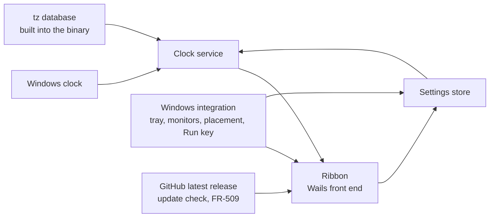

# TimeRibbon: Requirements Specification

Status: baselined by Oliver on 2026-09-27. Section 11 records the rulings that closed its open
questions; it holds none at present. Later changes arrive as dated amendments.

Amendment 2 (Oliver, 2026-09-27): Help, About and Licence (FR-508, FR-607 to FR-609) plus the
self-reading licence in setup (FR-811); CON-6, FR-108 and FR-502 carry notes of it.

Amendment 3 (Oliver, 2026-09-27): the web view's data moves inside `%APPDATA%\TimeRibbon` (FR-806).

Amendment 4 (Oliver, 2026-09-27): with 1.0.0 the settings file becomes a contract (NFR-C-1).

Amendment 5 (Oliver, 2026-09-27): the right-click menu gains `Exit` (FR-108); each setup screen opens
with nothing focused rather than on its lead action (FR-809).

Amendment 6 (Oliver, 2026-09-27): the ribbon runs in time order east from Greenwich, the reference,
worked out at each snapshot (FR-102); ordering by hand is withdrawn (FR-306).

Amendment 7 (Oliver, 2026-09-27): a ribbon whose length changes is re-centred along it on its
display, keeping its position across (FR-104).

Amendment 8 (Oliver, 2026-09-28): the Position submenu centres the ribbon on an edge (FR-408);
clocks come large or small (FR-610); the Settings header stays in place (FR-601).

Amendment 9 (Oliver, 2026-09-28): style and orientation move from Settings to the menus; each
orientation has a home edge the ribbon goes to when it is chosen (FR-409).

Amendment 10 (Oliver, 2026-09-28): the default place is flush against the home edge (FR-403).

Amendment 11 (Oliver, 2026-09-28): the product is renamed TimeRibbon over a trademark concern and
its window is the ribbon. Nothing carries over from the former name, which starts a new major
version (NFR-C-1).

Amendment 12 (Oliver, 2026-09-28): colour schemes, Neon among them, chosen from a Colour submenu
(FR-611).

Amendment 13 (Oliver, 2026-09-28): TimeRibbon runs on macOS (Apple Silicon, delivered as a signed
and notarised DMG) and Linux (delivered as a Flatpak) as well as Windows. Off Windows it keeps a real
tray icon; on Linux it runs through X11. The sign-in entry is named in each platform's words. On
macOS the drag distance is Windows' 4 DIP and a click on the menu bar icon opens its menu; on Linux
the tray host's activation shows or hides the ribbon. Section 1.3, section 2.3, CON-7, CON-8,
FR-401, FR-503, FR-605, FR-607, NFR-O-1, section 5 and section 12 carry notes of it.

Amendment 14 (Oliver, 2026-09-28): five more colour schemes (Amber, Ruby, Indigo, Berry, Contrast);
Neon gains a light side, so every scheme follows the theme; Ocean is redrawn to read as the sea rather
than as Classic; each scheme's hue is carried by the colours the ribbon itself paints (FR-611).

Amendment 15 (Oliver, 2026-09-28): an update check against GitHub's releases (FR-509), which is the
application's one network request; NFR-S-1 is restated to allow it and nothing else. Help gains
`Check for updates` (FR-508); the settings file gains the skipped release (NFR-C-1 allows the key).

Amendment 16 (Oliver, 2026-09-28): a date format chosen in Settings (FR-612): the day and month in
words either way round; else the short weekday with the whole date in numbers, day, month or year
first, separated by slashes. The settings file gains the choice (NFR-C-1 allows the key).

Amendment 17 (Oliver, 2026-09-28): launching TimeRibbon while it runs toggles the ribbon rather
than only showing it (FR-506), so a Stream Deck button can both show and hide it.

Amendment 18 (Oliver, 2026-09-28): the ribbon can be unpinned (FR-613). Unpinned, it shrinks to a
thin tab in the scheme's accent on its side nearer the display's edge (FR-614), opens while the
pointer rests on the tab (FR-615) and shrinks again a second after the pointer leaves (FR-616); it
stays on top (FR-617) and counts as shown (FR-618). NFR-U-5 exempts the tab. Section 1.3, FR-108,
FR-502, FR-506, FR-611 and FR-701 carry notes of it; the settings file gains the pin (NFR-C-1
allows the key). Section 11 records the four rulings behind it (OQ-6 to OQ-9).

Amendment 19 (Oliver, 2026-09-29): the pin chosen and the pin in effect are told apart. An unpinned
ribbon collapses only while flush against an edge of its display's work area that runs along its
orientation, inner edges between displays included (FR-619); anywhere else it shows and behaves as
pinned while the choice stays unpinned, so dragging it back onto an edge brings the tab back by
itself. A drop within 16 DIP of such an edge snaps flush (FR-410). The last edge it stood flush
against is remembered (FR-411); unticking `Pin ribbon` away from every edge moves the ribbon to the
centre of that edge (FR-613). The tab covers the flush side (FR-614, reversing OQ-6). FR-616 and
FR-617 now apply to a ribbon unpinned in effect. The settings file gains the remembered edge
(NFR-C-1 allows the key). Section 11 records the rulings (OQ-6 reversed, OQ-10 to OQ-12).

Amendment 20 (Oliver, 2026-09-29): a sun map (section 3.9, FR-901 to FR-912): a photographic world
map lit by day and dark by night with city lights, each clock's zone city marked in red, below or
above a horizontal ribbon and in a pull out beside a vertical one, turned on or off from both menus
and Settings. NFR-P-5 and NFR-C-2 measure it; ASM-5 holds the imagery's licence until confirmed. The
settings file gains the sun map and pull out choices (NFR-C-1 allows the keys). Section 11 records
the rulings (OQ-13 to OQ-18).

Source: the initial product specification of 2026-09-27, written under the product's former name,
plus Oliver's rulings of 2026-09-27: the stack is Go with Wails; orientation is a setting offering
both horizontal and vertical, both in the first release; a setup program ships with the first
release; this document is baselined before any code.

---

## 1. Introduction

### 1.1 Purpose

TimeRibbon is a small Windows desktop application showing a ribbon of clocks, one per chosen place in
the world. It answers one question at a glance: what time and what day is it where my friends are?

It shows places, never people. It is not a calendar, a meeting planner or a productivity tool.

Amendment 13 (Oliver, 2026-09-28): it runs on macOS and Linux as well as Windows.

### 1.2 Intended audience

Oliver Ernster as author and decision owner; contributors to the open source project.

### 1.3 Scope

**In scope:**

- A frameless ribbon of clocks, vertical by default, horizontal as a choice; either can be centred
  on an edge of its display.
- Each clock showing its place, its local time, its local weekday and date plus a zone
  abbreviation or UTC offset, all derived from real time zone rules.
- Adding, editing and removing clocks, with a searchable list of places; the ribbon keeps them in
  time order.
- Digital and analogue presentation, in large or small clocks; 12-hour and 24-hour time.
- Dragging the whole ribbon anywhere, including onto another monitor; restoring its monitor and
  position at the next launch; recovering it onto a visible display when its place has gone.
- A notification-area (tray) icon with a menu; optional Always on Top; optional Start with Windows.
- An unpinned ribbon that waits as a thin tab on the edge it stands against and opens while the
  pointer rests on it (FR-613 to FR-619); a drop near an edge snaps flush (FR-410).
- An optional world map beside the ribbon, lit by day and dark by night with city lights, each
  clock's place marked (FR-901 to FR-912).
- Light, dark and system themes, in ten colour schemes (FR-611).
- A check for a newer release on GitHub, the application's one network request (FR-509).
- Local persistence in one human-readable file.
- A setup program that installs, updates, repairs and removes the application for one user
  (section 5).

**Out of scope:**

| Item | Why |
|---|---|
| People, contacts or friend names | The spec: clocks represent places, not people |
| Calendars, meetings, reminders, alarms or time conversion tools | The spec's section 1 and closing paragraph |
| A second hand or seconds display | The spec's section 7: seconds are not central |
| Per-clock 12/24-hour format | The spec's section 7: a global preference until use shows otherwise |
| Wrapping clocks onto several rows or columns | The spec's section 19; overflow scrolls instead (FR-106) |
| Relative wording such as "tomorrow" or "+1 day" | The spec's section 14 prefers the local weekday and date |
| Any platform but Windows | The spec's section 20. Withdrawn by Amendment 13: macOS and Linux are in scope |
| Languages other than English | Not asked for; weekday and month names are English |
| Network time synchronisation | Windows owns the clock; TimeRibbon reads it (NFR-S-2) |
| Downloading time zone rule updates | Rules are built into the binary; macOS and Linux read the system's zone files first (CON-5, NFR-S-3) |
| Fixed UTC offsets as clocks | The spec's section 4 forbids them |
| Opening an unpinned ribbon by touch | A touch screen reports no resting pointer; pinned, the default, serves it. Claude's proposal, Amendment 18 |
| Moving a clock's mark to its real town | Amendment 20 (OQ-17): the mark is the zone's city; a label naming another town is not looked up |
| Zooming, panning or another projection of the sun map | Amendment 20: one whole-world map at the ribbon's length |
| Live satellite or cloud imagery, weather, the moon | Amendment 20: nothing is fetched (FR-911, NFR-S-1) |

### 1.4 Definitions

| Term | Meaning, fixed for this document |
|---|---|
| **Clock** | One configured entry: a zone plus a label, at a position in the order. |
| **Zone** | An IANA time zone identifier such as `America/New_York`, resolved as CON-5 describes. |
| **Label** | The place name a clock is shown by, such as `New York`. |
| **Default label** | The label derived from a zone id: its last segment with underscores read as spaces. `America/Argentina/Buenos_Aires` gives `Buenos Aires`. |
| **Ribbon** | The application's frameless window holding the clocks in order. |
| **Cell** | The part of the ribbon showing one clock. |
| **Orientation** | Horizontal (cells left to right) or vertical (cells top to bottom). |
| **Style** | Digital or analogue: how every cell presents its time. |
| **Format** | 12-hour or 24-hour: how every digital time and every textual time is written. |
| **Sun map** | The world map lit by day and dark by night shown with the ribbon (section 3.9). |
| **Pull out** | The sun map beside a vertical ribbon, opened and closed by its handle (FR-903). |
| **Zone mark** | The text beside a label naming the zone's current abbreviation or UTC offset (FR-203). |
| **Local date** | The weekday, day and month at the clock's zone for the current instant. |
| **Work area** | A monitor's rectangle minus the taskbar and docked toolbars, as Windows reports it. |
| **Placement** | The monitor the ribbon is on plus the ribbon's position relative to that monitor's work area. |
| **Invalid clock** | A stored clock entry that cannot be used: its zone is not recognised or its fields cannot be read. |
| **Settings file** | `%APPDATA%\TimeRibbon\settings.json`. |
| **Pinned** | The ribbon always shows in full while shown; the default. Unpinned, it collapses (FR-613). |
| **Tab** | The 8 DIP accent band an unpinned ribbon shrinks to (FR-614). |
| **Collapsed** | Unpinned and showing only its tab; **expanded** is unpinned and showing in full. |
| **DIP** | Device-independent pixel: one pixel at 100 percent Windows scaling. |

### 1.5 References

- The initial product specification of 2026-09-27, written under the product's former name.
- `ARCHITECTURE.md`: the layering invariants and the tests that enforce them.
- IANA tz database, as embedded by Go's `time/tzdata` package.
- ISO/IEC/IEEE 29148 for requirement quality; EARS for requirement syntax.
- WCAG 2.2, success criterion 1.4.3 (contrast minimum) and 1.4.1 (use of colour).

---

## 2. Overall description

### 2.1 Product perspective

A new, standalone application. It reads the Windows clock and nothing else from outside itself,
apart from the latest release it asks GitHub for (FR-509, Amendment 15).

The clock service takes an instant and the configured clocks and answers, for each clock, the text
and hand angles to show. Everything about Windows sits below the integration line.

### 2.2 User classes

| Class | Description | May do | May not do |
|---|---|---|---|
| **User** | Talks with friends in other time zones and wants their time and day at a glance | Everything the application offers | Nothing is withheld; there is one class |

### 2.3 Operating environment

Windows 10 or 11, 64-bit, with the WebView2 runtime present (it ships with Windows 11). Go 1.26 with
Wails v2 hosting a React and TypeScript front end; no CGO. Its one network use at runtime is the
update check (FR-509, Amendment 15).

Measured on 2026-09-27 against Wails v2.12.0 in the module cache:

- The Wails Windows manifest declares `permonitorv2,permonitor` DPI awareness.
- The Wails runtime offers no call that creates a second window; there is one window (CON-6).
- `ScreenGetAll` reports each screen's size plus primary and current flags only: no origin, no
  device name, no work area (CON-7).
- `WindowSetPosition` places the window relative to the work area of the monitor it is currently on,
  while `WindowGetPosition` answers absolute virtual-desktop coordinates (CON-7).

Measured on 2026-09-28 with a throwaway Wails v2.12.0 probe on Windows 11 at 100 percent, for the
tab of FR-614 (ASM-4):

- A frameless Wails window keeps `WS_CAPTION`, `WS_SYSMENU` and `WS_MINIMIZEBOX` (style
  `0x4ca0000`), which hold it at least 42 px wide: an 8 px `SetWindowPos` gave 42, the surplus
  hanging off the display's edge. Neither removing `WS_THICKFRAME` nor setting Wails' `MinWidth` to 1
  changed that. With those three styles removed, the same call gave 8 px and the page read an
  `innerWidth` of 8. That settles the width alone: the window is still overlapped, which Windows
  holds at least 39 px tall (`SM_CYMINTRACK`), so a horizontal tab stood 39 tall (Oliver, measured
  the same day on the built app: asked for 8, 20 or 38 it took 39). As a popup (`WS_POPUP` added) it
  took 8, 20 and 38 as asked. The tab is a popup while collapsed; since 2026-09-29 (below) the full
  ribbon keeps that style while unpinned and Wails' style returns only for a pinned ribbon or a panel.
- The page of a window never activated, placed topmost with `SWP_NOACTIVATE`, saw every arrival and
  departure of the pointer at 8 px: `mouseenter` and `mouseleave` on the document element matched a
  1 ms Go poll of the cursor against the window's rectangle on all 28 passes (a slow approach, a
  30 ms flick, a fast pass along the edge, a single jump 400 px away, a push against the display's
  edge, a window grown under the pointer), never more than 2.1 ms apart.
- Growing the window under the pointer with `SWP_NOACTIVATE` left the foreground window unchanged
  throughout; the page never had focus.
- A process launched from the shell is handed the foreground when its window is created, although
  the window starts hidden.

Measured on 2026-09-28 with the same probe on macOS 26.6.2 (Apple Silicon), the pointer moved by
Oliver's hand, as an accessory application at the status window level, with BBEdit in front:

- The window took 8 by 300 pt as asked; its `minSize` is zero and no style needed removing.
- The page is blind while the application is not active: over six arrivals and six departures the
  poll of `NSEvent mouseLocation` saw, the page reported no `mouseenter`, no `mouseleave` and not
  one `mousemove`. Its events came only after the application had been activated; once, while
  active, the page missed a departure the poll saw. A tab driven by the page opened only
  intermittently, whether hovered or clicked (Oliver's observation, borne out by the log).
- Driven instead by that poll, the prototype of FR-615 and FR-616 opened on all 8 rests, each 0.3 s
  after the pointer arrived; stayed shut when the pointer crossed the tab in 0.18 s; collapsed 1 s
  after each of 8 departures. Growing and shrinking the window with `setFrame` never activated the
  application or made the window key; BBEdit stayed in front throughout. The pointer returning
  within the second was not exercised.

Measured on 2026-09-28 with the same probe on Ubuntu 26.04 (GNOME on Wayland, scale 2), GTK forced
onto X11 as TimeRibbon runs, the pointer moved by Oliver's hand, a Wayland text editor in front:

- The window took 8 by 300 as asked, kept above others and off the taskbar.
- Neither the page nor a poll can see the pointer leave. The page reported one `mouseenter` per
  run and never a `mouseleave`. `XQueryPointer` answers in device pixels (twice GTK's units at
  scale 2). Once the pointer is over a Wayland window, it keeps answering the last place it was
  over an X11 one: for 11 s over the editor and the dock it read the tab's own edge.
- GTK's crossing events on the top-level window (`enter-notify-event`, `leave-notify-event`) saw
  every arrival and departure, leaving onto Wayland windows included. Driven by them, the
  prototype opened on all 8 rests, each 0.3 s after arrival; stayed shut for passes of 27 and 77 ms;
  collapsed 1 s after each of 8 departures. Each grow raised a false departure followed within 7 ms
  by an arrival, which the timers absorbed. The window never became active.
- As TimeRibbon's `awaitSize` already records, the move must wait for a new size to land: moved
  at once after shrinking, the tab kept the open window's left edge, 192 px in from the display's.

Measured on 2026-09-29 on Windows 11 at 100 percent, with a dev build opening a vertical tab while
the screen under the window was copied as fast as it could be (a frame every 8 to 17 ms), after
Oliver saw the ribbon flicker as it opened (check M-14). Three things showed before the clocks, each
15 to 60 ms, in three runs of three:

- Giving Wails' frame back as the ribbon opened had Windows paint a grey box or a faded copy of the
  last ribbon with a red close button in its corner (every run). Keeping the tab's frame on the full
  ribbon removed it in three runs of three.
- The window grew before the page knew, so the tab's band showed stretched over the whole window
  (or at one side of an empty window) until the page redrew (every run). Telling the page
  first and growing once it had drawn removed it.
- While the page caught up with the new size the window showed white, Wails' default background;
  given the page's own background, the frame showed that colour instead.

With all three in place, three runs showed the tab, at most one frame of the ribbon's first 8 px in
the tab, then the full ribbon; once a frame of the last ribbon drawn before collapsing (older clock
hands) and once a frame of plain background. No caption, band or white.

Amendment 13 (Oliver, 2026-09-28): also macOS 12 or later on Apple Silicon (the oldest macOS the Go
toolchain supports, read by `builddmg.sh`) and Linux desktops running Flatpaks, on the GNOME 50
runtime with WebKitGTK 4.1, drawing through X11 (XWayland on a Wayland desktop). Both build with
cgo against their toolkit. Measured against Wails v2.12.0 on 2026-09-28: on macOS its window keeps
its title, `WindowSetPosition` counts from the current screen's visible frame and the application
is made regular as it finishes launching; on Linux `SetPosition` is monitor-relative while
`GetPosition` is absolute.

**The reference machine** for performance requirements is the development machine, to be read and
recorded at the first measured build.

### 2.4 Constraints

| ID | Constraint |
|---|---|
| CON-1 | The layering invariant `UI to Application to Domain from Infrastructure` holds and is enforced by `tests/structural`. |
| CON-2 | Every Go source file and every TypeScript and CSS file under `frontend/src` stays at or below 400 lines; one landing between 381 and 400 lines is reduced to 350 or fewer. Build and packaging scripts are not counted. |
| CON-3 | The coverage floor over `internal/domain` and `internal/application` stays at 100 percent. |
| CON-4 | `VERSION` is the single source of truth for the version. No version literal elsewhere. |
| CON-5 | Zones resolve through Go's `time.LoadLocation` with the `time/tzdata` package embedded. Windows has no zone files, so there the embedded rules are the ones read (unless the `ZONEINFO` variable names others) and no rule depends on files present on the machine; on macOS and Linux `LoadLocation` reads the system's zone files first and uses the embedded rules only for a zone missing there (Go's `time` source, read 2026-09-28). Measured 2026-09-27 with `ZONEINFO` pointed at a missing path: `America/New_York` answered EST in January and EDT in July; `Not/AZone` answered an error. No DST rule is written by hand. |
| CON-6 | The ribbon, its context menu and the Settings surface share one window, since Wails v2 offers one. Settings is shown by resizing that window to a settings layout and returning it to the ribbon afterwards. Amendment 2: About and Licence (FR-607, FR-608) are shown the same way, as panels of that one window. The update panel of FR-509 is another such panel. |
| CON-7 | Monitor enumeration, work areas, monitor identity and window placement go through Win32 (`EnumDisplayMonitors`, `GetMonitorInfoW`, `SetWindowPos`) in infrastructure, never through Wails' position calls. Amendment 13: through GDK and GTK on Linux and AppKit (`NSScreen`, `NSWindow`) on macOS, in DIP. |
| CON-8 | Everything written stays per user: the settings file under `%APPDATA%` and the Start with Windows value under `HKCU`. Windows never asks for administrator rights. Amendment 13: on macOS the settings under `~/Library/Application Support` and the sign-in agent under `~/Library/LaunchAgents`; on Linux the settings in the Flatpak's own configuration folder and the sign-in entry under `~/.config/autostart`. |

### 2.5 Assumptions

| ID | Assumption | Owner | Confirm by |
|---|---|---|---|
| ASM-1 | The Windows clock is correct; TimeRibbon shows what it implies. | Oliver | Baselining |
| ASM-2 | Up to 12 clocks covers real use; beyond that the ribbon scrolls rather than grows (FR-106). The number sizes tests, not a limit. | Oliver | Baselining |
| ASM-3 | English weekday and month names suffice. | Oliver | Baselining |
| ASM-5 | Amendment 20: NASA's Blue Marble (day) and Black Marble (night lights) images may ship inside a GPL application with a credit and no fee; they can also be reduced to the size NFR-C-2 allows while staying readable. FR-905, FR-911 and FR-912 depend on it. | Claude | Before any sun map code: read from NASA's published media usage guidelines and the images' own pages, recorded here with the addresses |
| ASM-4 | The pointer arriving on and leaving the ribbon's window can be seen on Windows, macOS and Linux under X11, for a window as thin as the tab. FR-615 and FR-616 depend on it. Confirmed on Windows 2026-09-28 by the page's own events; on macOS the same day by the pointer's position read in Go, the page being blind while inactive; on Linux under X11 the same day by GTK's crossing events alone (section 2.3). Each platform needs its own source. | Claude | Confirmed 2026-09-28 |

---

## 3. Requirements

Every requirement below names the test that verifies it. A `Verified by:` line marked planned names
a test not yet written; one that says no test yet names none.

### 3.1 The ribbon

**FR-101 Frameless ribbon**
Priority: Must.
The ribbon shall be a window with no title bar, no system border and no taskbar button.
Rationale: the spec's sections 2 and 8; the tray is its presence (FR-501).
Verified by: inspection of the running build (section 12, check M-1).

**FR-102 Cells in configured order**
Priority: Must.
The ribbon shall show one cell per clock in ascending order of position, left to right when
horizontal and top to bottom when vertical.
Acceptance: Given clocks Sydney at position 0 and New York at position 1, when the ribbon is shown
horizontally, then Sydney's cell is left of New York's.
Amendment 6 (Oliver, 2026-09-27): the cells run east from Greenwich, the reference: first the
places level with or ahead of UTC by ascending offset, then the places behind UTC by ascending
offset, since going east from Greenwich reaches them last. Offsets are those at the moment shown,
daylight saving included, so the order is worked out at each snapshot. Clocks keeping the same
time keep their stored order; a clock that cannot be shown goes last. Acceptance: given New York,
Melbourne, Tokyo, Berlin and London added in that order, the ribbon shows London, Berlin, Tokyo,
Melbourne, New York.
Verified by: `TestTheRibbonRunsEastFromGreenwich`, `TestSnapshotFollowsClockOrderWithEachZonesDate` (application); `ribbon.test.tsx`.

**FR-103 Orientation setting**
Priority: Must (OQ-5, Oliver, 2026-09-27).
The ribbon shall lay its cells out in the orientation held in settings; vertical when none is held.
Rationale: Oliver, 2026-09-27: both orientations, as a setting.
Amendment 1 (Oliver, 2026-09-27, after the first build): the default changed from horizontal to
vertical.
Amendment 9 (Oliver, 2026-09-28): the orientation is chosen from the `Orientation` submenu of both
menus rather than in Settings (FR-108, FR-502, FR-601).
Verified by: `TestDefaultsAreDigitalTwentyFourHourVerticalAndNotOnTop` (domain); `ribbon.test.tsx`.

**FR-104 Changing orientation keeps the ribbon on screen**
Priority: Must.
When the orientation changes, the application shall keep the ribbon's top-left corner where it was,
then apply the recovery of FR-405 so the whole ribbon lies inside its monitor's work area.
Amendment 7 (Oliver, 2026-09-27): when the ribbon's length changes (a clock added or removed, a
notice raised or dismissed, the style or orientation changed), the application shall centre it
along its length on its monitor's work area, keeping its position across; it shall store that place.
Nothing else re-centres it: a drag is kept until the length next changes. Acceptance: given a
vertical ribbon dragged near the top of its display, when a clock is added, then it is centred top
to bottom with its left edge where it was; it opens there next time.
Amendment 9 (Oliver, 2026-09-28): a change of orientation no longer keeps the top-left corner; the
ribbon goes to that orientation's home edge instead (FR-409). A change of length for any other reason
is re-centred as above.
Verified by: `TestARibbonWhoseLengthChangesIsRecentredAndKept`, `TestAHorizontalRibbonIsRecentredLeftToRight`, `TestNothingButAChangeOfLengthRecentresTheRibbon`, `TestARecentringThatCannotBeSavedMakesRoomForItsNotice` (application).

**FR-105 Ribbon sized to its clocks**
Priority: Must.
The ribbon's length along its orientation shall equal the sum of its cells' lengths plus its padding,
while that sum fits the work area of its monitor.
Verified by: `TestRibbonLengthFollowsClockCountAndNeverExceedsWorkArea` (domain, placement).

**FR-106 Overflow scrolls**
Priority: Must.
If the ribbon's cells need more length than the monitor's work area offers along the orientation,
then the application shall size the ribbon to that work area and scroll the cells along the
orientation, never clipping a cell out of reach and never wrapping to a second row or column.
Acceptance: Given a work area 1920 DIP wide and 12 horizontal cells needing 2400 DIP, then the ribbon
is 1920 DIP long and the last cell is reachable by scrolling.
Verified by: `TestRibbonLengthFollowsClockCountAndNeverExceedsWorkArea` (domain); `ribbon.test.tsx` for the scroll.

**FR-107 Empty ribbon**
Priority: Must.
While no clock is configured, the ribbon shall show one cell reading `No clocks yet` with an `Add clock`
control opening the place search of FR-302.
Verified by: `ribbon.test.tsx`.

**FR-108 Context menu**
Priority: Should.
When the ribbon is right-clicked, the application shall offer `Add clock`, `Settings`, `Always on top`
(showing its state) and `Hide ribbon`.
Amendment 2 (Oliver, 2026-09-27): a `Help` submenu (FR-508) sits after `Always on top`.
Amendment 5 (Oliver, 2026-09-27): `Exit` follows `Hide ribbon` and ends the application as the tray's
does (FR-502).
Amendment 8 (Oliver, 2026-09-28): a `Position` submenu (FR-408) sits after `Settings`.
Amendment 9 (Oliver, 2026-09-28): `Style` and `Orientation` submenus sit between `Settings` and
`Position`, as in the tray menu (FR-502).
Amendment 12 (Oliver, 2026-09-28): a `Colour` submenu (FR-611) sits after `Style`.
Amendment 18 (Oliver, 2026-09-28): `Pin ribbon` (FR-613) follows `Always on top`.
Verified by: `TestContextMenuOffersTheRibbonsActions`,
`TestBothMenusOfferStyleAndOrientationWithTheCurrentTicked` (application).

### 3.2 Time and date

**FR-201 Local time per clock**
Priority: Must.
The clock service shall compute each clock's local time by converting the current instant to that
clock's zone through the tz database of CON-5.
Acceptance: Given the instant 2026-09-27T01:37:00Z, then `America/New_York` shows 21:37 and
`Australia/Sydney` shows 11:37.
Verified by: `TestLocalTimeInDistantZones` (domain).

**FR-202 Local date per clock**
Priority: Must.
Each cell shall show the weekday, day and month in its own zone, written `Sunday, 27 September`,
never the user's own date.
Acceptance: Given the instant 2026-09-27T20:37:00Z, then New York reads `Sunday, 27 September` while
Sydney reads `Monday, 28 September`.
Note: the spec's section 3 pairs New York 21:37 with Sydney 06:37; no single instant gives that pair,
since the two are 14 hours apart in late September (measured 2026-09-27). This example uses a pair
that occurs: New York 16:37, Sydney 06:37.
Verified by: `TestLocalDateCrossesMidnightByZone` (domain).

**FR-203 Zone mark**
Priority: Must.
Each cell shall show a zone mark: the zone's current abbreviation where the tz database gives one of
letters; otherwise `UTC` followed by the signed offset in hours, with minutes only when non-zero.
Acceptance, from values measured on 2026-09-27: New York in July reads `EDT`; São Paulo reads
`UTC-3`; Kathmandu reads `UTC+5:45`.
Verified by: `TestZoneMarkPrefersLettersElseOffset` (domain).

**FR-204 Daylight saving follows the rules**
Priority: Must.
The clock service shall take every offset and abbreviation from the tz database at the instant
being shown, holding no offset of its own.
Acceptance: Given `America/New_York`, the instant 2026-03-08T06:59:00Z reads `01:59 EST` and
2026-03-08T07:00:00Z reads `03:00 EDT`.
Verified by: `TestDaylightSavingTransitionIsFollowed` (domain).

**FR-205 Year boundary**
Priority: Must.
Each cell shall show its own zone's date across a year boundary.
Acceptance: Given the instant 2026-12-31T12:00:00Z, then `Pacific/Kiritimati` reads
`Friday, 1 January` while `America/Los_Angeles` reads `Thursday, 31 December`.
Verified by: `TestYearBoundaryDiffersByZone` (domain).

**FR-206 Time format**
Priority: Must.
Where the format is 24-hour, a time shall be written with two-digit hours (`06:37`, `21:37`); where
it is 12-hour, with unpadded hours plus `AM` or `PM` (`6:37 AM`, `9:37 PM`, `12:00 AM` at midnight,
`12:00 PM` at noon).
Verified by: `TestTwelveAndTwentyFourHourFormats` (domain).

**FR-207 Injected instant**
Priority: Must.
The clock service shall take the instant as an argument; no domain or application code shall read
the wall clock.
Verified by: `TestDomainIsPure` (structural), proved by a planted `time.Now()`.

**FR-208 Minute-aligned updates**
Priority: Must.
While the ribbon is shown, the application shall refresh every cell at each minute boundary of the
Windows clock, scheduling each refresh from the current time rather than from the last refresh.
Verified by: `TestNextRefreshIsTheNextMinuteBoundary` (domain); NFR-P-2.

**FR-209 Clock change and resume**
Priority: Must.
When Windows reports a system time change, a time zone change or a resume from sleep, the
application shall refresh every cell and reschedule the next minute boundary.
Verified by: section 12, check M-5 (a person changes the clock and sleeps the machine).

### 3.3 Clock configuration

**FR-301 Add a clock**
Priority: Must.
When the user chooses a place from the place search, the application shall append a clock for its
zone with the default label and persist it.
Verified by: `TestAddingAClockAppendsItWithTheDefaultLabel` (application).

**FR-302 Place search**
Priority: Must.
The place search shall list every zone of the tz database's `zone.tab`, built into the binary, by
default label, country and zone id, filtering as the user types by case-insensitive substring over
the default label, the zone id and the country name.
Acceptance: typing `york` offers `New York (America/New_York)`; typing `kolkata` offers `Kolkata`.
Note: a city without a zone of its own (Manchester, Brighton) is not searchable; the user picks its
zone and types the label (FR-303). Ruled on OQ-1 by Oliver, 2026-09-27.
Verified by: `TestPlaceSearchMatchesLabelZoneOrCountry` (application).

**FR-303 Edit a clock's label**
Priority: Must.
When the user edits a clock's label, the application shall store the new label; if the label is
empty after trimming spaces, then it shall store the default label instead.
Verified by: `TestEmptyLabelFallsBackToDefault` (domain).

**FR-304 Edit a clock's zone**
Priority: Must.
When the user chooses a different place for an existing clock, the application shall replace its
zone, keep its position and replace its label only if the label was the old zone's default label.
Verified by: `TestChangingZoneKeepsACustomLabel` (domain).

**FR-305 Remove a clock**
Priority: Must.
When the user confirms removal of a clock named in a confirmation prompt, the application shall
remove it and close the gap in the order.
Verified by: `TestRemovingAClockClosesTheGap` (domain); `settings.test.tsx` for the
prompt.

**FR-306 Reorder clocks**
Priority: Must.
The Clocks list in Settings shall reorder clocks by dragging a row and by `Move up` / `Move down`
controls reachable from the keyboard; the new order shall be persisted.
Rationale: dragging on the ribbon itself moves the window (FR-401), so reordering lives where a drag
cannot be mistaken for a move; the spec's section 10.
Withdrawn by Amendment 6 (Oliver, 2026-09-27): the order follows the time (FR-102), so there is
nothing to order by hand. The number is kept so references to it still resolve.

**FR-307 Label length**
Priority: Should.
A label shall hold at most 32 characters; a cell too narrow for its label shall end it with an
ellipsis and show the whole label as a tooltip.
Rationale: 32 is Claude's proposal, sized to keep a cell compact.
Verified by: `TestLabelIsCappedAt32Characters` (domain); no test yet for the ellipsis and tooltip.

**FR-308 Duplicate zones permitted**
Priority: Could.
The application shall accept a clock whose zone another clock already uses.
Rationale: two labels for one zone (`London`, `Brighton`) are a legitimate choice.
Verified by: planned `TestTheSameZoneMayBeAddedTwice` (application).

### 3.4 Dragging and placement

**FR-401 Whole-ribbon drag**
Priority: Must.
When the user presses the primary button on any part of the ribbon that is not a control and moves
further than the Windows drag threshold (`SM_CXDRAG`, `SM_CYDRAG`), the application shall move the
whole ribbon with the pointer, onto any monitor.
Amendment 13 (Oliver, 2026-09-28): on Linux the threshold is GTK's `gtk-dnd-drag-threshold`; macOS
publishes none, so it is Windows' 4 DIP.
Verified by: section 12, check M-2; `TestTheDragThresholdIsTheDesktopsOwn` (infrastructure, desktop,
Linux and macOS).

**FR-402 Controls do not drag**
Priority: Must.
A press on a control (a button, the scroll bar, a menu) shall not start a drag.
Verified by: `ribbon.test.tsx` for the drag regions; check M-2.

**FR-403 Default placement**
Priority: Must.
While no placement is stored, the application shall place the ribbon on the primary monitor with its
right edge 16 DIP inside the work area's right edge, centred vertically in the work area.
Rationale: the spec's section 8; 16 DIP is Claude's proposal.
Amendment 10 (Oliver, 2026-09-28): the ribbon sits flush, with no margin, against its orientation's
home edge (FR-409): the right edge, centred vertically, for a vertical ribbon; the top edge, centred
horizontally, for a horizontal one. The same holds wherever FR-405 or FR-406 fall back to this place.
Verified by: `TestDefaultPlacementIsRightEdgeCentred` (domain);
`TestLaunchWithNothingStoredGoesToTheDefaultPlace` (application).

**FR-404 Placement persisted**
Priority: Must.
When a drag ends, the application shall persist the placement: the monitor's device name, its work
area, its DPI and the ribbon's offset from that work area's top-left corner.
Verified by: `TestPlacementIsStoredRelativeToItsMonitor` (application).

**FR-405 Placement restored or recovered**
Priority: Must.
At launch, the application shall restore the ribbon to the stored monitor, scaling the stored offset
by the ratio of the monitor's current DPI to its stored DPI. If the stored monitor is not present,
then it shall use the primary monitor with the default placement of FR-403. If any part of the ribbon
would lie outside the chosen monitor's work area, then it shall move the ribbon the least distance
that brings it wholly inside.
Acceptance: Given a ribbon stored at offset (1700, 500) on `\\.\DISPLAY2` and only `\\.\DISPLAY1`
present, when launched, then the ribbon is at the default placement on `\\.\DISPLAY1`.
Verified by: `TestMissingMonitorFallsBackToPrimary`,
`TestOffscreenPlacementIsClampedIntoWorkArea` and `TestDpiChangeScalesTheOffset` (domain).

**FR-406 Display changes while running**
Priority: Must.
When Windows reports a display configuration change while the ribbon is shown, the application shall
apply the recovery of FR-405 to the ribbon's current position.
Verified by: `TestDisplayChangeRecoversARibbonLeftOffscreen` (domain); check M-3.

**FR-407 Scaling across monitors**
Priority: Must.
The ribbon shall keep its size in DIP when moved between monitors with different scaling, with text
drawn at the destination monitor's resolution.
Note: on Windows the window is sized by the scale the page is drawn at, which the page reports as its
`devicePixelRatio` once it has loaded and again whenever that changes; the display's DPI sets the
scale only until the first report. Windows' text size enlarges the page without changing the DPI, so
above 100 percent the DPI alone left the page cut off. A reported scale that is not a positive finite
number is refused. On macOS and Linux the window is sized in DIP, so the ratio is left to the toolkit.
Verified by: section 12, check M-3; `TestTheRibbonIsSizedByTheScaleThePageIsDrawnAt`,
`TestTheReportedScaleHoldsOnADisplayAtAnotherDPI`, `TestAPanelIsSizedByTheScaleThePageIsDrawnAt`,
`TestAScaledRibbonFitsTheRoomTheDisplayOffersAtThatScale`, `TestAnUnusableScaleIsRefused`
(application); `pixelRatio.test.ts`.

**FR-408 Centre on an edge**
Priority: Must (Amendment 8, Oliver, 2026-09-28).
The tray menu and the ribbon's right-click menu shall each hold a `Position` submenu offering the two
edges the ribbon runs along: `Centre on left edge` and `Centre on right edge` while the orientation is
vertical; `Centre on top edge` and `Centre on bottom edge` while it is horizontal. When one is chosen,
the application shall put the ribbon flush against that edge of the work area of the monitor it is
on, centred along the edge, then show it and store that placement (FR-404). While a panel is open the
placement is stored and the ribbon goes there when the panel closes. Flush, with no margin (Oliver,
2026-09-28), as the first-run place of FR-403 is.
Acceptance: given a vertical ribbon 196 DIP long on a work area 1032 DIP tall at 100 percent, when
`Centre on left edge` is chosen, then its left edge is the work area's left edge and its top is 418
DIP down; it opens there next time.
Verified by: `TestAgainstEdgeIsFlushAndCentredAlongTheEdge` (domain);
`TestToEdgePutsAVerticalRibbonFlushAndKeepsIt`, `TestToEdgeUsesTheDisplayTheRibbonIsOn`,
`TestToEdgeThatCannotBeSavedMakesRoomForItsNotice`, `TestPositionOffersTheEdgesAlongTheOrientation`
(application); `TestAPositionItemPutsTheRibbonAgainstItsEdge` (facade); check M-12.

**FR-409 An orientation's home edge**
Priority: Must (Amendment 9, Oliver, 2026-09-28).
When the orientation is chosen, the application shall put the ribbon against that orientation's home
edge as FR-408 does: the top edge for horizontal, the right edge for vertical. A choice whose save
failed has still taken, so it moves the ribbon; a choice that is refused leaves the ribbon fitted where
it stands.
Acceptance: given a vertical ribbon anywhere on its display, when `Horizontal` is chosen, then the
ribbon lies flush against the top of that display's work area, centred left to right.
Verified by: `TestEachOrientationHasAHomeEdge` (domain, settings); `TestChoosingAnOrientationGoesToItsHomeEdge`,
`TestStyleAndOrientationItemsChooseAndRedraw` (facade), each proved by planting the right edge as the
left; check M-12.

**FR-410 A drop near an edge snaps flush**
Priority: Should (Amendment 19, Oliver, 2026-09-29).
When a drag ends (FR-401) with the ribbon's side within 16 DIP of an edge of the work area of the
display it overlaps most (on either side of that edge) where that edge runs along the orientation
(left or right for a vertical ribbon, top or bottom for a horizontal one), the application shall
move the ribbon flush against that edge, inside that work area, keeping its position along the edge,
then store that placement (FR-404). Every display's own work area counts, so an edge shared with a
neighbouring display counts as much as an outer one; nearest wins where two edges qualify. This
holds whether the ribbon is pinned or not.
Rationale: Oliver, 2026-09-29: a drag by hand rarely lands on the pixel, while an unpinned ribbon
collapses only when flush (FR-619). 16 DIP is Claude's proposal, agreed. Inner edges (Oliver, with a
picture of four displays, one above the middle of three): each display's top, bottom, left and right.
Acceptance: given a vertical ribbon on a display whose work area ends at 1920 DIP, when a drag ends
with the ribbon's right side at 1910, then its right side is at 1920 and its top has not moved; when
one ends with the right side at 1900, then the ribbon stays where it was dropped. Given two displays
side by side, the left one's work area ending at 1920, when a drag ends with a vertical ribbon's
right side at 1930 and most of it on the left display, then its right side is at 1920.
Verified by: `TestADropNearAnEdgeSnapsFlush`, `TestTheNearerEdgeWinsWhenBothAreInReach`,
`TestTheEdgesAlongEachOrientation` (domain, placement); `TestADropNearAnEdgeSnapsFlushAndIsStored`,
`TestAVerticalRibbonNeverSnapsToTheTop` (application); check M-14.

**FR-411 The last edge is remembered**
Priority: Should (Amendment 19, Oliver, 2026-09-29).
Whenever the ribbon is placed flush against an edge that runs along its orientation, however it got
there (a snapped drop, `Position`, a change of orientation, recovery at launch or on a display
change), the application shall remember that edge and the display it belongs to in the settings
file. Placed anywhere else, it keeps the edge it last remembered.
Rationale: Oliver, 2026-09-29: unticking `Pin ribbon` away from every edge returns the ribbon to the
edge last used, not the nearest (FR-613).
Acceptance: given a vertical ribbon flush against the left edge of `\\.\DISPLAY2`, when it is
dragged to the middle of `\\.\DISPLAY1`, then the settings file still names the left edge of
`\\.\DISPLAY2`.
Verified by: `TestAnUnknownRememberedEdgeIsForgotten` (domain, settings);
`TestTheLastEdgeIsRemembered`, `TestRearrangingClampsAndSavesNothing` (application);
`TestSettingsRoundTrip`, `TestAnUnreadableLastEdgeIsNone` (infrastructure, store).

### 3.5 Tray and window behaviour

**FR-501 Tray icon**
Priority: Must.
While the application runs, it shall show a notification-area icon with the tooltip `TimeRibbon`.
Verified by: check M-4.

**FR-502 Tray menu**
Priority: Must.
When the tray icon is right-clicked, the application shall offer `Show ribbon` or `Hide ribbon`
(whichever applies), `Add clock`, `Settings`, `Always on top` (showing its state) and `Exit`.
Amendment 2 (Oliver, 2026-09-27): a `Help` submenu (FR-508) sits after `Always on top`.
Amendment 8 (Oliver, 2026-09-28): a `Position` submenu (FR-408) sits after `Settings`.
Amendment 9 (Oliver, 2026-09-28): `Style` (`Digital`, `Analogue`) and `Orientation` (`Horizontal`,
`Vertical`) submenus sit between `Settings` and `Position`, each ticking the current choice; choosing
an item applies it at once as FR-602 does.
Amendment 12 (Oliver, 2026-09-28): a `Colour` submenu (FR-611) sits after `Style`.
Amendment 18 (Oliver, 2026-09-28): `Pin ribbon` (FR-613) follows `Always on top`; a collapsed ribbon
counts as shown (FR-618).
Verified by: `TestTrayMenuNamesTheOppositeOfTheVisibility`,
`TestBothMenusOfferStyleAndOrientationWithTheCurrentTicked` (application); check M-4.

**FR-503 Tray click**
Priority: Should.
When the tray icon is left-clicked, the application shall toggle the ribbon's visibility.
Amendment 13 (Oliver, 2026-09-28): on Linux the tray host's activation toggles it (a double click on
Ubuntu, where a single click opens the menu); on macOS a click opens the menu, as every menu bar icon
does. There the menu's `Show ribbon` or `Hide ribbon` toggles it.
Verified by: check M-4.

**FR-504 Hide is not exit**
Priority: Must.
Hiding the ribbon shall leave the application running with its tray icon; only `Exit` ends it.
Verified by: check M-4.

**FR-505 Always on Top**
Priority: Must.
Where Always on Top is on, the ribbon shall stay above windows that are not themselves topmost; the
setting shall be off by default and persisted.
Verified by: `TestDefaultsAreDigitalTwentyFourHourVerticalAndNotOnTop` (domain); `TestChangingASettingPersistsIt` (application); check M-4.

**FR-506 One instance**
Priority: Must.
If TimeRibbon is launched while it is already running for the same user, then the new process shall
exit and the running application shall toggle the ribbon as a left click on the Windows tray icon
does: hide it while it is shown, else show it.
Amendment 17 (Oliver, 2026-09-28): the second launch toggles rather than only showing, so one
Stream Deck button (its Open action pointed at TimeRibbon) both shows and hides the ribbon.
Rationale: a friend asked for one press to show or hide the clocks. Consequence accepted: a ribbon
shown but covered by other windows counts as shown, so launching TimeRibbon to find it hides it; a
second launch shows it again.
Amendment 18 (Oliver, 2026-09-28): a collapsed ribbon counts as shown, so a launch hides its tab
(FR-618).
Acceptance: given TimeRibbon running with the ribbon shown, when it is launched again, then the
second process exits and the ribbon is hidden; when it is launched once more, then the ribbon is
shown. Given a launch before the running copy has finished starting, then nothing is toggled.
Verified by: `TestASecondLaunchTogglesTheRibbon` (facade); check M-6.

**FR-507 Alt+F4 hides**
Priority: Must.
When `Alt+F4` is pressed while the ribbon has focus, the application shall hide the ribbon as
`Hide ribbon` does and keep running.
Rationale: ruled on OQ-4 by Oliver, 2026-09-27; `Exit` stays in the tray alone.
Verified by: `TestCloseRequestHidesRatherThanQuits` (application); check M-4.

**FR-508 Help submenu**
Priority: Must (Amendment 2, Oliver, 2026-09-27).
The tray menu and the ribbon's right-click menu shall each hold a `Help` submenu offering `About`
(FR-607) and `Licence` (FR-608). Choosing either shall show the ribbon's window as that panel.
Amendment 15 (Oliver, 2026-09-28): `Check for updates` (FR-509) follows `Licence`.
Verified by: `TestBothMenusOfferHelpWithAboutLicenceAndUpdates` (application);
`TestASubmenuIsNumberedAfterEveryItemBeforeIt` (infrastructure, desktop); check M-10.

**FR-509 Update check**
Priority: Should (Amendment 15, Oliver, 2026-09-28).
The application shall ask GitHub's latest-release endpoint for the repository's latest published
release (never a draft or a prerelease) 3 seconds after it starts, then once every 24 hours while it
runs, with a 5 second timeout and no retry. When that release is newer than the running version and
is not the one the user skipped, the ribbon shall be shown as the update panel, naming both versions
and offering `Download`, `Skip this version` and `Later`. Otherwise an automatic check shall show
nothing. `Check for updates` in Help (FR-508) shall run the same check while ignoring the skipped release;
it shall always show its outcome: the offer, "You are running the latest version." or "The update check
could not reach GitHub. Please try again later." `Download` shall open this platform's release
asset (`.exe` on Windows, `.dmg` on macOS, `.flatpak` on Linux), else the release page, in the
default browser. `Skip this version` shall keep that version in the settings file as
`skippedUpdate`. A version that is not dotted integers, as a prerelease tag, is never newer.
Acceptance: given 1.2.0 running and v1.3.0 published, when the automatic check runs, then the
ribbon shows the update panel; after `Skip this version`, the next automatic check shows nothing,
while `Check for updates` offers v1.3.0 again. Given GitHub out of reach, the automatic check shows
nothing and `Check for updates` says it could not reach GitHub.
Verified by: `TestIsNewerVersionComparesDottedIntegers`, `TestEachSystemDownloadsItsOwnAsset`,
`TestANewerReleaseIsOffered`, `TestAnUnreachableSourceOffersNothing`,
`TestTheRunningVersionIsNotOffered`, `TestASkippedReleaseIsOfferedOnlyWhenAskedFor`,
`TestSkippingKeepsTheVersion` (application); `TestTheLatestReleaseIsReadWithOnlyWholeAssets`,
`TestEveryUnusableAnswerIsAnError`, `TestTheProductionSourceAsksThisRepositoryAndGivesUp`
(infrastructure, update); `TestAnAutomaticCheckSpeaksOnlyOfANewRelease`,
`TestAManualCheckAlwaysAnswers`, `TestTheWatchChecksAfterTheStartThenAtEachIntervalUntilTheEnd`,
`TestDownloadOpensWhatWasOffered`, `TestSkipKeepsTheOfferedVersion` (facade); `TestSettingsRoundTrip`
(infrastructure, store); `help.test.tsx`; the real request and browser by check M-13.

### 3.6 Settings and startup

**FR-601 Settings content**
Priority: Must.
Settings shall offer: style (digital, analogue); format (12-hour, 24-hour); orientation
(horizontal, vertical); theme (system, light, dark); Always on Top; Start with Windows; the Clocks
list of FR-303 to FR-305, in the ribbon's order; at its foot, a donate button that hands the
donation page to the desktop's browser. Nothing else.
Amendment 8 (Oliver, 2026-09-28): size (large, small; FR-610) follows style. The title and `Close`
stay at the top of the window while the rest of the panel scrolls beneath them, as the foot stays
at the bottom.
Amendment 9 (Oliver, 2026-09-28): style and orientation leave Settings for the menus (FR-108,
FR-502), so Settings offers size, format and theme.
Verified by: `settings.test.tsx`; the header by check M-12.

**FR-602 Settings apply at once**
Priority: Must.
When a setting changes, the application shall apply it to the ribbon and persist it without a Save
step.
Verified by: `TestChangingASettingPersistsIt` (application).

**FR-603 Analogue style**
Priority: Must.
Where the style is analogue, each cell shall show a dial with hour and minute hands for the local
time plus the label, zone mark and local date as text.
Verified by: `TestHandAnglesForLocalTime` (domain); no front-end test yet draws the dial.

**FR-604 Digital style**
Priority: Must.
Where the style is digital, the time shall be the largest text in each cell.
Verified by: no test yet.

**FR-605 Start with Windows**
Priority: Should.
When Start with Windows is turned on, the application shall write the value `TimeRibbon` under
`HKCU\Software\Microsoft\Windows\CurrentVersion\Run` holding its own quoted path; when turned off, it
shall delete that value. It shall be off by default and never written without the user turning it on.
The value carries no arguments: a sign-in start shows the ribbon at once, as a normal launch does
(ruled on OQ-2 by Oliver, 2026-09-27). Setup's box of FR-805 writes this same value.
Amendment 13 (Oliver, 2026-09-28): Settings names the entry in the platform's words: `Start with
Windows`, `Open at Login` on macOS, `Start when I sign in` on Linux. On macOS it is a launchd agent
named for the app id in `~/Library/LaunchAgents`; on Linux an XDG autostart entry named for the app
id, in the real `~/.config/autostart` under a Flatpak with `flatpak run` as its command. Each is
removed when turned off.
Verified by: `TestStartWithWindowsWritesAndRemovesOneValue` (infrastructure);
`TestOpenAtLoginWritesAndRemovesOneAgent` (macOS), `TestStartAtSignInWritesAndRemovesOneEntry`
(Linux).

**FR-606 Theme**
Priority: Should.
Where the theme is system, the ribbon shall follow the Windows app theme as it changes; light and dark
shall hold regardless of Windows.
Verified by: check M-7; no front-end test yet.

**FR-607 About**
Priority: Must (Amendment 2, Oliver, 2026-09-27).
The About panel shall show, in this order: the application icon; the product name with the version
this build carries; `by Oliver Ernster`; `© Oliver Ernster`; then a credit for every component the
application ships, each naming the component, its licence and what it does here. Close and Escape
return the window to the ribbon.
Amendment 13 (Oliver, 2026-09-28): the credits are those of the platform's own build.
Verified by: `help.test.tsx`; `TestEveryLinkedModuleIsCredited`,
`TestAModuleIsCreditedOncePerPlatform` (structural); `TestEachPlatformCreditsWhatItShips` (product).

**FR-608 Licence**
Priority: Must (Amendment 2, Oliver, 2026-09-27).
The Licence panel shall show the whole of the `LICENSE` file the application was built with, as
embedded in the binary. Close and Escape return the window to the ribbon.
Verified by: `help.test.tsx`; `TestTheLicencePanelIsSizedForTheLicencesWidestLine` (structural).

**FR-609 Help content reads itself**
Priority: Must (Amendment 2, Oliver, 2026-09-27).
While the About or Licence panel holds more than fits, its body shall read itself in the house
auto-scroll cycle: still for 5 s on opening; down 1 DIP every 80 ms; still for 5 s at the end;
back to the top at 15 DIP every 40 ms; still for 2 s; repeat. A wheel, a press, a touch, a key or
focus arriving in the body shall suspend the cycle for 2.5 s of stillness, after which it resumes
from where the reader left it. Focus arriving while the opening 5 s still run shall not shorten
them. While a dialog marked modal stands above the body, the cycle shall stand frozen in place. The
cycle is one script, shared with the setup program (FR-811).
Verified by: `autoScroll.test.ts`; `help.test.tsx`.

**FR-610 Clock size**
Priority: Must (Amendment 8, Oliver, 2026-09-28).
The ribbon shall draw every clock cell at the size held in settings, large or small, in either style;
large when none is held, so a settings file written before the size existed keeps the clocks it
had. Small cells are 146 by 72 DIP digital and 146 by 116 DIP analogue against large's 176 by 92 and
176 by 176, with their text and dial reduced to fit; the empty ribbon's prompt is the same at either
size. A ribbon lying flush against an edge of its display stays against that edge when the size
changes, as it does when its cells change for any other reason (Oliver, 2026-09-28).
Rationale: small screens such as a 13 inch laptop, where large analogue cells leave room for few
clocks.
Acceptance: given two analogue clocks in a vertical ribbon at 100 percent with 6 DIP padding, when the
size is small, then the ribbon is 158 DIP wide and 244 DIP long.
Verified by: `TestUnknownChoicesAreNormalisedToDefaults` (domain);
`TestKeptFlushHoldsTheFarEdgeNotTheCorner` (domain); `TestTheSmallSizeFitsTheRibbonToSmallCells`,
`TestShrinkingKeepsTheRibbonAgainstItsEdge` (application); `TestA1Point0SettingsFileIsReadWhole`,
`TestSettingsRoundTrip` (infrastructure, store); `ribbon.test.tsx`, `settings.test.tsx`; the fit of
the text by check M-12.

**FR-611 Colour schemes**
Priority: Should (Amendment 12, Oliver, 2026-09-28).
The ribbon shall draw every clock in the colour scheme held in settings: `Classic` (the look it
had before schemes), `Neon`, `Ocean`, `Sunset`, `Forest`, `Amber`, `Ruby`, `Indigo`, `Berry` or
`Contrast`; Classic when none is held. Both menus shall hold a `Colour` submenu offering every scheme
with the current one ticked; choosing one applies it at once as FR-602 does. Every scheme has a light
and a dark side, chosen by the theme as Classic's are (FR-606); Neon's digits and hands glow on its
dark side. A scheme's hue shall be carried by the colours the ribbon paints (its surface, cells,
dividers and text), never by the accent alone, which only Settings shows. Text, muted text and
problem text meet 4.5:1 against the cell and the surface on every side (NFR-U-1).
Amendment 18 (Oliver, 2026-09-28): the tab of an unpinned ribbon is painted in the accent (FR-614),
so the accent shows there as well as in Settings.
Acceptance: given the theme Light, when `Neon` is chosen, then the cells are white with deep cyan
digits and labels and magenta zone marks; given the theme Dark, then they are near black with
glowing cyan digits. When `Ocean` is chosen, then the cells are pale aqua in Light and deep teal in Dark.
Verified by: `TestUnknownChoicesAreNormalisedToDefaults` (domain);
`TestBothMenusOfferEveryColourWithTheCurrentTicked` (application);
`TestStyleAndOrientationItemsChooseAndRedraw` (facade); `TestSettingsRoundTrip`,
`TestA1Point0SettingsFileIsReadWhole` (infrastructure, store);
`TestEveryOfferedSchemeHasItsOwnCompleteBlock` (structural); the colours on screen by check M-12.
The contrast was measured over `frontend/src/colours.css` on 2026-09-28, the weakest pairing 5.8:1.
Distinctness was measured the same day as the mean CIEDE2000 difference over the colours the ribbon
paints: every pair of schemes differs by at least 10 on each side.

**FR-612 Date format**
Priority: Should (Amendment 16, Oliver, 2026-09-28).
Settings shall offer a `Date format` choice, every cell writing its local date in the format held in
settings: `28 September` (the weekday, day and month in words, as before; the default when none is
held), `September 28` (the same with the month first), `DD/MM/YYYY`, `MM/DD/YYYY` or `YYYY/MM/DD`
(the short weekday, then the whole date in numbers with two-digit day and month). Choosing one applies
it at once as FR-602 does.
Acceptance: given the instant 2026-12-31T12:00:00Z, when `DD/MM/YYYY` is chosen, then
`Pacific/Kiritimati` reads `Fri 01/01/2027` while `America/Los_Angeles` reads `Thu 31/12/2026`; when
`September 28` is chosen, then they read `Friday, January 1` and `Thursday, December 31`.
Verified by: `TestEachDateFormatWritesTheLocalDate`, `TestUnknownChoicesAreNormalisedToDefaults`
(domain); `TestSnapshotWritesDatesInTheChosenFormat`, `TestChangingASettingPersistsIt`,
`TestAValueASettingDoesNotOfferIsRefused` (application); `TestSettingsRoundTrip` (infrastructure,
store); `settings.test.tsx`; each format fitting its cell by check M-12.

**FR-613 Pin ribbon**
Priority: Should (Amendment 18, Oliver, 2026-09-28).
The tray menu and the ribbon's right-click menu shall each hold a `Pin ribbon` item directly after
`Always on top`, ticked while the ribbon is pinned; choosing it flips the pin, applied at once as
FR-602 does. The ribbon is pinned while the settings file holds no pin, so a file written before the
pin existed keeps the ribbon it had.
Rationale: a friend asked for the clocks to stay out of the way until wanted, as the flyout of the
Windows taskbar clock does. Pinned by default keeps today's ribbon for everyone else.
Acceptance: given a 2.2.0 settings file, when TimeRibbon starts, then `Pin ribbon` is ticked and the
ribbon shows in full; when `Pin ribbon` is chosen, then it is unticked, the settings file holds
`"pinned": false` and the ribbon collapses once the pointer is off it (FR-616).
Amendment 19 (Oliver, 2026-09-29): the tick shows the pin chosen, never the pin in effect (FR-619).
When `Pin ribbon` is unticked while the ribbon is flush against no edge that runs along its
orientation, the application shall also move it flush against the edge it last stood against
(FR-411), centred along it as FR-408 does; it shall store that placement. If no edge is remembered
(or the remembered one does not run along the current orientation) then it shall use the orientation's
home edge (FR-409); if the remembered display is not present, then the same edge of the display the
ribbon is on. That display is always one that is present: a ribbon whose display has gone is already
recovered onto another at launch (FR-405) and while running (FR-406), so no choice of edge can leave
it off screen. Unticking while flush moves nothing; ticking moves nothing.
Acceptance (Amendment 19): given a pinned vertical ribbon in the middle of `\\.\DISPLAY1` whose
remembered edge is the left edge of `\\.\DISPLAY1`, when `Pin ribbon` is chosen, then the ribbon is
flush against that left edge, centred top to bottom; it collapses once the pointer is off it.
Given no remembered edge, then it goes to the right edge instead. Given the remembered display
unplugged, then it goes to the left edge of `\\.\DISPLAY1`.
Verified by: planned `TestAFileWithoutAPinIsPinned` (infrastructure, store),
`TestBothMenusOfferPinAfterAlwaysOnTop` (application), `TestChoosingPinFlipsAndKeepsIt` (facade);
`TestA1Point0SettingsFileIsReadWhole`, `TestSettingsRoundTrip` (infrastructure, store);
`TestUnpinningAwayFromAnEdgeGoesToTheLastEdge`, `TestUnpinningGoesToTheRememberedDisplay`
(application); `TestUnpinningAwayFromAnEdgeMovesItToTheLastEdge`,
`TestUnpinningOnAnEdgeMovesNothingAndRecentringKeepsThePin` (facade); check M-14.

**FR-614 The tab**
Priority: Should (Amendment 18, Oliver, 2026-09-28).
While the ribbon is collapsed, the application shall show in the ribbon's place only its tab: a
band 8 DIP deep along the ribbon's whole length, painted in the colour scheme's accent (FR-611),
covering the side of the ribbon that is flush against its edge (FR-619).
Rationale: Oliver, 2026-09-28: a thin tab about 8 DIP deep in the accent. Collapsing moves nothing:
the stored placement (FR-404) is the expanded ribbon's. Amendment 19 (Oliver, 2026-09-29, reversing
OQ-6): only a flush ribbon collapses, so the tab always lies on an edge; the tab of a ribbon standing
away from every edge, on its side nearer one, left a band stranded in the middle of the screen.
Acceptance: given a vertical ribbon 196 DIP long flush against the right edge of its work area,
when it collapses, then only an 8 by 196 DIP band in the accent shows, flush against that right
edge. Given a horizontal ribbon flush against the bottom edge of the upper of two stacked displays,
when it collapses, then the band lies along that bottom edge.
Verified by: `TestTheTabCoversTheFlushSide` (domain, placement); `TestCollapsingKeepsThePlacement`,
`TestARibbonAgainstNoEdgeHasNoTab` (application); `ribbon.test.tsx` for the accent; check M-14.

**FR-615 The ribbon opens on a resting pointer**
Priority: Should (Amendment 18, Oliver, 2026-09-28).
While the ribbon is collapsed, when the pointer has stayed on the tab for 0.3 s, the application
shall expand the ribbon to its stored placement without taking keyboard focus from the window that
holds it. If the pointer leaves the tab before 0.3 s have passed, then the application shall leave
the ribbon collapsed, counting afresh from the pointer's next arrival.
Rationale: Oliver, 2026-09-28: expand after a rest of 0.3 s, so a pointer crossing the tab on its
way elsewhere does not open it. The focus clause keeps typing in another window unbroken.
Acceptance: given a collapsed ribbon, when the pointer rests on the tab for 0.3 s, then the ribbon
shows in full at its stored placement while the focused window keeps focus; when the
pointer crosses the tab in 0.1 s, then the ribbon stays collapsed.
Verified by: planned `TestTheRibbonOpensAfterTheRest`, `TestAPassingPointerDoesNotOpenIt`
(application, with the instant injected); focus by check M-14.

**FR-616 The ribbon collapses after the pointer leaves**
Priority: Should (Amendment 18, Oliver, 2026-09-28).
While the ribbon is unpinned in effect (FR-619) and expanded, with no drag under way (FR-401), none of its menus open
and no panel shown, when the pointer has been off the ribbon for 1 s, the application shall collapse
it to its tab. If the pointer returns within that second, then the application shall keep the
ribbon expanded, counting afresh from the pointer's next departure.
Rationale: Oliver, 2026-09-28: collapse 1 s after the pointer leaves. Settings, Help and the update
panel never collapse (Claude's proposal, keeping today's panels whole).
Acceptance: given an expanded unpinned ribbon, when the pointer leaves it and stays away 1 s, then
only the tab shows; when the pointer leaves and returns after 0.5 s, then it stays expanded; while
its right-click menu is open, it stays expanded whatever the pointer does.
Verified by: planned `TestTheRibbonCollapsesASecondAfterThePointerLeaves`,
`TestAReturningPointerKeepsItOpen`, `TestNothingCollapsesDuringADragAMenuOrAPanel` (application);
check M-14.

**FR-617 An unpinned ribbon stays on top**
Priority: Should (Amendment 18, Oliver, 2026-09-28).
While the ribbon is unpinned in effect (FR-619), the application shall keep the ribbon and its tab
above windows that are not themselves topmost, whatever Always on top holds. Amendment 19 (Oliver,
2026-09-29): a ribbon pinned in effect because it stands away from every edge follows Always on
top, as a pinned one does.
Rationale: OQ-8. A tab covered by a maximised window could not be reached again; the flyout this
copies stays on top. Always on top keeps its stored value, taking effect again once the ribbon is
pinned (FR-505).
Acceptance: given Always on top off and an unpinned ribbon, when a window is maximised on its
display, then the tab shows above that window; when `Pin ribbon` is chosen, then the ribbon is no
longer kept above other windows while `Always on top` stays unticked.
Verified by: planned `TestAnUnpinnedRibbonIsKeptOnTop` (application); check M-14.

**FR-618 A collapsed ribbon counts as shown**
Priority: Should (Amendment 18, Oliver, 2026-09-28).
While the ribbon is collapsed, the application shall treat it as shown for the tray menu (FR-502),
the tray click (FR-503) and a second launch (FR-506), so each of them hides it, tab included.
Rationale: OQ-9. One meaning for every toggle; a Stream Deck button hides the tab and brings it back.
Acceptance: given a collapsed ribbon, when TimeRibbon is launched again, then neither ribbon nor tab
shows and the tray menu offers `Show ribbon`; when it is launched once more, then the tab shows and
the ribbon stays collapsed until the pointer rests on the tab.
Verified by: planned `TestTheTrayMenuTreatsACollapsedRibbonAsShown` (application),
`TestASecondLaunchHidesACollapsedRibbon` (facade); check M-14.

**FR-619 The pin in effect**
Priority: Should (Amendment 19, Oliver, 2026-09-29).
The ribbon shall be unpinned in effect while `Pin ribbon` is unticked and the ribbon is flush against
an edge that runs along its orientation (left or right for vertical, top or bottom for horizontal)
of the work area of the display it lies on, that display's edges shared with a neighbour included.
Otherwise it is pinned in effect: shown in full, never collapsing, following Always on top, while
the choice in the settings file and the menus' tick stay as they were. After every placement,
whatever made it (a drag, `Position`, a change of orientation or of length, recovery at launch or on
a display change), the application shall read the pin in effect afresh; a ribbon that has become
unpinned in effect collapses once the pointer has been off it for 1 s (FR-616).
Rationale: Oliver, 2026-09-29: dragging the ribbon away from an edge pins it; the unpinned choice is
remembered so that locking it back to a side unpins it again; a re-centring keeps it. Pinned in
effect is how the ribbon is shown, never a change to what was chosen.
Acceptance: given an unpinned vertical ribbon flush against the right edge, when it is dragged to
the middle of the display and the pointer leaves it, then it stays in full, `Pin ribbon` stays
unticked and the settings file still holds `"pinned": false`; when it is then dragged to within
16 DIP of the left edge and the pointer leaves it, then it snaps flush (FR-410) and collapses to a
tab on that edge 1 s later. Given an unpinned vertical ribbon standing away from every edge at
launch, then it shows in full. Given an unpinned ribbon flush against an edge, when `Centre on left
edge` is chosen, then it stays unpinned and collapses on that edge once the pointer is off it.
Verified by: `TestFlushnessGivesThePinInEffect`, `TestAnUnpinnedRibbonIsAlwaysOnTop` (domain,
settings); `TestOnlyAnEdgeAlongTheOrientationIsFlush`, `TestAnInnerEdgeCounts` (domain, placement);
`TestAnUnpinnedRibbonOffAnEdgeShowsInFull`, `TestDraggingBackOntoAnEdgeCollapsesAgain`,
`TestUnpinningOnAnEdgeMovesNothingAndRecentringKeepsThePin` (facade); check M-14.

### 3.7 Persistence and recovery

**FR-701 Settings file**
Priority: Must.
The application shall keep its settings in the settings file as indented JSON holding the file's
format `version`, style, size, colour, format, orientation, theme, Always on Top, placement, clocks
plus `skippedUpdate`, the release the user skipped (FR-509), `dateFormat` (FR-612) and `pinned`
(FR-613, Amendment 18); each clock
holding a stable id, its zone id, its label and its position. Derived values (offset, abbreviation,
time, date) shall not be stored.
Verified by: `TestSettingsRoundTrip` and `TestNoDerivedValueIsStored` (infrastructure).

**FR-702 Atomic writes**
Priority: Must.
The application shall write the settings file to a temporary file in the same folder and replace the
old file with it, so a crash mid-write leaves the previous file intact.
Verified by: `TestWriteReplacesAtomically` (infrastructure).

**FR-703 First run**
Priority: Must.
If the settings file does not exist, then the application shall start with default settings and no
clocks, write nothing until something changes and report no problem.
Verified by: `TestAbsentFileMeansDefaults` (infrastructure).

**FR-704 Unreadable file**
Priority: Must.
If the settings file exists but is not valid JSON, then the application shall rename it to
`settings.unreadable.json`, start with default settings and show on the ribbon `Settings could not be
read; the old file was kept as settings.unreadable.json`.
Verified by: `TestUnreadableFileIsKeptAsideAndReported` (infrastructure).

**FR-705 One bad clock**
Priority: Must.
If one clock entry cannot be read or names a zone the tz database does not recognise, then the
application shall load every other clock, keep the bad entry in the file unchanged and show it as an
invalid clock.
Acceptance: Given three clocks where the second names `Not/AZone`, then the first and third show
their times and the second reads `Unknown time zone: Not/AZone`.
Verified by: `TestOneBadClockLeavesTheOthersWorking` (application).

**FR-706 Invalid clock shown for repair**
Priority: Must.
An invalid clock shall keep its place in the order, show its stored label (else its stored zone
text) with the words `Unknown time zone` and offer `Edit` and `Remove` in Settings. The application
shall never substitute another zone.
Verified by: `ribbon.test.tsx`; `TestInvalidClockIsNeverGivenAnotherZone` (application).

**FR-707 Write failure**
Priority: Must.
If the settings file cannot be written, then the application shall keep running with the change in
effect and show `Settings could not be saved:` followed by the reason, until a later write succeeds.
Verified by: `TestWriteFailureIsReportedAndCleared` (application).

### 3.8 Non-functional

| ID | Requirement | Method |
|---|---|---|
| NFR-P-1 | From launch to the ribbon showing current times shall take at most 1.5 s on the reference machine. | Timed from the log's first line to the first snapshot, median of 5 launches |
| NFR-P-2 | While running normally, each cell shall show the new minute within 1 s after the Windows clock reaches it. | Log timestamps against the refresh, over 10 boundaries |
| NFR-P-3 | After a resume or a system time change, every cell shall be correct within 2 s. | Check M-5 |
| NFR-P-4 | While the ribbon is shown, its page shall schedule no periodic timer more frequent than once per minute. The self-reading cycle of a Help panel (FR-609) runs only while that panel is shown. Off Windows, where no broadcast reports a time change or a resume, the Go side compares the wall clock with the monotonic clock every 2 s to see one (FR-209). | Inspection plus a planned structural test over the front end's timer calls |
| NFR-U-1 | Label, time, date and zone mark text shall meet a contrast ratio of at least 4.5:1 against the cell in both themes. | Planned theme token contrast test |
| NFR-U-2 | No state shall be told by colour alone; an invalid clock carries words (FR-706). | Inspection |
| NFR-U-3 | Every control in Settings and the place search shall be reachable and operable from the keyboard, with a visible focus indicator on the focused control. | `settings.test.tsx`; check M-8 |
| NFR-U-4 | Every icon-only control shall carry an accessible name and a tooltip. | Planned `a11y.test.tsx` |
| NFR-U-5 | Interactive targets shall be at least 24 by 24 DIP. Amendment 18 (Oliver, 2026-09-28, OQ-7): the tab of FR-614 is exempt at 8 DIP; it is rested on rather than pressed, while against a display's edge the pointer stops on it. | Inspection; WCAG 2.2 criterion 2.5.8 |
| NFR-S-1 | The application shall make no network request other than the update check of FR-509: one unauthenticated request to GitHub's latest-release endpoint, sending nothing about the user or their clocks. Amendment 15 (Oliver, 2026-09-28): before it, no network request at all. | `TestOnlyTheUpdateCheckImportsANetworkPackage`, `TestTheNetworkExemptionNamesTheUpdatePackage` (structural) |
| NFR-S-2 | The application shall not change the Windows clock or time zone. | Inspection |
| NFR-S-3 | Non-claim: time zone rules are those of the tz database embedded at build time wherever the system offers none, which on Windows is always (CON-5). There a rule change made by a government after the build is shown only after a new release. The README states this. | Inspection of the README |
| NFR-M-1 | The coverage floor of CON-3, the size limit of CON-2 and the layering of CON-1 are enforced by `test.ps1`, which `build.ps1` runs first with no switch to skip it. | `build.ps1` |
| NFR-M-2 | Go code passes gofmt, go vet and staticcheck; the front end passes eslint, `tsc --noEmit` and Vitest. | `test.ps1` |
| NFR-C-1 | From 1.0.0, every later 1.x release shall read every settings file 1.0.0 writes to the same settings: no key 1.0.0 writes is renamed, dropped or given another meaning; no stored word changes. A later release may add keys; 1.0.0 keeps a key it does not know and writes it back. Amendment 4 (Oliver, 2026-09-27). Amendment 11 (Oliver, 2026-09-28): the next major version still reads that shape to the same settings; the file now lives in the renamed folder and nothing is read from the former one. | `TestA1Point0SettingsFileIsReadWhole` over the frozen fixture `internal/infrastructure/store/testdata/settings-1.0.0.json` |
| NFR-P-5 | Amendment 20: drawing the sun map (FR-905) at 960 by 480 DIP shall take at most 100 ms on the reference machine. | Timed around the draw in the page, median of 10 minute refreshes, written to the log |
| NFR-C-2 | Amendment 20: the built-in map images (FR-911) shall add at most 4 MB to the application's executable. | Executable size compared with and without the images, read by `build.ps1` |
| NFR-O-1 | The application shall write a log to `%APPDATA%\TimeRibbon\TimeRibbon.log` recording launch, placement recovery decisions, settings failures and invalid clocks; standard error is pointed at it before anything can fail. Amendment 13: on macOS and Linux, `TimeRibbon.log` in the settings folder of CON-8. | `TestLogReceivesStandardError` (infrastructure) |

### 3.9 The sun map

Amendment 20 (Oliver, 2026-09-29). A friend (Eid) asked for a live world map lit where it is day and
dark where it is night, city lights on the night side, the clocks' places marked, after the Solar
World Clock, which shows its clocks in a row above such a map. Glossary: the **sun map** is that map;
the **pull out** is the sun map beside a vertical ribbon; the **handle** opens and closes it; the
**subsolar point** is where the sun stands overhead; **solar altitude** is the sun's height above
the horizon at a place, in degrees.

**FR-901 Sun map on or off**
Priority: Should.
The tray menu, the ribbon's right-click menu and Settings shall each hold a `Sun map` choice, ticked
while the sun map is on; choosing it turns the sun map on or off at once as FR-602 does. The sun map
is off while the settings file holds no choice for it.
Rationale: off by default keeps today's ribbon for everyone who has not asked for the map.
Acceptance: given a settings file from 2.2.0, when TimeRibbon starts, then no map shows and `Sun
map` is unticked; when it is chosen, then the map shows (FR-902 or FR-903) and the settings file
holds `"sunMap": true`.
Verified by: planned `TestAFileWithoutASunMapHasItOff` (infrastructure, store),
`TestBothMenusOfferSunMap` (application); check M-15.

**FR-902 The map beside a horizontal ribbon**
Priority: Should.
While the sun map is on, the ribbon is horizontal and shown in full, the application shall show the
sun map adjoining the ribbon's long side that faces away from the edge the ribbon stands against:
below a ribbon against the top edge, above one against the bottom edge. Against no edge, the map
shall adjoin the side facing the more room in the work area; below at an equal distance.
Rationale: Oliver, 2026-09-29: clocks in a row above the map, as the reference shows; above a ribbon
at the bottom edge, where below has no room (OQ-13).
Acceptance: given a horizontal ribbon flush against the top edge with the sun map on, then the map's
top edge meets the ribbon's bottom edge along the ribbon's length; dragged flush against the bottom
edge, then the map's bottom edge meets the ribbon's top edge.
Verified by: planned `TestTheMapAdjoinsTheSideAwayFromTheEdge` (domain); check M-15.

**FR-903 The pull out beside a vertical ribbon**
Priority: Should.
While the sun map is on and the ribbon is vertical and shown in full, the ribbon shall show a handle
on its long side facing away from the edge it stands against (against no edge, the side facing the
more room). When the handle is chosen, the application shall show the sun map adjoining that side if
it was hidden; else hide it. The application shall remember whether the pull out is open in the
settings file.
Rationale: Oliver, 2026-09-29: adjacent to a vertical ribbon as a pull out, opened by a handle
(OQ-14). The handle is a control, so a press on it starts no drag (FR-402).
Acceptance: given a vertical ribbon flush against the right edge with the sun map on and the pull
out closed, when the handle is clicked, then the map shows adjoining the ribbon's left side; when it
is clicked again, then the map hides; after a restart, the pull out is as it was left.
Verified by: planned `TestTheHandleOpensAndClosesThePullOut` (facade), `ribbon.test.tsx` for the
handle; check M-15.

**FR-904 The map's size**
Priority: Should.
The application shall size the sun map at twice as long as it is deep, as long as the ribbon along
the ribbon's length and centred on it, never shorter than 480 by 240 DIP. If the work area has less
room across the ribbon than that depth, then the application shall scale the map down, keeping its
shape, to the room there is. If that room is less than 120 DIP, then the application shall not show
the map.
Rationale: Oliver, 2026-09-29: the map matches the ribbon (OQ-15). 480 by 240 and the 120 DIP floor
are Claude's proposals, sized so a two-clock ribbon still gets a readable map.
Acceptance: given a horizontal ribbon 1200 DIP long flush against the top of a work area 1032 DIP
tall, then the map is 1200 by 600 DIP; given one 336 DIP long, then the map is 480 by 240 DIP centred
on it; given a vertical ribbon 1032 DIP long with 700 DIP of room beside it, then the map is 700 by
350 DIP.
Verified by: planned `TestTheMapMatchesTheRibbon`, `TestTheMapScalesToTheRoom`,
`TestTooLittleRoomShowsNoMap` (domain).

**FR-905 Day and night**
Priority: Should.
The application shall draw each point of the sun map from the day image where the solar altitude
there is above 0 degrees, from the night image with its city lights where it is below minus 12
degrees, blending the two in proportion between, at the instant of the snapshot (FR-208).
Rationale: Oliver, 2026-09-29: photographic, with city lights (OQ-16). Minus 12 degrees is nautical
dusk, Claude's proposal: city lights come on as the sky darkens rather than at the line itself.
Acceptance: at 12:00 UTC on 2026-03-20 (an equinox), the point at latitude 0, longitude 0 is drawn
from the day image; the point at latitude 0, longitude 180 from the night image; a point where the
solar altitude is minus 6 degrees is drawn half from each.
Verified by: planned `TestSolarAltitudeAtTheEquinox` (domain); `sunMap.test.ts` for the blend.

**FR-906 The sun's position**
Priority: Should.
The domain shall compute the subsolar point for any instant to within 0.2 degrees of latitude and of
longitude of the NOAA Solar Calculator's.
Rationale: 0.2 degrees is under a pixel at 960 DIP across 360 degrees of longitude.
Acceptance: for each of eight instants spread over a year, stored with NOAA's values beside them,
the computed subsolar point is within 0.2 degrees of NOAA's.
Verified by: planned `TestTheSubsolarPointMatchesNOAA` (domain) over those instants in `testdata`.

**FR-907 The map follows the time**
Priority: Should.
When the ribbon takes a new snapshot (FR-208, FR-209), the application shall redraw the sun map for
that snapshot's instant.
Rationale: the line between day and night moves a quarter of a degree a minute; a redraw each minute
keeps it within a pixel, with no timer of its own (NFR-P-4).
Acceptance: given the sun map shown at 12:00, when the snapshot of 12:01 arrives, then the map is
drawn for 12:01.
Verified by: planned `sunMap.test.ts`.

**FR-908 The clocks' places**
Priority: Should.
For each clock whose zone has a place in the tz database's zone table, the application shall mark
that place on the sun map with a red dot beside the clock's label. If a clock's zone has no place
there (as `UTC` or `Etc/GMT+5`), then the application shall mark nothing for that clock.
Rationale: Oliver, 2026-09-29: the zone's own city, in red (OQ-17). A Europe/London clock labelled
Brighton is marked at London. The label carries the words, so the mark is not told by colour alone
(NFR-U-2).
Acceptance: given clocks for `Europe/London` labelled `Mum` and `UTC`, then one red dot shows near
51.5 N 0.1 W with `Mum` beside it and nothing shows for `UTC`.
Verified by: planned `TestEveryPlaceHasItsZonesCoordinate` (infrastructure, zones),
`TestAZoneWithNoPlaceHasNoMark` (application); `sunMap.test.ts`.

**FR-909 The map goes with the ribbon**
Priority: Should.
The application shall move the sun map with the ribbon, keeping them adjoined; a drag started on the
map shall move both as FR-401 does. The ribbon's own edge alone decides whether it is flush (FR-619).
Verified by: check M-15.

**FR-910 When the map is not shown**
Priority: Should.
While the ribbon is collapsed to its tab, hidden or showing a panel, the application shall not show
the sun map; it returns with the full ribbon. While the pointer is on the sun map, an unpinned ribbon
counts the pointer as on the ribbon (FR-616).
Rationale: Oliver, 2026-09-29: the map hides with the tab (OQ-18).
Acceptance: given an unpinned ribbon with the sun map shown, when it collapses, then neither shows
but the tab; while the pointer rests on the map, the ribbon stays open.
Verified by: planned `TestTheMapHidesWithTheTab` (facade); check M-15.

**FR-911 The imagery is built in**
Priority: Should.
The application shall carry the day and night images inside itself and fetch nothing to draw the
map; NFR-S-1 holds unchanged. If an image cannot be read, then the application shall show the map's
place as a notice naming the image rather than a blank or partial map.
Rationale: offline, like everything else TimeRibbon does; the one network request stays the update
check. Source and licence: ASM-5.
Verified by: `TestOnlyTheUpdateCheckImportsANetworkPackage` (structural); planned
`TestAnUnreadableImageRaisesANotice` (infrastructure).

**FR-912 The imagery is credited**
Priority: Should.
About shall credit the source of each map image with its licence, as it does the code TimeRibbon
uses (FR-508).
Verified by: `TestEachPlatformCreditsWhatItShips` (product), extended to the images (planned).

---

## 4. Documents

README.md, ARCHITECTURE.md, TESTING.md and DEVELOPMENT.md, ported in shape from BridgeTalk, are
written with the first build and kept true by the docs pass. NOTES.md holds the release notes;
TECH_DEBT.md holds the known technical debt.

---

## 5. Delivery and the setup program

`build.ps1` reads `VERSION` into the binary, runs `test.ps1` first with no switch to skip it, builds
the application with `wails build`, then builds the setup program embedding it. A setup program ships
with the first release (ruled on OQ-3 by Oliver, 2026-09-27). It is a second Wails application in the
same module, `installer/`, whose install policy lives in `internal/infrastructure/setup`; ported in
shape from BridgeTalk's.

Amendment 13 (Oliver, 2026-09-28): the setup program and FR-801 to FR-811 are Windows only. macOS is
delivered by `builddmg.sh` as a DMG signed with a Developer ID and notarised, the application
dragged to Applications; Linux by `build_flatpak.sh` as a Flatpak installed for the user, granted
X11 with IPC and the GPU, the tray host's and the single-instance lock's bus names, the autostart
folder plus the network for the update check (FR-509).

**FR-801 Setup opens on the screen the machine calls for**
Priority: Must.
When setup starts with `-uninstall`, it shall open on the Uninstall screen. Otherwise it shall open on
Install where nothing is installed; on Installed, offering Repair, Reinstall and Uninstall, where the
same version is installed; on Update or Go back where another version is installed, with the button
making the change leading. Versions compare by major, minor then patch as numbers, ignoring anything
after a hyphen; a missing or non-numeric field counts as zero.
Verified by: `TestCompareOrdersVersions` (infrastructure, setup); check M-9.

**FR-802 Every install writes the same way**
Priority: Must.
When Install, Update, Go back or Reinstall is confirmed, setup shall write the application's files into
`%LOCALAPPDATA%\Programs\TimeRibbon`, place a copy of itself there as `uninstall.exe`, record the
application in the Apps list with Modify and Repair offered, then apply the boxes of FR-805.
Verified by: `TestExtractZipWritesEveryEntry` and `TestTheUninstallEntryNamesTheRealPath`
(infrastructure, setup); check M-9.

**FR-803 A payload entry leaving the install folder is refused**
Priority: Must.
If an entry in the payload names a path outside the install folder, then setup shall stop, report
`unsafe path in payload` with the entry's name and write nothing further.
Verified by: `TestExtractZipRejectsAPathThatEscapes` (infrastructure, setup).

**FR-804 Repair keeps the options as they stand**
Priority: Must.
When Repair is pressed, setup shall write the files again as FR-802 does, keeping the Start Menu
shortcut, the Desktop shortcut and the Start with Windows value exactly as they are on the machine.
Verified by: `TestTheBoxesReflectWhatIsOnTheMachine` (infrastructure, setup).

**FR-805 Install options**
Priority: Must.
The Install screen shall offer three boxes: `Add to the Start Menu` (ticked), `Add a Desktop shortcut`
(unticked) and `Start with Windows` (unticked), plus `Start TimeRibbon when setup closes` (ticked).
`Start with Windows` shall write the one value FR-605 writes, so the two cannot disagree.
Verified by: `TestStartWithWindowsIsTheSameValueSettingsWrites` (infrastructure).

**FR-806 Uninstall removes the application and keeps the user's settings unless told**
Priority: Must.
When Uninstall is confirmed, setup shall remove the shortcuts, the Start with Windows value and the
Apps list entry, then delete the install folder once setup has closed. Where `Also forget my settings`
is ticked, which it is not by default, setup shall also delete `%APPDATA%\TimeRibbon`.
Amendment 3 (Oliver, 2026-09-27): everything the application writes under `%APPDATA%`, the web
view's data included, lies inside `%APPDATA%\TimeRibbon`, so forgetting leaves nothing behind.
Verified by: `TestForgettingRemovesOnlyTheSettingsFolder` (infrastructure, setup); check M-9.

**FR-807 A running copy is closed before setup writes**
Priority: Must.
If TimeRibbon is running when setup is asked to write or to uninstall, then setup shall say so and offer
to close it. If it is still running 5 seconds after being asked to close, then setup shall say it could
not be closed and ask for it to be closed by hand.
Verified by: check M-9.

**FR-808 A failure says why**
Priority: Must.
If a step fails, then setup shall show `Something went wrong` with the reason and a Close button.
Verified by: `setupScreens.test.ts`.

**FR-809 Setup answers the keyboard**
Priority: Must.
Setup shall move focus forward on Tab and Right, back on Shift+Tab and Left, wrapping at both ends and
passing over disabled or hidden controls; Enter on a focused box shall toggle it as Space does; each
screen shall open with nothing focused, the first Tab or Right entering at the first control and the
first Shift+Tab or Left at the last.
Verified by: `setupRing.test.ts`, `setupScreens.test.ts`.

**FR-810 Per user, no elevation**
Priority: Must.
Setup shall write only under `%LOCALAPPDATA%`, `%APPDATA%` (the Start Menu and the settings folder),
the user's Desktop and `HKCU`, so Windows never asks for administrator rights (CON-8).
Verified by: inspection of `internal/infrastructure/setup`; check M-9.

**FR-811 Setup's licence reads itself**
Priority: Must (Amendment 2, Oliver, 2026-09-27).
While setup's Licence screen is shown and holds more than fits, it shall read itself in the cycle
of FR-609, from the same script, starting afresh each time the screen opens.
Verified by: `setupScreens.test.ts`.

---

## 6. Architecture sketch

The packages as built; ARCHITECTURE.md holds the layering and the tests that enforce it. The sketch
proposed before the first build had one `internal/infrastructure/windows` package, which was built as
`desktop`, `monitors` and `startup`.

| Layer | Package | Holds |
|---|---|---|
| Domain | `internal/domain/clock` | Clock, zone mark rule, time and date formatting, hand angles; takes an instant |
| Domain | `internal/domain/placement` | Monitors as rectangles, default placement, edges, DPI scaling, recovery by clamping |
| Domain | `internal/domain/settings` | Settings value, defaults, clock operations |
| Application | `internal/application` | Use cases: snapshot (in time order), add, edit, remove, change setting, place, recover, menus, update check; ports for store, monitors, startup entry, zone catalogue, release source |
| Infrastructure | `internal/infrastructure/store` | JSON settings file, atomic write, tolerant clock decoding |
| Infrastructure | `internal/infrastructure/zones` | Zone resolution through `time.LoadLocation` with `time/tzdata` built in (CON-5); the place catalogue |
| Infrastructure | `internal/infrastructure/desktop` | The ribbon's window, drag, tray, native menus, time change and resume |
| Infrastructure | `internal/infrastructure/monitors` | Each display's device name, work area and DPI |
| Infrastructure | `internal/infrastructure/startup` | The one entry that starts TimeRibbon at sign-in |
| Infrastructure | `internal/infrastructure/update` | The latest release, asked of GitHub (FR-509) |
| Infrastructure | `internal/infrastructure/appdata`, `runlog`, `system` | The settings folder, the log, the wall clock and clock ids |
| Infrastructure | `internal/infrastructure/setup` | The setup program's install policy (section 5) |
| Infrastructure | `internal/infrastructure/cocoamain`, `gtkmain`, `iconscale` | The macOS and Linux main threads; the Linux tray's icon sizes |
| Product | `internal/product` | Name, version, credits, the sign-in entry's words |
| Facade | the root package `main` | The composition root and the methods the page calls |
| UI | `frontend/` | The ribbon, the cells in both styles, Settings, the place search, Help |

---

## 7. Silence check

| Situation | Answered by |
|---|---|
| First run with no data | FR-703, FR-107 |
| Largest plausible input | FR-106 (scrolling), FR-307 (label length) |
| Interrupted write | FR-702 |
| Settings file damaged | FR-704, FR-705 |
| Disk not writable | FR-707 |
| Second launch | FR-506 |
| Time moving backwards or the zone changing | FR-209 |
| Monitor removed or scaling changed | FR-405, FR-406, FR-407 |
| Upgrade from a previous version | The settings file carries a `version` field from the first release; an unknown later field is kept on write |
| No permission | CON-8: nothing needs elevation |
| GitHub out of reach | FR-509: an automatic check says nothing; `Check for updates` says it could not reach GitHub |
| Unpinned ribbon dragged, moved to an edge, re-oriented, resized or its display changed | FR-619: the pin in effect is read afresh after every placement, whatever set it; a drag holds the ribbon open (FR-616); a drop near an edge snaps flush (FR-410) |
| Unpinned ribbon standing away from every edge | FR-619: shown in full as though pinned, the choice kept; unticking `Pin ribbon` there moves it to the last edge (FR-613, FR-411) |
| Ribbon against an edge shared by two displays | FR-410, FR-619: each display's own work area counts, inner edges included |
| Sun map with too little room beside the ribbon | FR-904: scaled down to fit; under 120 DIP of room it is not shown |
| A clock whose zone has no place | FR-908: no mark; the clock itself is unchanged |
| A map image that cannot be read | FR-911: a notice in the map's place |
| Sun map while collapsed, hidden or showing a panel | FR-910: not shown |
| Sun map with no network | FR-911: nothing is fetched |
| Sun map with the time changed or after a resume | FR-907: redrawn with the new snapshot |
| Sun map from the keyboard | `Sun map` is in both menus (FR-901); the pull out's handle is reached by the pointer only, as the ribbon's cells are |
| Unpinned ribbon covered by other windows | FR-617 |
| A panel or a menu open while unpinned | FR-616: neither collapses |
| Unpinned ribbon hidden, then shown | FR-618: hidden takes the tab too; shown brings back the tab |
| A notice raised while collapsed | Claude's proposal: it is read when the ribbon next opens; the tab carries no words, so it tells nothing by colour (NFR-U-2) |
| Keyboard only | `Pin ribbon` is in both menus (FR-613); a collapsed ribbon opens only to the pointer, while its menus reach every action |
| Touch only | Out of scope (section 1.3); pinned, the default, serves it |
| Pointer tracking on macOS and Linux | ASM-4, measured before design |

---

## 8. Build order

Built inside out: domain, then application, then infrastructure, then the user interface. Every
action that changes what the application does (add, edit, remove, change a setting, place,
recover, snapshot) is executable from a Go test with no window open before the front end is built.

1. Domain: clock formatting and zone marks against fixed instants; placement recovery.
2. Application: the use cases over faked ports.
3. Infrastructure: the settings store, the zone catalogue, the Windows integration.
4. User interface: the ribbon in digital style, then dragging and placement, then Settings, the tray,
   the analogue style and the vertical orientation.
5. Hardening against section 12's checks on real hardware; then artwork and polish.

---

## 9. Prioritisation

| Priority | Content |
|---|---|
| **Must** | FR-101 to FR-107, FR-201 to FR-209, FR-301 to FR-305, FR-401 to FR-409, FR-501, FR-502, FR-504 to FR-508, FR-601 to FR-604, FR-607 to FR-610, FR-701 to FR-707, FR-801 to FR-811, NFR-P-1 to NFR-P-4, NFR-U-1 to NFR-U-5, NFR-S-1 to NFR-S-3, NFR-M-1, NFR-M-2, NFR-C-1, NFR-O-1 |
| **Should** | FR-108, FR-307, FR-410, FR-411, FR-503, FR-509, FR-605, FR-606, FR-611 to FR-619, FR-901 to FR-912, NFR-P-5, NFR-C-2 |
| **Could** | FR-308 |
| **Withdrawn** | FR-306 (Amendment 6) |
| **Won't this time** | Everything in the out-of-scope table of section 1.3 |

---

## 10. Traceability

The spec's first-useful-release criteria, mapped:

| Spec criterion | Requirements |
|---|---|
| 1 Launch on Windows | FR-101, NFR-P-1 |
| 2 Add several places | FR-301, FR-302 |
| 3 Current local times together | FR-102, FR-201 |
| 4 Correct local weekday and date | FR-202, FR-205 |
| 5 DST automatic | FR-204, CON-5 |
| 6 Compact horizontal frameless ribbon | FR-101, FR-105 |
| 7 Drag anywhere | FR-401, FR-402 |
| 8 Onto another monitor | FR-401, FR-407 |
| 9 Restart restores clocks, order, display, position | FR-404, FR-405, FR-701 |
| 10 Add, edit, remove, reorder | FR-301, FR-303 to FR-305; reordering withdrawn (FR-306), FR-102 orders by time |
| 11 Digital or analogue | FR-603, FR-604 |
| 12 12-hour or 24-hour | FR-206 |
| 13 Optional Always on Top | FR-505 |
| 14 Tray control | FR-501 to FR-504 |
| 15 Survive monitor changes | FR-405, FR-406 |

No requirement is considered met until its test exists and has been seen to fail without the
implementation; where no test can hold it, its `Verified by:` line names the check in section 12.

---

## 11. Open questions

There are no open questions. The five raised while drafting were ruled by Oliver on 2026-09-27;
the four raised by Amendment 18 on 2026-09-28; the three raised by Amendment 19 on 2026-09-29, when
OQ-6 was also reversed; the six raised by Amendment 20 the same day:

| ID | Question | Ruling | Now held by |
|---|---|---|---|
| OQ-1 | Should the place search find cities with no zone of their own? | No: zone and country names only; any label can be typed | FR-302 |
| OQ-2 | Does a sign-in start show the ribbon or wait in the tray? | Show it at once | FR-605 |
| OQ-3 | Does a setup program ship with the first release? | Yes | Section 5 |
| OQ-4 | What does `Alt+F4` on the ribbon do? | Hide the ribbon | FR-507 |
| OQ-5 | Is the vertical orientation in the first useful release? | Yes | FR-103, FR-104 |
| OQ-6 | Where does the tab of a ribbon standing away from every edge go? | Nowhere: such a ribbon never collapses; it shows in full, pinned in effect, keeping the choice (Amendment 19, reversing the ruling of 2026-09-28) | FR-614, FR-619 |
| OQ-7 | The 8 DIP tab or the 24 DIP minimum target: which gives? | The tab is exempt | NFR-U-5 |
| OQ-8 | Can a window cover an unpinned ribbon's tab? | No: unpinned stays on top | FR-617 |
| OQ-9 | Does a collapsed ribbon count as shown to the toggles? | Yes | FR-618 |
| OQ-10 | Unticking `Pin ribbon` away from every edge: where does the ribbon go? | Centred on the edge last used; else the home edge; the same edge here should its display be gone | FR-613, FR-411 |
| OQ-11 | Which edges count as an edge? | Those along the orientation, of each display's own work area, inner edges between displays included | FR-410, FR-619 |
| OQ-12 | How close must a drop land to count as against an edge? | Within 16 DIP, either side; it then snaps flush | FR-410 |
| OQ-13 | Where does a horizontal ribbon's map go? | On the side away from its edge: below at the top, above at the bottom | FR-902 |
| OQ-14 | How does a vertical ribbon show its map? | A pull out beside it, opened and closed by a handle, remembered | FR-903 |
| OQ-15 | How big is the map? | As long as the ribbon, twice as long as deep, at least 480 by 240 DIP | FR-904 |
| OQ-16 | What does the map look like? | Photographic, with city lights at night | FR-905, ASM-5 |
| OQ-17 | Where is a clock's place marked? | At its zone's city, in red with its label | FR-908 |
| OQ-18 | What does the map do while the ribbon is its tab? | Hides with it | FR-910 |

---

## 12. Checks a person settles

Amendment 13 (Oliver, 2026-09-28): each check is made on Windows, macOS and Linux. M-1's taskbar is
the Dock on macOS; M-4 follows FR-503 as amended; M-5 and M-7 use the platform's own settings; M-9
is installing and removing the DMG on macOS and the Flatpak on Linux.

| ID | Check |
|---|---|
| M-1 | The ribbon shows with no title bar, border or taskbar button. |
| M-2 | Dragging empty ribbon area moves it; pressing a control does not; a small wobble does not. |
| M-3 | Dragged onto a monitor with different scaling, the ribbon keeps its size and stays crisp; unplugging that monitor brings it back onto a visible one. |
| M-4 | The tray icon, its menu, left click, Always on Top and Exit behave as FR-501 to FR-505 say. |
| M-5 | Changing the Windows clock, changing the time zone and sleeping then waking the machine each leave every cell correct within 2 s. |
| M-6 | Launching a second copy leaves one tray icon and hides a shown ribbon; launching again shows it; a Stream Deck Open action pointed at TimeRibbon does the same on each press. |
| M-7 | Switching the Windows theme while on system theme recolours the ribbon. |
| M-8 | Settings and the place search can be driven entirely from the keyboard. |
| M-9 | Setup installs, updates, repairs and uninstalls on a real machine without asking for administrator rights, closing a running copy first. |
| M-10 | Both menus open a Help submenu whose About and Licence each show their panel; the licence reads itself down after 5 s, a wheel stops it and it resumes; setup's Licence screen does the same. |
| M-11 | The donate button at the foot of Settings opens the default browser on the donation page. |
| M-12 | Each Position item puts the ribbon flush against its edge and centred along it on the display it is on; it opens there next time; choosing Horizontal or Vertical from either menu sends it to the top or right edge; small clocks show their whole date and time in both styles; the Settings title and Close stay put while the panel scrolls; each colour scheme looks right and unmistakably its own in Light, Dark and System, Neon glowing on its dark side only; every date format shows its whole date in large and small cells, a Wednesday in September the widest. |
| M-13 | Help's Check for updates says this is the latest version with the network on and that GitHub could not be reached with it off; a build older than the latest release shows the update panel a few seconds after it starts; Download opens this platform's download in the browser; after Skip this version the next start shows nothing; the Flatpak build reaches GitHub too. |
| M-14 | Unticking Pin ribbon in either menu shrinks the ribbon to an accent tab on the edge it stands against a second after the pointer leaves (a ribbon away from every edge first moves to the edge last used); dragged away from every edge it stays in full with Pin ribbon still unticked; dropped within 16 DIP of an edge (an edge between two displays included) it snaps flush and collapses again; resting the pointer on the tab for 0.3 s opens it while the window being typed in keeps focus, with no flash of a close button, a stretched band or white as it grows; crossing the tab quickly does not; the tab stays above a maximised window with Always on top off; a Stream Deck press hides the tab and the next brings it back; ticking Pin ribbon ends all of it. |
| M-15 | Ticking Sun map in either menu shows the map below a horizontal ribbon at the top edge and above one at the bottom, as long as the ribbon, lit where it is day with city lights where it is night; each clock's city is a red dot beside its label; a vertical ribbon shows a handle whose click slides the map out beside it and back, kept across a restart; dragging the map moves both; the map hides with the tab and returns with the ribbon; after a minute the line between day and night has moved. |
